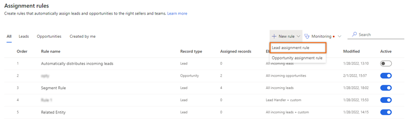
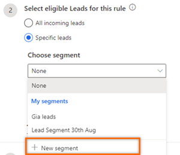
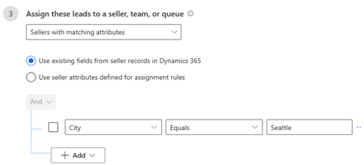
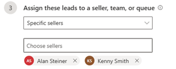
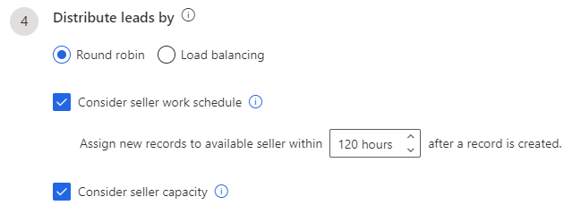

# Create and activate an assignment rule 

Create and activate assignment rules for leads and opportunities by defining conditions to automatically assign records to sellers when the defined conditions are met in Dynamics 365 Sales.

## License and role requirements
| Requirement type | You must have |
|-----------------------|---------|
| **License** | Dynamics 365 Sales Premium or Dynamics 365 Sales Enterprise  More information: [Dynamics 365 Sales pricing](https://dynamics.microsoft.com/sales/pricing/) |
| **Security roles** | System Administrator or Sequence Manager    More information: [Predefined security roles for Sales](security-roles-for-sales.md)|

## Introduction

As a sequence manager, you create an assignment rule for lead and opportunity records by defining different conditions such as segment, sellers, and lead or opportunity distribution. After a rule is activated and a record satisfies the conditions that are defined in the rule, the record is automatically assigned to a seller. When records are created in Dynamics 365 Sales, you don't have to manually assign them to sellers. 

>[!NOTE]
>A rule considers only the records that are created or updated after it's activated. 

When a lead or opportunity record is created in an organization, assignment rules are applied from the top of the order in which they're listed. When the record satisfies the conditions defined for a rule, that rule is applied to the record. By default, rules are listed in the order in which they were created, with the most recent at the bottom. You can select and drag the rules into any order you want.

>[!NOTE]
>For the example in this procedure, we create a lead assignment rule. Similarly, you can use this procedure to create an opportunity assignment rule. 

## To create and activate an assignment rule

1.	Sign in to your Dynamics 365 Sales Hub app.    
2.	Go to **Change area** in the lower-left corner of the page, and select **Sales Insights settings**.   
3. Under **Sales accelerator**, select **Assignment rules**.    
4. On the **Assignment rules** page, from the **Rule** tab, select **New rule** > **Lead assignment rule**.

   >[!div class="mx-imgBorder"]
   >   

    The **Create assignment rule** pane opens.    

5. Under **Rule name**, enter a name for the rule.

6. Under **Select eligible Leads for this rule**, select one of the following options:

      >[!div class="mx-imgBorder"]
      >

    - **All incoming leads**: All the new leads that are created will be assigned to sellers in accordance with the conditions defined in the rule.
    - **Specific lead**: Select a segment from the **Choose segment** dropdown menu to connect leads that are available in the segment to sellers in accordance with the conditions defined in this rule. All the active segments related to leads are displayed in the list. However, if you want to create a segment specific to this rule, select **New segment**. More information: [Create and activate a segment](create-and-activate-a-segment.md)

      >[!NOTE]
      >If no segment is selected for a rule, or no segment is defined in the application, you can select **None**.

      Also, you can configure more settings to determine how the leads in the segment must be assigned to sellers. Select **Additional condition**, and then select **Add**. Configure the conditions as follows:

        - **Add row**: Add conditions for when the segment should be applied. In the following example, we add a row to specify that this segment be applied to leads created by the user **John Thomas**:

          1. Select an attribute from the dropdown list in the first column.
          2. Select an operator from the dropdown list in the second column.
          3. Enter a value to filter by in the third column.

          >[!div class="mx-imgBorder"]
          >

          Similarly, you can create more conditions to further filter the leads to apply the segment to.

        - **Add group**: Add multiple conditions as a group to your segment if you want to filter leads by using more than one field:

          1. Select **And** or **Or** to group the conditions.   

             >[!div class="mx-imgBorder"]
             >

          2. Select the conditions that you want to add to the group.

             >[!div class="mx-imgBorder"]
             >

            When you select **And**, this segment is only applied to leads that meet both criteria. When you select **Or**, the segment is applied to leads that meet any of the filter criteria. For example, to apply this segment to leads that were created by Kenny Smith and have the company name Contoso, select **AND**. Similarly, you can create multiple groups and further filter the leads based on the conditions defined in the groups.

        -	**Add related entity**: Add a condition based on the attributes of related entities.
            Select an attribute from the **Related Entity** list in the topmost field, and then choose **Contains data** or **Does not contain data**. This enables the condition section.

            >[!div class="mx-imgBorder"]
            >

        You can't have more than 10 conditions in a rule. More information: [Conditions in assignment rules](#conditions-in-assignment-rules)

    -  **Consider leads created in the last *hours***: Select the option to assign records that are created in the application in the specified timeframe to sellers.  
        If no seller is available to take the record within the set timeframe, the record is marked as overdue with the status reason *Seller not assigned as record is older than the set timeframe*.   
        To know more about unassigned records and status reasons, see [View unassigned records](manage-unassigned-records.md#view-unassigned-records).  

7. Under **Assign these leads to sellers or a team**, choose one of the options described in the following table.

    | Option | Description |
    |--------|-------------|
    | Any seller | Assign leads to any seller according to their availability, capacity, or distribution pattern. |
    | Seller with matching attributes | Assign leads to sellers who satisfy the conditions defined through attributes selected from Dynamics 365 or assignment rules. The following options are available:<ul><li>Use existing fields from seller records in Dynamics 365.</li><li>Use seller attributes defined for assignment rules. More information: [Manage seller attributes](manage-seller-attributes.md)</li></ul>For example, you want to assign leads to sellers who are based out of Seattle. Select the **Use existing fields from seller records in Dynamics 365** option, and then select **Add** > **Add row**. Enter the condition as **City** (attribute) **Equals** (condition) **Seattle** (value).   You can't have more than 10 conditions in a rule. More information: [Conditions in assignment rules](#conditions-in-assignment-rules) |
    | Specific sellers | Assign leads to specific sellers. Select the sellers from the **Choose sellers** lookup. **Note**: The security roles for sellers displayed in the list were added through defining team access. More information: [Grant permissions to use assignment rules](manage-sales-teams.md#grant-permissions-to-use-assignment-rules)  |
    | Specific teams | Assign leads to a specific team. The lead is available for all members of the team you select. The teams must be defined in your organization and added to the security roles through define team access. More information: [Grant permissions to use assignment rules](manage-sales-teams.md#grant-permissions-to-use-assignment-rules) The **Distribute leads by** option won't displayed as the leads are assigned to the teams. |

8. Under **Distribute leads by**, choose one of the following options. This setting is available only when you select a seller option in the **Assign these leads to** section. More information: [Understand lead distributions in assignment rules](understand-lead-distributions-assignment-rules.md)

   >[!NOTE]
   >The **Distribute leads by** setting isn't available for teams.

   - **Round robin**: Leads are distributed on a cyclical basis to sellers who are qualified to receive the lead, based on the conditions of the assignment rule.
   - **Load balancing**: Leads are distributed among sellers depending on their current workload. This helps ensure that all sellers are equally busy.
   - **Assign if seller is available within *time*** (optional): Select this checkbox to take the work schedule of the seller into account when assigning leads. More information: [Configure your work availability](personalize-sales-accelerator.md#configure-your-work-availability)
      
        Also, you can select number of hours a lead record that's created in the application can wait in the loop to be assigned to a seller or a team. You can select upto a maximum of 120 hours. To assign leads, the application first considers those sellers who are currently available to work on the lead records. If no seller is currently available (due to a day off or outside of working hours), the application considers the sellers who will be available within the configured specified hours.  
        
        If sellers don't update their [work availability](personalize-sales-accelerator.md#configure-your-work-availability), the application considers them to be always available and assigns them leads. 
      
        For example, if you select 10 hours, the application considers sellers who will be available within 10 hours to assign the record. If no seller is available within the 10-hour limit, the record isn't assigned and marked as overdue. To manage the overdue records, see [View and manage unassigned records](manage-unassigned-records.md). 

        When the [Consider leads created in the last](#considerLeadsCreated) option is selected as described in step 6, the rule first checks for configured timeframe to assign the record and then the sellers' availability.

   - **Assign leads based on seller capacity** (optional): Select this checkbox to take into account the maximum number of leads a seller can handle at once. More information: [Set lead capacity for sellers](manage-sales-teams.md#set-capacity-for-sellers)

      >[!div class="mx-imgBorder"]
      >

9. Select **Create rule**.

The rule is created and activated. It is listed in the **Rules** section, which is organized in ascending order by date; the most recently created rule is always listed at the bottom of the list unless you move it.

## Conditions in assignment rules

At any given time, you can have a maximum of 10 conditions, including conditions defined within groups and related entities. The condition limit is added to optimize the runtime experience, ensuring faster execution and improved efficiency. If you exceed the limit, a message is displayed stating that the limit is reached and can't save the rule. 

### Recommendation to add conditions

While configuring the **Select eligible leads for this rule** section for **Specific *entity***, you can have a maximum of 10 conditions at any given time. However, you can optimize the conditions by following the recommendations described below:

- **Distribute assignment rules**: Create multiple assignment rules with proper distribution of conditions. For example, if you have 20 conditions, create two assignment rules with 10 conditions each. 

- **Create rollup entities**: To add more conditions, use rollup entities with many-to-many or one-to-many relationships. More information: [Define rollup columns that aggregate values](/power-apps/maker/data-platform/define-rollup-fields) 

- **Avoid simple conditions**: Don't use attributes in conditions that are already used in the connected segment. For example, if you have a segment with the condition **City** (attribute) **Equals** (condition) **Seattle** (value), don't use the **City** attribute in the assignment rule. 

- **Don't update data or metadata**:  Updating the data or metadata of a record that's already in the assignment rule can cause unexpected behavior or bypass the validations. For example, if you update the owner of a lead that's already in a rule, the lead is removed from the rule. 

[!INCLUDE[cant-find-option](../includes/cant-find-option.md)]

### See also

[Manage assignment rules](create-manage-assignment-rules.md)     
[Understand lead distributions in assignment rules](understand-lead-distributions-assignment-rules.md)

[!INCLUDE[footer-include](../includes/footer-banner.md)]
