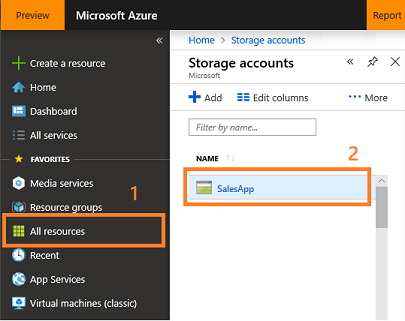
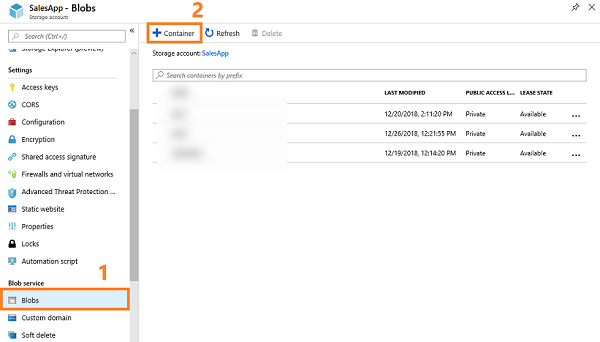
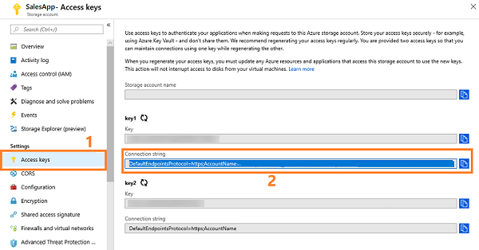

# Create a call recording repository in Azure

Create a call recording repository (blob container) in an Azure storage account to help you upload the call recordings in the repository for conversation intelligence to assess.  

> [!NOTE] 
> While creating the repository, ensure that the repository is created in the same region as your tenant to upload the call recordings. For example, if your tenant is in NAM (North America), ensure that you create the repository in the NAM region only.

1. Sign in to the Azure dashboard.
  
1. On the navigation pane, select **All resources**, and open the desired storage account.  
    > [!div class="mx-imgBorder"]
    >   
1. From **Blob service**, select **Blobs** then **+ Container**.  
    > [!div class="mx-imgBorder"]
    >   
1. Specify the container information, such as name and public access level.  
1. Select **OK**.  
   The container is created. To learn more, see [Create a container](/azure/storage/blobs/storage-quickstart-blobs-portal#create-a-container)  
1. From **Settings**, go to **Access keys** and note the **Connection string** of the storage account. This connection string is used to connect conversation intelligence to your Azure storage account.  
    > [!div class="mx-imgBorder"]
    >   

Now you are ready to configure conversation intelligence to use your [own Azure storage](fre-setup-sales-insight-app.md#configure-conversation-intelligence).  