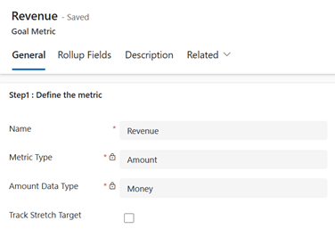
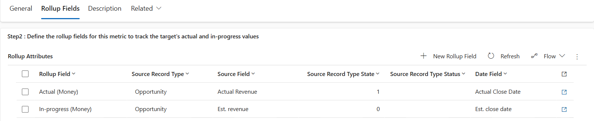
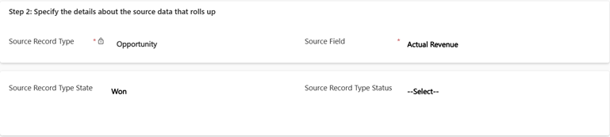

# Define a goal metric

Measure goals in terms of count or amount, depending on what you’re measuring. Use rollup fields to track progress on the goals.

## License and role requirements
| Requirement type | You must have |
|-----------------------|---------|
| **License** | Dynamics 365 Sales Premium or Dynamics 365 Sales Enterprise   More information: [Dynamics 365 Sales pricing](https://dynamics.microsoft.com/sales/pricing/) |
| **Security roles** | Sales Manager or Vice President of Sales   More information: [Predefined security roles for Sales](security-roles-for-sales.md)|

## What are goal metrics?

Goal metrics let you clearly define how a goal will be measured. For example, a sales team's performance can be measured based on the number of leads they get or the revenue amount. There are two goal metric types: Amount and Count. The Amount metric type can be a money value, an integer, or a decimal number. The Count metric type is an integer. For example, you can use the Amount (money) goal metric to track the revenues from all active opportunities or sales orders. An integer type can be used to track sales calls made by a salesperson. A decimal number can represent a product sold by weight, such as grain or sugar.  

## Create a goal metric 

1.	Make sure that you have the Manager, Vice President, CEO-Business Manager, System Administrator, or System Customizer security role or equivalent permissions.

2.	In the site map, at the bottom, select the Change area icon , and then select **App Settings**.  

    > [!div class="mx-imgBorder"]
    > 

3. Select **Goal Metrics**.

    > [!div class="mx-imgBorder"]
    > 
 
4.	To create a new goal metric, on the command bar, select **New**.

5.	Under **Step 1: Define the metric**, fill in the information:

    a.	**Name**. Required. Enter a name between 1 and 100 characters.
    
    b.	**Metric Type**. Required. To track a monetary amount, select **Amount**. To track another type of amount, such as how many new contacts are added, select **Count**.

    
    > [!NOTE]
    > After you save the goal metric, you will no longer be able to edit this field.
    
    c.	**Amount Data Type**. Required. This option is not available if the you chose is **Count** as the **Metric Type** because [!INCLUDE[pn-dyn-365-sales](../includes/pn-dyn-365-sales.md)] automatically sets the data type to integer.
    
    > [!NOTE]
    > After you save the goal metric, you will no longer be able to edit this field.
    
    d.	**Track Stretch Target**. Select this check box if you want this metric to track an additional target beyond the primary goal.

    > [!div class="mx-imgBorder"]
    > 
 
6.	Select **Save**.

7.	On the **Rollup Fields** tab, define how you want to calculate the actual and in-progress values for this metric. For example, let's say your goal metric is based on revenue. You can define your rollup fields as shown in the following screenshot:

       > [!div class="mx-imgBorder"]
       > 

    a.	Select **Add New Rollup Field**.

    b.	Complete the following fields:

      -  **Rollup Field:** Select the rollup field type. Select Actual, In-progress, or Custom rollup. Apart from the actual and inprogress values, you can track one more value as a **Custom Rollup Field**. For example, let's say you want to track the lost revenue as a third rollup.  

      - **Source Record Type:** Select the record type to use as the source for the rollup data. Example: Opportunity.

        > [!NOTE]
        > Custom record types are not supported.

      - **Source Field:** Select the field to use for calculating the rollup value. Example: Actual Revenue.

      - **Source Record Type State:** Select the record state you want to use as the source of the rollup data for the metric. Example: Won.

      - **Source Record Type Status:** Select the status of the records you want to use as the source of the rollup data for the metric. State and status may be identical, depending on the record type you selected.

          > [!div class="mx-imgBorder"] 
          > 

      - **Record Type:** Select the entity that contains the date field you want. Typically, you can only choose the same record type you selected as the Source Record Type.

      - **Date Field**. Select a date field you want to use to determine the goal period that the records will roll up into. Example: Actual Close Date.  

         > [!div class="mx-imgBorder"]
         > 
 
    e. Select **Save & Close**.

8.	On the **Description** tab, enter a description for the goal metric to enable other users to understand what metrics are being tracked.

9.	Select **Save**.

[!INCLUDE [cant-find-option](../includes/cant-find-option.md)]
  
### See also  

[Create or edit goals](../sales-enterprise/create-edit-goal-sales.md)   
[Define a goal rollup queries](create-edit-goal-rollup-query-sales.md)

[!INCLUDE[footer-include](../includes/footer-banner.md)]
