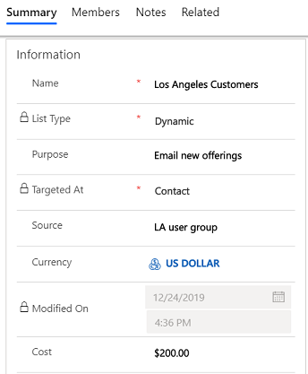

# Create a marketing list using in-app marketing

Your marketing list is the core of running a successful marketing campaign. It can include any one type of customer record, such as leads, accounts, or contacts.  
  
 You can create two types of marketing lists:  
  
- **Static** Use a static list if you prefer to add and update members manually.  
  
- **Dynamic** Use a dynamic marketing list if you want the list to return a list of members dynamically when needed, based on search criteria you set. For example, if you want to run a campaign to members of a specific city, use a dynamic list. A dynamic marketing list retrieves the updated list of members each time you open the list, create a quick campaign from the list, or distribute a campaign activity for a campaign associated with the list.  

## License and role requirements
| Requirement type | You must have |  
|-----------------------|---------|
| **License** | Dynamics 365 Sales Premium, Dynamics 365 Sales Enterprise, or Dynamics 365 Sales Professional  More information: [Dynamics 365 Sales pricing](https://dynamics.microsoft.com/sales/pricing/) |
| **Security roles** | Any primary sales role, such as salesperson or sales manager   More information: [Primary sales roles](security-roles-for-sales.md#primary-sales-roles)|

  
## Create a marketing list  
  
1. In the site map, select **Marketing Lists**. 
  
2. Select **New**.  
  
3. On the **Summary** tab, add the required information. 
  
   > [!div class="mx-imgBorder"]  
   >   
  
   > [!NOTE]
   >  To look up records in the **Owner** field, first select **Save**, or you'll lose your changes.  
  
4. Select **Save** so you can enter information in other areas of the form.  
  
5. Select the **Notes** tab to add any other information that applies to your marketing list.  
  
6. Select **Save**.  
  
## Manage members in a static marketing list  

You can manage members in a static marketing list by using one of the following options:

- [Add using Lookup](#add-using-lookup)
- [Add using Advanced Find](#add-using-advanced-find)
- [Remove using Advanced Find](#remove-using-advanced-find)
- [Evaluate using Advanced Find](#evaluate-using-advanced-find)

> [!NOTE]
> - To add more than 30,000 members to a static marketing list, you must either be a part of the Salesperson security role or higher, or have the **List Operation** permission.
> :::image type="content" source="media/listoperation.png" alt-text="Listoperation permission in the custom entities tab.":::
> - You can add up to 120,000 members to a static marketing list through a single Add operation. If you need to add more than 120,000 members to a static marketing list, split those members and perform multiple add operations. One way to do this is by using the [Advanced Find](#add-using-advanced-find) dialog to create queries that return less than 120,000 members. Alternatively, depending on your scenario, you can also consider using a dynamic marketing list instead of static list. More information: [Create a dynamic marketing list](#define-the-member-selection-criteria-for-a-dynamic-marketing-list)

### Add using Lookup

This option allows you to add members to a marketing list by searching through the records.

1. In a marketing list record, select the down arrow next to **Manage Members** on the command bar, and then select **Add using Lookup**.

2. In the **Lookup Records** dialog box, select your search criteria.  

3. Select the records that you want to add, and then select **Add**.  
  
### Add using Advanced Find

This option allows you to add members to a marketing list in bulk based on a search criteria.

1. In a marketing list record, select the down arrow next to **Manage Members** on the command bar, and then select **Add using Advanced Find**.

2. In the **Add members using advanced find** dialog box, the entity that the marketing list is targeted at is automatically selected.
    
3. In the **Use Saved View** drop-down box, select a view for the selected entity, which will be used for filtering.
    
4. Select **Add**, and then select **Add row**, to define the search criteria. For example, to find all the contacts in the Seattle city, in the first box select the field as **Address 1: City**. Then, in the second box, select the query relational operator as **Equals**. In the third box, type **Seattle**. You can select fields from the current record type, or from related record types.   
    
5. Select **Find**.  

6. Select the members that you want to add, and then select one of the following options:  
    - Add only selected
    - Add all
  

### Remove using Advanced Find

This option allows you to remove members from a marketing list in bulk based on a search criteria.

1. In a marketing list record, select the down arrow next to **Manage Members** on the command bar, and then select **Remove using Advanced Find**.

2. In the **Remove members using advanced find** dialog box, the entity that the marketing list is targeted at is automatically selected.

3. In the **Use Saved View** drop-down box, select a view for the selected entity, which will be used for filtering.

4. Select **Add**, and then select **Add row**, to define the search criteria. For example, to find all the contacts in the Seattle city, in the first box select the field as **Address 1: City**. Then, in the second box, select the query relational operator as **Equals**. In the third box, type **Seattle**. You can select fields from the current record type, or from related record types.   

5. Select **Find**.  

6. Select the members that you want to remove, select one of the following options:  

    - Remove only selected  
    - Remove all  

> [!NOTE]
> For the better performance of application and avoid time outs, remove the members in the marketing list in groups of 10000 at a time. For example, if there are 20000 members in a marketing list and you want to remove the members. Remove 10000 members first and then remove the other 10000. 

### Evaluate using Advanced Find

This option allows you to evaluate which members to keep in the marketing list based on search criteria.

1. In a marketing list record, select the down arrow next to **Manage Members** on the command bar, and then select **Evaluate using Advanced Find**.

2. In the **Evaluate members using advanced find** dialog box, the entity that the marketing list is targeted at is automatically selected.
    
3. In the **Use Saved View** drop-down box, select a view for the selected entity, which will be used for filtering.
    
4. Select **Add**, and then select **Add row**, to define the search criteria. For example, to find all the contacts in the Seattle city, in the first box select the field as **Address 1: City**. Then, in the second box, select the query relational operator as **Equals**. In the third box, type **Seattle**. You can select fields from the current record type, or from related record types.   
  
5.  Select **Find**.  
  
6.  Select the members that you want to keep, select one of the following options:  

    - Keep only selected  
    - Keep all  

## Define the member selection criteria for a dynamic marketing list  
  
1.  In any marketing list, on the command bar, select **Manage Members**.  
  
2.  In the **Manage Dynamic List Members** dialog box, the entity that the marketing list is targeted at is automatically selected.
    
3. In the **Use Saved View** drop-down box, select a view for the selected entity, which will be used for filtering.
    
4. Select **Add**, and then select **Add row**, to define the search criteria. For example, to find all the contacts in the Seattle city, in the first box select the field as **Address 1: City**. Then, in the second box, select the query relational operator as **Equals**. In the third box, type **Seattle**. You can select fields from the current record type, or from related record types.  

5. Select **Find**.

6. Select **Use Query** to add the matching records to your dynamic marketing list.
  
## Associate campaigns or quick campaigns to a marketing list

After you have created a campaign or quick campaign, you can associate it to your marketing list. You can also create a new campaign or quick campaign from your marketing list.  
  
1.  In the **Campaigns** or **Quick Campaigns** area, select **New Campaign** or **New Quick Campaign**.  
  
2.  Search for the campaign or quick campaign you want to associate to this marketing list.  
  
    > [!NOTE]
    > - If you don't have any campaigns, or if you want to create a new one, you can select **New**.  
    > - If you don't have any quick campaigns, the Quick Campaign Wizard will start.  
  
## Customized marketing list form

If you're using a custom form for a marketing list that doesn't include certain fields, you'll see the following message: 'The form is missing the following elements: 'query', 'membertype', 'accountsUCI', 'contactsUCI', 'leadsUCI', 'dynamic_accounts', 'dynamic_contacts', 'dynamic_leads'. Functionalities will be affected.

The elements listed in the message are required to populate the members list that is included in the default form. If your custom form doesn't display the members list, you can ignore the message.

[!INCLUDE [cant-find-option](../includes/cant-find-option.md)]

### See also  
 [Get started with in-app marketing](get-started-app-marketing-sales.md)   
 [Create or edit a campaign using in-app marketing](create-edit-campaign-using-app-marketing-sales.md)   
 [Create a quick campaign using in-app marketing](create-quick-campaign-using-app-marketing-sales.md)   
 [Add an activity to a campaign using in-app marketing](add-activity-campaign-using-app-marketing-sales.md)   
 [Add a marketing list, sales literature, or product to a campaign using in-app marketing](add-marketing-list-sales-literature-product-campaign-using-app-marketing-sales.md)   
 [Track a marketing campaign response using in-app marketing](track-marketing-campaign-response-using-app-marketing-sales.md)   
 

[!INCLUDE[footer-include](../includes/footer-banner.md)]
