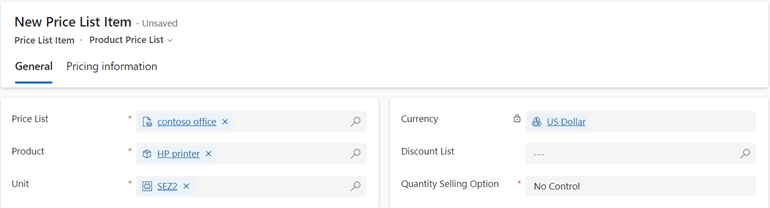
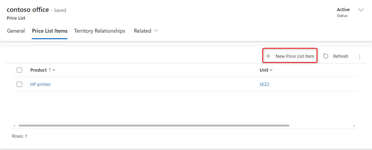
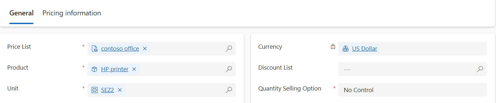
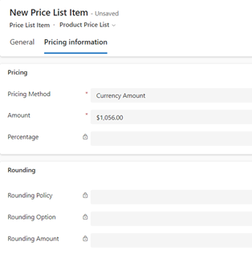
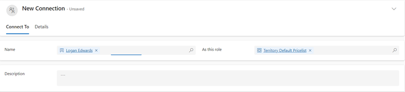

# Define product pricing with price lists and price list items 

Use price lists and price list items to define price for a product.  

[!INCLUDE [trial-cta-note](../includes/trial-cta-note.md)]

## License and role requirements

| Requirement type | You must have | 
|-----------------------|---------|
| **License** | Dynamics 365 Sales Premium, Dynamics 365 Sales Enterprise, or Dynamics 365 Sales Professional  More information: [Dynamics 365 Sales pricing](https://dynamics.microsoft.com/sales/pricing/) |
| **Security roles** | Sales Manager, Sales Professional Manager, or Vice President of Sales   More information: [Predefined security roles for Sales](security-roles-for-sales.md)|

## What is a price list?

Price lists tell your sales agents what to charge for your products or services. You can create multiple price lists so that you can maintain separate price structures for different regions,  sales channels, or sales territories. 

Price lists tie the unit, product, and pricing details together, so before you create a price list, make sure the units and products are in place.  

> [!NOTE]
>- Territories are only supported for Sales Enterprise and Sales Premium licenses.
>- The Price list table inherits its privileges from the Product table. For example, if a user has read and write privileges on the Product table, they get the same privileges on the Price list table too. 
>- You must create at least one price list for each of the currencies that your organization does business in.
  
## Create a price list and price list items

1. Depending on the sales app that you're using, do one of the following:
 
    -  If you're using the Sales Hub app, 
        1. Select **Change area**  at the lower-left corner of the site map, and then select **App Settings**. 
        1. In the **Product Catalog** area, select **Price Lists**. 
   - If you're using the Sales Professional app,
       - Select **Price List** from the site map.
4. To create a new price list, select **New**.   
  
5. In the price list form, fill in your information, and then select **Save**. 

    a.  **Name**. Type a descriptive name for the price list. For example, if you're creating a price list for retail, mention that.

    b.  **Start Date**/**End Date**. Select the start date and end date for the price list. For example, if this is a promotional price list that’s effective only for the promotional period, select that period.

    c.  **Currency**. Select the currency you’re creating the price list for. You can have different price list for different currencies.

    > [!div class="mx-imgBorder"]
    > 
  
6.	To add price per unit for a product, create and add price list items.

    a.	In the **Price List** form, select the **Price List Items** tab, and then select **New Price List Item**.

    > [!div class="mx-imgBorder"]
    > 
 
    b.  In the **Price List Item** form, fill in the information, and select **Save**:

       -  **Product**. Select the product for which you’re creating this price list. 

       -  **Unit**. Select the unit for the product you’re creating this price list for.

       -  **Currency**. The currency defined for the price list is automatically populated.

       -  **Discount List**. If you want to offer a discount on the products, select a discount list to the price list item. 

       -  **Quantity Selling Option**. select whether the product or service can be ordered in whole, partial, or both types of quantities. This information is used in the Quantity field of Quote Product, Order Product, and Invoice Product records. 

       > [!div class="mx-imgBorder"]
       > 

    c.  In the **Price List item** form, on the **Pricing information** tab, fill in the following information, and select **Save & Close**:

       -  **Pricing Method**. select an option that determines how the pricing will be calculated. It could be a certain amount, or a percentage of the current or standard cost. The available options are as follows: 
          -  **Currency Amount**. Use this to ignore a product's list price in the product catalog and to enter a different price manually for this price list.  
          
          -  **Percent of List**. Use this to calculate a product's price in the price list as a percentage of the list price of the associated product.  
        
          -  **Percent Markup - Current Cost**. Use this to add a percent markup on top of the current cost of the product.   

          - **Percent Markup - Standard Cost**. Use this to add a percent markup on top of the standard cost of the product.

          -  **Percent Margin - Current Cost**. Use this for the price offered in the price list to yield a percentage margin of the current cost of the product. 

          -  **Percent Margin - Standard Cost**. Use this for the price offered in the price list to yield a percentage margin of the standard cost of the product.

       -  **Amount**. If you selected **Currency Amount** as the pricing method, type the amount at which the product will be sold.

       -  **Percentage**. If you selected any value other than **Currency Amount** as the pricing method, type the percentage for the pricing method that you want.

       -  **Rounding Policy**. If you selected a pricing method other than **Currency Amount**, you can set up a rounding policy. For example, if you want per unit prices to be in the form of $0.99, you can select a rounding policy where all prices per unit automatically have a price that ends in 99 cents. To do this, you select the rounding policy to round up the price, and then set the price to end in a certain amount, such as 99 cents.

          -  **None**. Prices are not rounded.

          -  **Up**. Prices are rounded up to the nearest rounding amount.

          -  **Down**. Prices are rounded down to the nearest rounding amount.
    
          -  **To Nearest**. Prices are rounded to the nearest rounding amount.

       -  **Rounding Option**. Select **Ends in** or **Multiple of** if you want the price to end in a certain amount or multiples of a certain amount.

       -  **Rounding Amount**. Enter the amount.

            > [!div class="mx-imgBorder"]
            > 

 
7.  (Applicable for Sales Premium and Sales Enterprise) You can also associate default price lists for territories so that the sales reps working with accounts and contacts in certain territories have the price list selected by default.  

    a.  In the price list record, select the **Territory Relationship** tab.

    b.	In the **Territories** section, select **Add New Connection**.

    c.	In the **New Connection** form, enter the following, and select **Save & Close**: 
    
    -  **Name**. Select the Lookup button and select a territory.
      
    -  **As this role**. Select a connection role that is associated with the territory record type.

         > [!div class="mx-imgBorder"]
         > 
 
    d.	In the price list record, select **Save & Close**.
   

## Typical next steps  

  [Publish a product or bundle to make it available for selling](publish-product-bundle-make-available-selling.md)  
  
  [Set up a product catalog: Walkthrough](set-up-product-catalog-walkthrough.md)  

[!INCLUDE [cant-find-option](../includes/cant-find-option.md)]

### See also  
 [System Settings dialog box - Sales tab](/power-platform/admin/system-settings-dialog-box-sales-tab)   
 [Classify products and bundles into product families](create-product-bundles-sell-multiple-items-together.md)  
[Price calculation for opportunity, quote, order, and invoice records](price-calculation-opportunity-quote-order-invoice-records.md)

[!INCLUDE[footer-include](../includes/footer-banner.md)]
