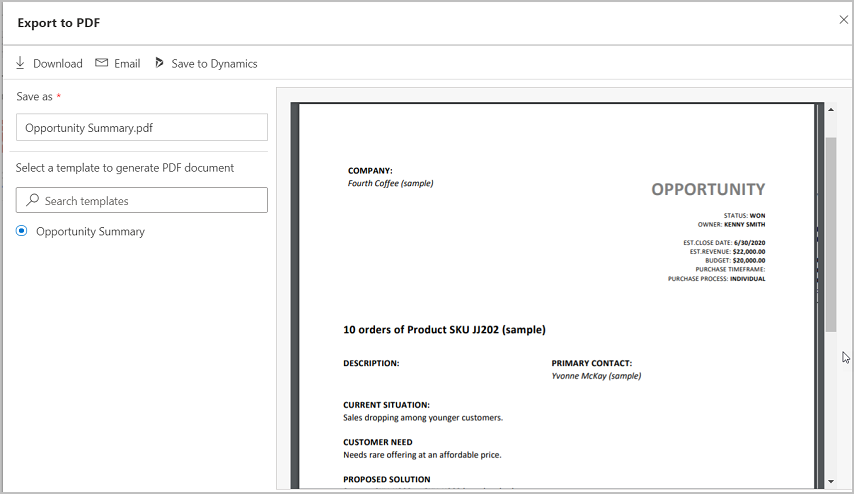
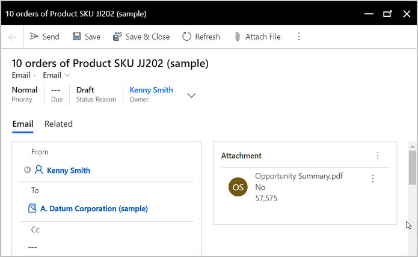
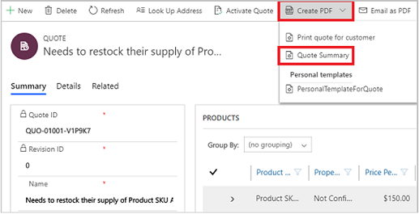
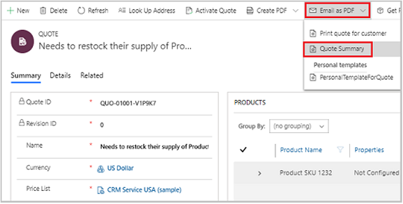

# Export sales records to PDF  

Share sales records with your customers in a professional, read-only PDF format, created using your standard Word templates.  

## Prerequisites

Your administrator must, 
- [Enable PDF generation from sales records](enable-pdf-generation-quote.md).
- Ensure that word templates are available for the entities you want to generate PDF files for. Out-of-the-box templates are available for the Account, Opportunity, Order, Quote, and Invoice entities. To enable PDF generation for other entities, your administrator must [create new word templates](manage-word-templates.md).

## Export to PDF

Use the PDF generation capability to create and share read-only, professional-looking PDF files for Dynamics 365 records with your customers. The PDF file is generated by using a standard Word template from your organization. You can create PDF files of records from all entities that have the PDF generation capability enabled.

> [!IMPORTANT]
> Creating PDF of the custom entity records is supported only on the web app.  

1. Open the record that you want to export as a PDF. For example, if you want to create a PDF file for a quote, open the quote record.

1. On the command bar, select **Export to PDF**.

    > [!NOTE]
    > If you don't see the **Export to PDF** option on the command bar, look for it in **More commands** (**&vellip;**). If you still don't see it, contact your administrator to [enable PDF file generation for the entity](enable-pdf-generation-quote.md).

    The **Export to PDF** dialog box appears.

    

    A preview based on the selected template is shown, and the PDF file name is populated. If you'd like to use a different template than the one selected, search for and select it in the **Select a template to generate PDF document** box. After you select the template, the preview will be refreshed.

    > [!IMPORTANT]
    >- If there are multiple Word templates available for the entity, by default the first template in the list is selected. 
    >- If the setting to view or download a PDF file automatically is disabled in your browser settings, the preview functionality won't work. 

3. In the **Save as** field, change the PDF file name if you want.
4. Do one of the following:
   1. To download the PDF file to your computer, select **Download**.
   2. To send the PDF file to your customer in email, select **Email**. 

      The email form opens with the important fields automatically populated.

      

      > [!NOTE]
      > The **Regarding** field is populated with the record from which the email was triggered. The **Sending email** flag in the primary entity must be enabled in the **Customization** area for the **Regarding** field to be populated. For more information about this flag, see [Entity options that can only be enabled](/powerapps/maker/common-data-service/edit-entities#entity-options-that-can-only-be-enabled).

    3. Select **Save to SharePoint** or **Save to Dynamics**.
      - Use **Save to SharePoint** to save the PDF file to a SharePoint site. This button is available only when SharePoint integration is enabled for your organization and the **Document Management** check box is selected on the entity page in the **Customization** area. If you don't see this button, contact your system administrator.
      - If SharePoint integration isn't enabled, you'll see the **Save to Dynamics** button. This command saves the PDF file as a note to the primary record. The **Save to Dynamics** button is available if notes are enabled for the primary entity. If you don't see this button, contact your system administrator.  

## Export to PDF from Dynamics 365 for phones mobile app

If you're using Dynamics 365 for phones on a mobile device, the capability for generating PDF files is limited to the following entities: Account, Contact, Lead, Opportunity, Order, Quote, and Invoice. 

1. Open the record that you want to export as a PDF. For example, if you want to create a PDF file for a quote, open the quote record.

2. On the command bar, select **Create PDF** and then select the template you want to use to create the PDF. 

    > [!div class="mx-imgBorder"]
    > 

3. In the dialog box that appears, save or download the PDF.

    - If you select **Save**, the PDF file is stored in the default SharePoint site if SharePoint is configured and enabled for the primary entity. If SharePoint isn't configured, the PDF is saved as a Notes attachment to the primary entity record in Dynamics 365 Sales.

    - If you select **Download**, the PDF is downloaded to your local drive. After it's downloaded, you can add this file to a note, send it as an attachment in an email, or upload it to SharePoint.

## Email a PDF from Dynamics 365 for phones mobile app

You can also generate a PDF file and directly email it to a customer.

1. Open the record that you want to export as a PDF.

2. On the command bar, select **Email as PDF**, and then select a document template.

    

    The email form opens with the important fields automatically populated.

3. Verify or change any details in the email form as necessary, and then select **Send**.

> [!IMPORTANT]
> The time taken to generate the PDF file and download or send the email depends on the size of the file. You'll see optimum performance when the file size is less than 2 MB. Larger files can require considerably more response time.

## FAQ

**Question:** What happens if more than one SharePoint document location is associated with a record?  
**Answer:** Regardless of the number of SharePoint document locations that exist for a record, the generated PDF file is always saved to the default location: \[<record_name>_<record_id>]. 

**Question:** Can I specify a different name for the PDF file before generating it? 
**Answer:** Yes. You can specify a different file name if you are not using Dynamics 365 for phones on a mobile device. 

**Question:** Can I choose to save the PDF file to the Sales app as notes or to SharePoint?  
**Answer:** No. If SharePoint is enabled for the entity for which you're generating a PDF, the PDF file will be saved to the SharePoint location by default.   

**Question:** Is the PDF generation capability available on all entities?  
**Answer** No. The PDF generation capability is available only on seven out-of-the-box entities: Account, Contact, Lead, Opportunity, Quote, Order, Invoice. With 2020 release wave 2, the PDF generation capability is enhanced to support custom entities. 

**Question:** Does the generated PDF file support custom fonts?  
**Answer:** The fonts in the generated file are limited to the fonts installed on the server that generates the PDF files. Here's a list of supported fonts:

- Microsoft-Windows-Font-Bitmap-Courier
- Microsoft-Windows-Font-Bitmap-Fixed
- Microsoft-Windows-Font-Bitmap-MS_Sans_Serif
- Microsoft-Windows-Font-Bitmap-MS_Serif
- Microsoft-Windows-Font-Bitmap-OEM
- Microsoft-Windows-Font-Bitmap-Small
- Microsoft-Windows-Font-Bitmap-System
- Microsoft-Windows-Font-Bitmap-Terminal
- Microsoft-Windows-Font-FMS
- Microsoft-Windows-Font-RegistrySettings
- Microsoft-Windows-Font-StaticCache
- Microsoft-Windows-Font-TrueType-Arial
- Microsoft-Windows-Font-TrueType-ArialBlack
- Microsoft-Windows-Font-TrueType-Bahnschrift
- Microsoft-Windows-Font-TrueType-Calibri
- Microsoft-Windows-Font-TrueType-Cambria_Regular
- Microsoft-Windows-Font-TrueType-ComicSansMS
- Microsoft-Windows-Font-TrueType-Consolas
- Microsoft-Windows-Font-TrueType-CourierNew
- Microsoft-Windows-Font-TrueType-Ebrima
- Microsoft-Windows-Font-TrueType-EbrimaBold
- Microsoft-Windows-Font-TrueType-FontsRegistrySettingsMigration
- Microsoft-Windows-Font-TrueType-Gadugi
- Microsoft-Windows-Font-TrueType-Georgia
- Microsoft-Windows-Font-TrueType-Inkfree
- Microsoft-Windows-Font-TrueType-JavaneseText
- Microsoft-Windows-Font-TrueType-LeelawadeeUI_Regular
- Microsoft-Windows-Font-TrueType-LeelawadeeUI
- Microsoft-Windows-Font-TrueType-LucidaConsole
- Microsoft-Windows-Font-TrueType-MalgunGothic
- Microsoft-Windows-Font-TrueType-MicrosoftHimalaya
- Microsoft-Windows-Font-TrueType-MicrosoftJhengHei
- Microsoft-Windows-Font-TrueType-MicrosoftYaHei
- Microsoft-Windows-Font-TrueType-MongolianBaiti
- Microsoft-Windows-Font-TrueType-MVBoli
- Microsoft-Windows-Font-TrueType-MyanmarText
- Microsoft-Windows-Font-TrueType-NewTaiLue
- Microsoft-Windows-Font-TrueType-NirmalaUI_Regular
- Microsoft-Windows-Font-TrueType-NirmalaUI
- Microsoft-Windows-Font-TrueType-PhagsPa
- Microsoft-Windows-Font-TrueType-SegoePrint
- Microsoft-Windows-Font-TrueType-SegoeUI_Regular
- Microsoft-Windows-Font-TrueType-SegoeUI
- Microsoft-Windows-Font-TrueType-SimSun
- Microsoft-Windows-Font-TrueType-TaiLe
- Microsoft-Windows-Font-TrueType-TimesNewRoman
- Microsoft-Windows-Font-TrueType-TrebuchetMS
- Microsoft-Windows-Font-TrueType-Verdana
- Microsoft-Windows-Font-TrueType-Webdings
- Microsoft-Windows-Font-TrueType-Wingdings
- Microsoft-Windows-Font-TrueType-YiBaiti
- Microsoft-Windows-Font-TrueType-YuGothicMedium
- Microsoft-Windows-Font-Vector
- Microsoft-Windows-Type1-Fonts

[!INCLUDE [cant-find-option](../includes/cant-find-option.md)]

## Related information

[Enable or disable PDF generation from sales records](enable-pdf-generation-quote.md)  

[!INCLUDE[footer-include](../includes/footer-banner.md)]
