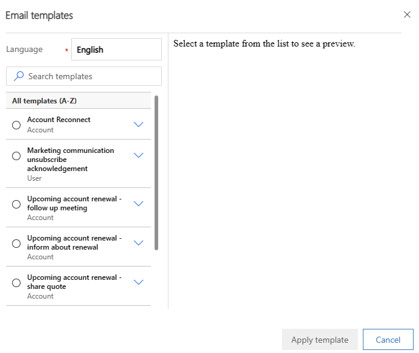
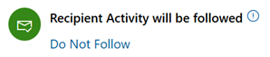
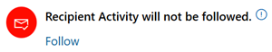
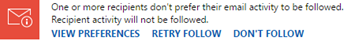

# Create and send an email message 

When your organization turns on email engagement, you get a few more choices when you compose an email in Dynamics 365 Sales.

:::image type="content" source="media/new-email-page-email-engagement-callouts.png" alt-text="Screenshot of the New Email page in Dynamics 365 Sales, with email engagement features highlighted." lightbox="media/new-email-page-email-engagement-callouts.png":::<!-- EDITOR'S NOTE: Please highlight the screenshot IAW the new [screenshot guidelines](/bacx/screenshots-for-bap?branch=main). -->

Legend:

1. **Attachment**: A list of files attached to your email and whether they're followed or unfollowed, along with controls for adding, removing, and modifying the attachments.

1. **Follow/Don't Follow**: Turn on following to track your customer's engagement with the message or turn it off to stop tracking. Other controls and links appear as needed, such as when a recipient doesn't allow following.

1. **Send Later**: Set the delivery time for your message if you don't want to send it right away. Recommended delivery times may appear here, depending on the recipient's time zone.

1. **Set a Reminder**: Set a reminder to follow up at a specific time. For example, you might want to get an alert if the message remains unopened for three days.

1. **Insert Template**: Insert standard text that you can revise as needed. Your organization may have a template for different purposes, such as a meeting follow-up or an introduction. Email engagement may suggest a template based on previous performance.

When your organization turns on email engagement, it applies by default to all messages you create in Dynamics 365 Sales, as long as none of the recipients are set up to [block followed messages](configure-individuals-privacy-preferences.md).

## License and role requirements

| Requirement type | You must have |
|-----------------------|---------|
| **License** | [Dynamics 365 Sales Premium or Dynamics 365 Sales Enterprise](https://dynamics.microsoft.com/sales/pricing/) |
| **Security roles** | [Any primary sales role, such as salesperson or sales manager](security-roles-for-sales.md#primary-sales-roles) |

## Create a message   

Email engagement features apply to any email you send from Dynamics 365 Sales. When you send an email, it adds an email activity to the record you're looking at, and that record is set as the message's **Regarding** value. The To, From, and Copy-to addresses affect where in Sales you can view the message and where its key performance indicators (KPIs) may apply.

1. Open the record you want to add the activity to (typically a contact, opportunity, lead, or account).

1. In the **Timeline** section, select **+** (**Create a timeline record**) > **Email**.

1. Select one or more recipients and enter the message subject.

1. Enter the body of your message, or [insert an email template](#EmailTemplates).

1. Select **Send**, or select **Save** to save the message as a draft and finish it later.

> [!TIP]
> To add a link to your message, select the text you want to add the link to, press Ctrl+K, and type or paste the link address.

## Use an email template 

Email templates are standard messages that you send often, such as introductions, confirmations, thank-you messages, and reminders. They can include dynamic values that are filled in automatically, like the recipient's name or an order number. They give you a quick start when you're writing common messages.

Email engagement analyzes the performance of all the messages your sales team has sent from Dynamics 365 Sales and identifies the most successful templates. It shows all available templates, but highlights the ones that it found to generate the most opens, replies, or sales.

1. [Create a message](#NewMessage).

1. On the command bar, select **Insert Template**.

1. In the **Email templates** window, select the language if needed, and then search for and select a template.

  <!-- EDITOR'S NOTE: This UI is different from what I see in Sales Hub. Are there different apps or configurations this article needs to mention? -->

1. Select **Select**.<!-- EDITOR'S NOTE: My Sales Hub UI shows **Apply template**, not **Select**. -->

1. Customize the template content as needed.

1. Select **Send**, or select **Save** to save the message as a draft and finish it later.

## Follow or unfollow a message   

When you follow an email, email engagement can tell you when the recipient opened it, replied to it, opened an attachment, or selected a link in it.

The **Email Engagement** section includes the following indicators and controls:

- : Indicates you're following the current email, including any links you include, and you have the option to follow any files you attach. Select **Don't Follow** to stop tracking the message.

    This state is the default for new messages when your organization has turned on email engagement and all the recipients allow following.

- : Indicates you're not following the current email, including any links you include. You can't follow any attachments either. Select **Follow** to turn on following if the recipients allow it.

- : Indicates that one or more recipients have following set to **Do Not Allow**. You can't follow this message unless you either remove the recipients that don't allow following or change their setting.

  - Select **View Preferences** to view the recipient names and following preferences in a new window. Select a name to open the recipient's record.
  - If you removed recipients who don't want to be followed or changed their setting to allow following, select **Retry Follow** to try again.
  - Select **Don't Follow** to stop trying to follow this message.

Within about 15 minutes after a followed message is opened, the system creates an action card in the assistant. The card includes links to the message and related records and action buttons to generate a call activity, snooze the alert, or dismiss it. [Learn more about guided customer communications with assistant](assistant.md).

## Add followed attachments 

When you follow an attachment, email engagement can tell you when the recipient opens it. To follow attachments, OneDrive for Business must be available in Dynamics 365 and your organization must turn on document management for email. Ask your administrator if the followed attachments option isn't available for you.

You can't add followed attachments if the message recipients don't allow following. You can still add unfollowed attachments. You can also mix followed and unfollowed attachments in any message you're following.

1. [Create a message](#NewMessage).

1. [Turn on following](#EnableTrackingOnMessages) for the message.

1. Select **Save** on the toolbar to save your message and turn on the attachment feature.

1. In the **Attachment** section, select **New Attachment**.

1. Select **Choose File**, and then locate and select the file.

1. Select **Attach** to upload the file.

    It may take several seconds to upload the file, depending on its size.

1. Select **Follow** to track the attachment, or select **Do Not Follow** to stop following it.

1. Select **Close** to close the attachment window.

1. Select **Send**, or select **Save** to save the message as a draft and finish it later.

## Choose the most effective delivery time 

Your email messages may receive more or less attention depending on when they arrive in recipients' inboxes. For example, many people start their day with a full inbox, so messages that arrive overnight must compete for attention and may get put off or even forgotten. Emails that arrive later in the day may get noticed and handled right away. With email engagement, you can compose your email messages when it's convenient for you, but let Dynamics 365 Sales deliver them when it's best for your recipients.

The system sometimes recommends a delivery time based on the recipient's time zone. It assumes a standard workday of 8:00 AM to 5:00 PM, Monday through Friday, and suggests the next closest business hour if you're working outside the recipient's business day. If the message has more than one recipient or no address is provided, the system doesn't make a recommendation.

Your organization must turn on Bing Maps and the recipient must have a physical address in Sales for email engagement to determine the time zone.

If no recommendation is given, or if you prefer to use your own logic, you can specify any delivery time you choose.

The delivery time feature is available for both followed and unfollowed messages.

1. [Create a message](#NewMessage).

1. When you're ready to send the message, look under **Send Later** in the **Email Engagement** section.

    If the system can recommend a delivery time, one appears here. Whether or not it does, you can delay delivery anyway.

1. Select **Send Later**.

  If the system recommended a time or date, then that information is filled in for you. If not, the date is blank. In either case, it uses *your local time*, not the recipient's.

1. Use the **Set at** controls to set your preferred delivery date and time.

1. Select **OK** to save your setting and close the window.

    The **Delay Send** indicator turns green. Select **Change Schedule** or **Remove Delay** if you need to change the delay or send the message right away. You can change the scheduled delivery at any time before the message is sent.

    :::image type="content" source="media/send-later-control-scheduled.png" alt-text="Screenshot of the Send Later control for a scheduled email in Dynamics 365 Sales.":::

1. Select **Send**, or select **Save** to save the message as a draft and finish it later.

Scheduled messages appear as such in the **Activities** list for the **Regarding** record. Until the scheduled time arrives, you can delete or reschedule the message from there. You can also edit the follow-up reminder date or time. You can't change any other settings after you select **Send**.

## Set a message follow-up reminder 

If you want to make sure you don't forget to follow up on an important email, set a reminder.

1. [Create a message](#NewMessage).

1. When you're ready to set the reminder, select **Set Reminder** in the **Email Engagement** section.

    The **Set Reminder** window opens.

    :::image type="content" source="media/set-reminder-window.png" alt-text="Screenshot of the Set Reminder window.":::

1. In the **Title** box, enter the text you want to see when the reminder is triggered.

1. In the **Condition** list, select the condition that triggers the reminder:

    - **If I do not receive a reply by**: Triggers the reminder if no reply has been received by the **Remind by** date. Only available for followed messages.

    - **If the email is not opened by**: Triggers the reminder if the message hasn't been opened by the **Remind by** date. Only available for followed messages.

    - **Remind me anyway at**: Triggers the reminder at the specified time and date, no matter what.

1. In **Remind by**, specify the date and time to show the reminder if the **Condition** is met.

1. Select **OK** to save your settings and close the window.

    The **Set Reminder** indicator turns blue and a short summary of your reminder settings appears. After the reminder time passes, the summary updates to indicate this. Select **Change Reminder** or **Remove Reminder** if you need to change the reminder or remove it.

    :::image type="content" source="media/set-reminder-scheduled.png" alt-text="Screenshot of the reminder for a scheduled activity in Dynamics 365 Sales.":::

1. Select **Send**, or select **Save** to save the message as a draft and finish it later.

When the reminder is triggered, the system creates an action card in the assistant. The card is given high priority, so you should see it right away. The card includes links to the message and related records and action buttons to snooze or dismiss the alert. [Learn more about guided customer communications with assistant](assistant.md).

[!INCLUDE [cant-find-option](../includes/cant-find-option.md)]

### See also

[Turn on email engagement](configure-email-engagement.md)  
[View message interactions with email engagement](email-engagement.md)  
[Configure privacy preferences](configure-individuals-privacy-preferences.md)  
[Create templates for email](/dynamics365/customer-engagement/admin/create-templates-email)
