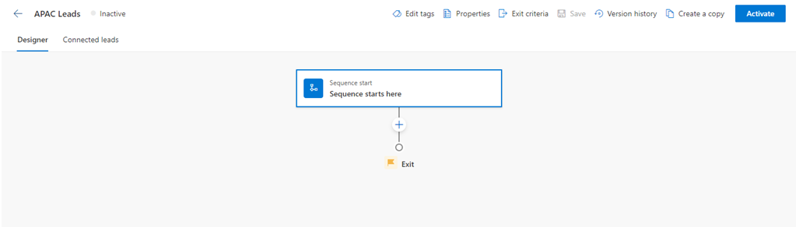
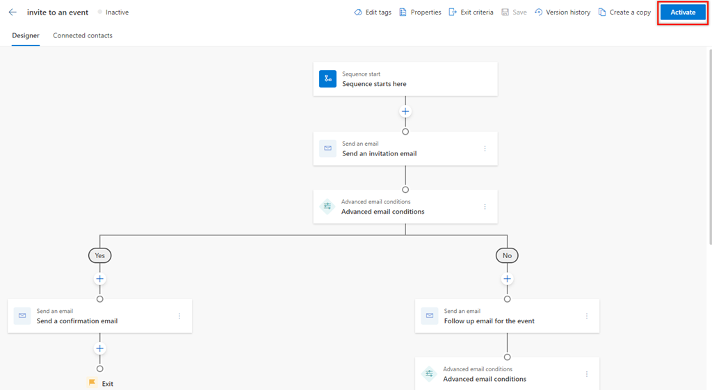
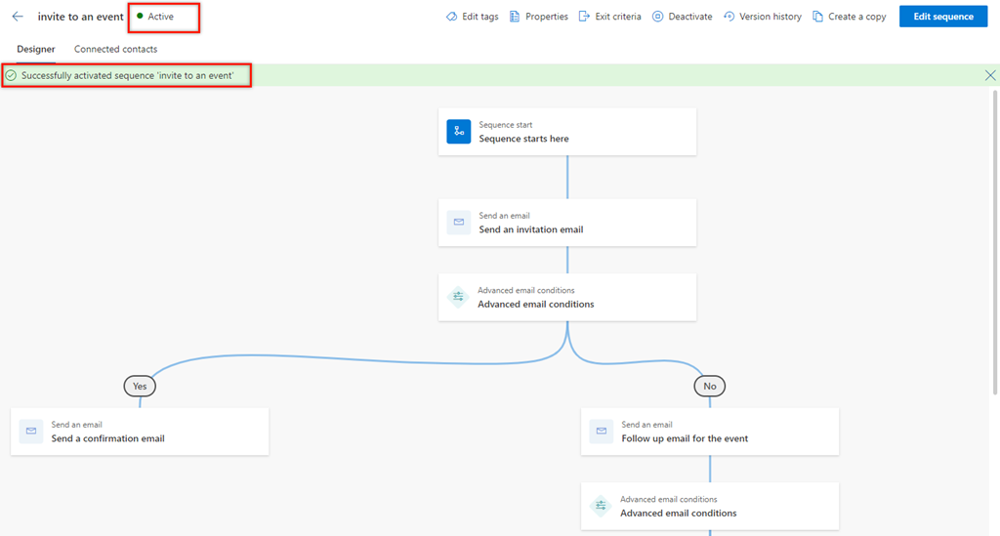

# Create and connect sequences for yourself

Create sequences to automate your work by creating a set of activities such as, send an email, call the customer, and wait time, and personalize communication while reaching out to prospects.

## License and role requirements

| Requirement type | You must have |
|-----------------------|---------|
| **License** | Dynamics 365 Sales Enterprise, Dynamics 365 Sales Premium, or [Microsoft Relationship Sales](https://dynamics.microsoft.com/en-in/sales/relationship-sales/)  More information: [Dynamics 365 Sales pricing](https://dynamics.microsoft.com/sales/pricing/) |
| **Security roles** | Salesperson    More information: [Predefined security roles for Sales](security-roles-for-sales.md)|

## What is a sequence?

A sequence enforce best practices by introducing a set of consecutive activities for you to follow during your day. You can create and connect sequences to records&mdash;such as leads, opportunities, and accounts that appear in your work queue&mdash;to help prioritize activities that help you focus on selling, be more productive, and better align to your organization's business processes.

When you create a sequence, you define a set of activities that you want to perform on records, and the order to perform them in. This lets you concentrate on selling and gives you a better understanding of what to do next.

## Permissions required to create and connect sequences

- When the sales accelerator workspace isn't enabled in your organization, you can create and connect sequences through the Salesperson role. You can also delete and edit the sequences that you've created.

- When the sales accelerator workspace is enabled in your organization and the access is restricted to specific security roles, only the users who have those roles can create and connect sequences. To get access to create and connect sequences, ask your administrator to provide permissions for your security role. More information: [Manage access and record type](manage-access-record-type-sales-accelerator.md)

>[!NOTE]
>If you have the the Sequence Manager role and want to create sequences, go to [Create and activate a sequence](create-and-activate-a-sequence.md).

## Who has access to my sequences?

The sequences that you create are available for your business unit. Other sellers can only view, connect, or create a copy of your sequence. However, administrators and users who have the Sequence Manager role have all privileges, such as editing and deleting the sequence.  

## How to create sequences

Create sequences by using the sequence designer. You can access the sequence designer in the following ways:

- [Personal settings](#personal-settings)
- [Up next widget](#up-next-widget)
- [Record grid view](#record-grid-view)

### Personal settings

We recommend using personal settings to access the sequence designer. Here you can create, edit, delete, and connect sequences.

**To access the sequence designer**

1. Sign in to your sales app, and in the lower-left corner of the page, go to **Change area** > **Personal settings**.

2. On the **Personal settings** page, under **Sales accelerator** > **Sequence**, select **New sequence**.

    :::image type="content" source="media/sequence-seller-select-new-sequence-sequences-page.png" alt-text="Screenshot of the sequences page to select a new sequence.":::

    The **Create a sequence** dialog opens. To continue creating the sequence, go to [Create a sequence](#create-a-sequence) later in this topic.

### Up next widget

The **Up next** widget is available on the out-of-the-box contact, opportunity, lead, and account forms. When you open a record, by default the main form displays the **Up next** widget. For example, when you open a lead record, the **Lead** form displays the **Up next** widget. 

:::image type="content" source="media/sequence-seller-connect-sequence-upnext-widget.png" alt-text="Screenshot of using the Up next widget to connect a sequence.":::

When a sequence isn't connected to a record, the **Up next** widget displays a message to connect a sequence.  

Select **Connect *record type* to a sequence**, and the **Connect *record type* to sequence** dialog opens. In the following example, we opened the connect sequence dialog for leads, which have had no sequences connected yet.
    
:::image type="content" source="media/sequence-seller-connect-lead-sequence.png" alt-text="Screenshot of the Connect lead to sequence dialog.":::

>[!NOTE]
>If sequences are available for the record type, the list is displayed. To create a sequence, select **Create new sequence**. 

Select **Create a new sequence** and the **Create a sequence** dialog opens in a new tab. To continue creating the sequence, go to [Create a sequence](#create-a-sequence), later in this topic.

### Record grid view

While connecting a record to a sequence, you can create a new sequence if there are no sequences available for the record type or the existing list doesn't meet your requirements.

Open the record type&mdash;such as lead, contact, or opportunity&mdash;in the grid view for which you want to create the sequence. Select a record, and then select **Connect sequence**. In this example, we opened the **Accounts** grid view to connect the sequence.

:::image type="content" source="media/sequence-seller-accounts-grid-connect-sequence.png" alt-text="Screenshot of the Accounts grid view to connect a sequence."::: 

The **Connect account to sequence** dialog opens. 

>[!NOTE]
>If sequences are available for the record type, the list is displayed. To create a sequence, select **Create new sequence**. 

Select **Create a new sequence**. The **Create a sequence** dialog opens in a new tab. To continue creating the sequence, go to the following section, [Create a sequence](#create-a-sequence).

## Create a sequence

Now that you've opened the sequence creation dialog through one of the ways described in [How to create sequence](#how-to-create-sequences), follow these steps to complete the sequence creation:

1. In the **Create a sequence** dialog, select one of the following options to create the sequence:  

    - **Use template**: Use the templates to quickly set up sequences. Sequence templates provide a set of activities to guide sellers with the next best action to take to achieve a task, such as getting introduced to a lead and winning the deal. More information: [Sequence templates](sequence-templates.md)

      When you use the Up next widget or record grid view to create a sequence, the templates displayed here are relevant for that record type.

    - **Start from blank**: Use a blank sequence to create a sequence from scratch.   

    :::image type="content" source="media/sequence-select-option-create-sequence.png" alt-text="Select an option to create a sequence.":::

2. In the **Define sequence properties** dialog, enter the following information.

    | Parameter | Description |
    |-----------|-------------|
    | Sequence name | The name of the sequence. |
    | Description | A description of the sequence (optional.) |
    | Entity | The entity type to which you want to apply the sequence. By default, the lead entity type is selected. |

    :::image type="content" source="media/sequence-create-sequence.png" alt-text="Create a sequence dialog.":::

3. Select **Next**.

    The sequence designer page opens.

    > [!div class="mx-imgBorder"]
    >    

    By default, the **Sequence starts here** step is added to the sequence as the first step.  

4. After the **Sequence starts here** step, select **Add** (**+**), and configure the sequence steps. The steps are categorized into the following four groups:

    - **Steps**: A step in a sequence is an engagement task that a seller performs for sales outreach, such as an email, phone call, or task. More information: [Add steps to sequence](steps-sequence.md)
    - **Conditions**: The condition step in a sequence determines the next course of action that the sequence will take after the condition is either met or not met, based on the completed activity. More information: [Add condition steps to sequences](adaptive-sequence.md)
    - **Commands**: The command step in a sequence determines the next course of action according to the value given in the field or stage of a business process. More information: [Add command steps to sequences](command-sequence.md)  
    - **LinkedIn**: The LinkedIn activity step in a sequence allows sellers to diversify their day-to-day activities by including social selling functions. You can use LinkedIn's vast network with recommended actions that your sellers can take to build deeper connections. More information: [Add LinkedIn activities to sequence](linkedin-activities-sequence.md)

5. Select **Add**, and then repeat step 4 for all the activities that you want to add to the sequence.

6. Save the sequence.  

Now, you can activate the sequence. 

## Activate the sequence

1. Open a sequence, and then select **Activate**.

    >[!NOTE]
    >You can have up to 250 active sequences at a time in your organization.

    > [!div class="mx-imgBorder"]
    >   

1. In the confirmation message that appears, select **Activate**.

    > [!NOTE]
    > An error might occur if you've added **Set wait time** as the last activity of the sequence. You must delete this last **Set wait time** activity, and then save and activate the sequence.

    The sequence is activated and listed on the sequence designer home page. You can see the status of the sequence beside the name and you can see a confirmation message.  

    > [!div class="mx-imgBorder"]
    >   

Next, you connect the active sequence to records. 

## Connect sequences to records

After you create and activate a sequence, you can connect the sequence to records depending on the record type that you created the sequence for.

You can use one of the following ways to connect a sequence to a record:

- [Through a sequence](connect-a-sequence-to-records.md#ContactThroughASequence)
- [Through the record type grid view](connect-a-sequence-to-records.md#ContactThroughGridView)
- [Through a record](connect-a-sequence-to-records.md#ContactThroughARecord)

[!INCLUDE[cant-find-option](../includes/cant-find-option.md)]

### See also

[What is the sales accelerator?](sales-accelerator-intro.md)  
[Manage your sequences](manage-sequences-seller.md)  
[Apply and remove tags from your sequences](apply-remove-tags-seller.md)

