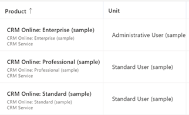

# Customize the Add Products dialog

Customize the Add Products dialog so that salespeople can see important product details while adding products to opportunity, quote, order, or invoice records in Dynamics 365 Sales.

## License and role requirements
| Requirement type | You must have |
|-----------------------|---------|
| **License** | Dynamics 365 Sales Premium, Dynamics 365 Sales Enterprise, or Dynamics 365 Sales Professional  More information: [Dynamics 365 Sales pricing](https://dynamics.microsoft.com/sales/pricing/) |
| **Security roles** | System Administrator   More information: [Predefined security roles for Sales](security-roles-for-sales.md)|

> [!IMPORTANT]
> Customizations described in this topic must be done within a custom solution. For more information see, [Why you shouldn't use the default solutions to manage customizations](/power-platform/alm/use-solutions-for-your-customizations#why-you-shouldnt-use-the-default-solutions-to-manage-customizations)

## What can you customize?

You can customize the following components of the **Add product** dialog to help sellers identify and add products quickly:

- Add more columns to the products grid. More information: [Add or remove columns in the grid](#add-or-remove-columns-in-the-grid)

- Add more attributes to the **Product** column. More information: [Add or edit attributes in the Product column](#add-or-edit-attributes-in-the-product-column)
    > [!NOTE]
    > Attributes in the **Product** column help sellers get more information *before* choosing a product. So, if you want to add a category or product ID to help distinguish products from each other, add it to the **Product** column. On the other hand, if sellers need to perform an action *after* selecting a product&mdash;for example, choosing delivery priority (a custom attribute)&mdash;add that attribute to the grid.
- Customize the fields to search. More information: [Customize the fields to search](#customize-the-fields-to-search)

## Add or remove columns in the grid

By default, the **Add products** dialog displays the following columns in the grid:

- Product name
- Unit
- Price per unit
- Quantity

Depending on the Dynamics 365 Sales license you have, select one of the following tabs for specific information: 

# [Sales Premium and Sales Enterprise](#tab/SEAddColumns)

If you have the Sales Hub app, follow the instructions in this tab. Otherwise, follow the instructions in the **Sales Professional** tab to configure the option in Power Apps.

**To add or remove columns in the grid**

1. In the Sales Hub app, select the **Change area** icon  in the lower-left corner of the page and then select **App Settings**.  

2. Under **Product Catalog**, select **Product Catalog Settings**.  

3. Turn on the **Enhanced experience for adding products** option, if you haven't already.  
    You'll see additional options to customize the Add products dialog for
    opportunity, quote, invoice, and order.  

4. Select the add products view of the entity that you want to customize. For example, select **Quote 'add products' view**  to customize the Add products dialog for quotes.  
    You will be redirected to the corresponding view in Power Apps.

5. Select **View Column** and then select the columns you want to add to the grid. Or, simply drag-and-drop the columns into the grid.

6. To remove a column, select the column in the grid and select **Remove**.

7. Select **Publish** to save and publish the customizations.
    The changes are applicable to the Add products dialog of the selected entity.

8. Open the entity that you've customized. If you customized the add products view for quotes, open a quote and then select **Add products**. Verify whether the customizations to the grid are reflected in the dialog.

# [Sales Professional](#tab/SPAddColumns)

**To add or remove columns in the grid**

1. Sign in to Power Apps and open the view editor. For step-by-step instructions, see [Choose and configure columns in views](/powerapps/maker/model-driven-apps/choose-and-configure-columns#open-the-view-editor).  
1. Select the following tables and views to configure the Add products dialog for opportunity, quote, order, and invoice:
   
    |Table Name  |View Name  |
    |---------|---------|
    |Opportunity Product     |Opportunity products Add Products         |
    |Quote Product     | Quote products Add Products        |
    |Order Product     | Order products Add Products         |
    |Invoice Product     |Invoice products Add Products          |

2. Add or remove columns as per your requirement. For step-by-step instructions, see [Choose and configure columns in views](/powerapps/maker/model-driven-apps/choose-and-configure-columns#add-columns-to-views).
1. Publish the customization.  
     The changes should now be visible in the Add products dialog of the corresponding entity. See, [Find and add multiple products to an opportunity](add-products-enhanced-experience.md)
   
---

## Add or edit attributes in the Product column

By default, the **Product** column in the Add product dialog includes the product name and ID. You can customize this column to add other attributes to help you better distinguish the products. For example, you can add the product category to differentiate products as shown in the following image:

**Note**: The **Product** column can display up to three attributes, apart from the product name.  

Depending on the Dynamics 365 Sales license you have, select one of the following tabs for specific information: 

# [Sales Premium and Sales Enterprise](#tab/SEProductColumns)

If you have the Sales Hub app, follow the instructions in this tab. Otherwise, follow the instructions in the **Sales Professional** tab to configure the option in Power Apps.

**To add or edit product attributes:**

1. In the Sales Hub app, select the **Change area** icon  in the lower-left corner of the page and then select **App Settings**.

2. Under **Product Catalog**, select **Product Catalog Settings**.

3. Turn on **Enhanced experience for adding products**, if you haven't already.
    You'll see additional options for customizing the Add products dialog.

4. Select **Customize Product lookup view.**
    You'll be redirected to the **Product Lookup View** in Power Apps.

5. Select **+ View Column** and then select the attributes you want to add. Or, simply drag-and-drop the attributes into the grid.

6. To remove an attribute, select the attribute in the grid and select **Remove**.

7. Select **Publish** to save and publish the customizations.
    The changes are applicable to the Add products dialog of opportunity, quote, order, and invoice.

7. To verify the changes, open an opportunity and select **Add products**.  
   You will see the updated attributes in the **Product** column.

# [Sales Professional](#tab/SPProductColumns)

**To add or edit product attributes:**

1. Open Power Apps, and select the **Product Lookup View** in the **Product** table.  

1. Add or remove columns as per your requirement. For step-by-step instructions, see [Choose and configure columns in views](/powerapps/maker/model-driven-apps/choose-and-configure-columns#add-columns-to-views).  

1. Save and publish the customization.
     The changes should now be visible in the Product column of the Add products dialog for all entities. See, [Find and add multiple products to an opportunity](add-products-enhanced-experience.md)
--- 

## Customize the fields to search  

By default, the search field in the Add products dialog searches the product name, ID, and description. You can expand the search to include other text-based fields too. For example, you can add the hierarchy path field to the search scope.

**To customize the fields to search:**

1. Open Power Apps and navigate to **Tables** in the left pane.

2. Search for the **Product** entity and open it.

3. Select the **Views** tab and open the **Quick Find All Products** view. 

4. In the right pane, go to the **Find by** section and select **Edit find table columns**. Select the fields you want to include in search.
    > [!NOTE] 
    > Select only the text-based fields.

    >[!div class="mx-imgBorder"]
    >

5. Select **Publish** to save and publish changes to the view.
    The changes are applicable to the product search in the Add products dialog of opportunity, quote, order, and invoice.

6. To verify the changes, open an opportunity and select **Add products**.

7. Search for a keyword and verify whether the search is returning matches from the newly added fields.

[!INCLUDE [cant-find-option](../includes/cant-find-option.md)]

### See also

[Create a solution](/powerapps/maker/data-platform/create-solution)  
[Choose and configure columns in model-driven app views](/powerapps/maker/model-driven-apps/choose-and-configure-columns)  
[Add products to an opportunity by using the enhanced experience](add-products-enhanced-experience.md)  
[Add products to quotes, orders, or invoices](add-products-qoi-enhanced.md)
