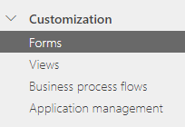

# Customize forms

In Dynamics 365 Sales, forms provide the user interface that people use to interact with the data they need to do their work. It is important that the forms people use are designed to allow them to find or enter the information they need quickly. You can use the form designer to customize the forms included with Dynamics 365 Sales to meet the specific needs of your organization.

> [!IMPORTANT]
> Only customizations done within the app are supported. You should not try to customize your forms outside of the app itself.

## License and role requirements
| Requirement type | You must have |  
|-----------------------|---------|
| **License** | Dynamics 365 Sales Premium, Dynamics 365 Sales Enterprise, or Dynamics 365 Sales Professional  More information: [Dynamics 365 Sales pricing](https://dynamics.microsoft.com/sales/pricing/) |
| **Security roles** | Sales Manager, Sales Professional Manager, or Vice President of Sales    More information: [Predefined security roles for Sales](security-roles-for-sales.md)|

## How do forms relate to entities?

A form is a set of data-entry fields that matches the items your organization tracks for a specific entity. For example, your organization might have fields that track a customer’s previous orders and specific requested reorder dates.

When you publish a customized form, you are publishing an updated version of the entity associated with the form.

## What forms can you customize?

You can customize any of the following forms in Dynamics 365 Sales:

-   Account

-   Contact

-   Invoice

-   Lead

-   Opportunity

-   Quote

## Customize forms

Depending on the license you have, select one of the following tabs for more information:

# [Sales Premium and Sales Enterprise](#tab/SE)

1. Sign in to [Power Apps](https://make.powerapps.com/).

2. Follow the instructions in [Create and customize a model-driven app form](/powerapps/maker/model-driven-apps/create-and-edit-a-model-driven-form?context=/dynamics365/context/sales-context) to create or customize a form.  

# [Sales Professional](#tab/SP)

**To access and customize the forms:**

1.  In the site map, select **Sales Settings**.

2.  Under **Customization**, select **Forms**.

    

    You'll see the list of available forms.

    

    The page displays the date when the form was published, and whether the form is active or not.

4.  To open a form, select the form from the **Name** column. Alternately, you can select a form, and then select **Edit** above the **Quick find** field.

For more information on creating forms, see [Create and design model-driven app forms](/powerapps/maker/model-driven-apps/create-design-forms).

To set a form as the default form in the app, see [Why isn't my form displayed as the default form in the app?](/powerapps/maker/model-driven-apps/create-design-forms#form-display-faq)

---

[!INCLUDE [cant-find-option](../includes/cant-find-option.md)]

### See also

[Customize views](customize-views.md)  
[Customize business process flows](customize-business-process-flows.md)  
[Column-level security to control access](/power-platform/admin/field-level-security)

[!INCLUDE[footer-include](../includes/footer-banner.md)]
