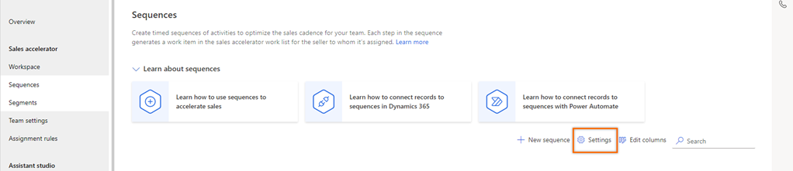
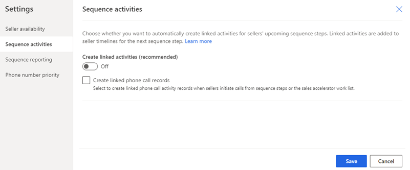
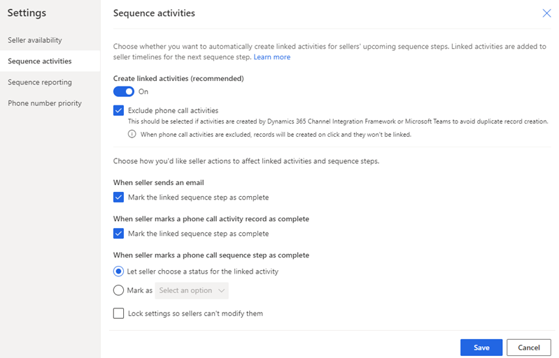
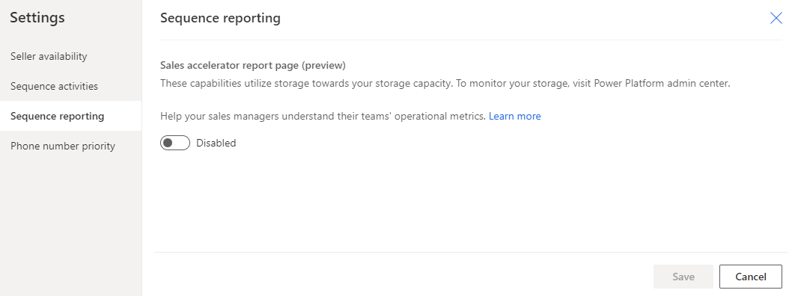
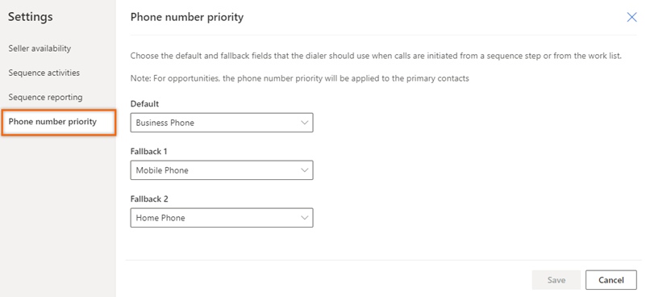

# Configure sales accelerator settings for sellers to personalize

The personalize sales accelerator settings allows sellers determine what happens when you complete an activity. 

## What can you configure?

As an administrator or sequence manager, you can configure sequences by using the following options to allow sellers to customize and personalize their experience:

- [Seller availability](#seller-availability)
- [Sequence activities](#sequence-activities)
- [Sequence reporting](#sequence-reporting)
- [Phone number priority](#phone-number-priority) 

## Seller availability

Configure sellers’ availability to optimize workload by considering only business days and excluding the non-working days for the work list activities. Also, you can select the calendar type to identify the weekdays or work hours for sellers. Further, the wait time step also considers weekends and computes the activity schedule accordingly.    

For example, let’s look at the following scenarios and understand the enhanced calendar and wait time computation work:   
- With the calendar selection, the workflow works as:    
    -    Task 1: Send an introductory email to customer (Wednesday)
    -    Task 2: Follow up with a call after three days (Task will be displayed on the following Monday, which is the subsequent working day).
- With the enhanced calendar and wait time calculation, the workflow works as:
    -    Task 1: Send an introductory email to customer (Wednesday)
    -    Task 2: Follow up with a call after three days (Task will be displayed on the following Tuesday considering that the wait time takes weekends as non-working days).

> [!NOTE]
> Starting from  April 1, 2024, you can't set the seller's availability through Outlook. More information: [Deprecation of setting seller availability using Outlook calendar](deprecations-sales.md#set-seller-availability-using-outlook-calendar)

**Follow these steps:**

1. Sign in to your sales app, and in the lower-left corner of the page, go to **Change area**  > **Sales Insights settings**.    

1. On the site map, under **Sales accelerator**, select **Sequences**.    

1. On the **Sequences** page, select **Settings**.    

    >[!div class="mx-imgBorder"]
    >        

1. On the **Settings** page, select **Seller availability**.      

1.	Turn on the **Seller availability settings** toggle. 

    :::image type="content" source="media/sa-configure-seller-availability-enable.svg" alt-text="Enable Seller availability settings.":::

    Sellers can configure work hours, time off, and non-working hours through the Dynamics 365 calendar in personal settings. To know more on configuring sellers’ work availability, see [Configure your work availability](personalize-sales-accelerator.md#configure-your-work-availability).

1.	Under the **Wait time computation** selection, select **Wait time computation** from which the sequence steps consider seller’s work week and working hours for the activities to be adjusted based on business days.    
    >[!NOTE]
    >If you want the sequence steps to consider all days of the week, don’t select the Wait time computation option. 

    Select the option for wait time activity to skip non-work hours and move it to the following working day.
    For example, a seller configures weekends as non-working hours, and the wait time activity falls on a Saturday. With the Wait time computation option enabled, the wait time activity scheduled Saturday (non-working hours) will be moved to the following working day (Monday) and subsequently, other activities are moved in the order they're defined. 
    When selected, the Wait time computation option is enabled for all sequences. However, if you want to disable the Wait time computation option for a sequence, do the following steps:   

    1.	Open the sequence.
    1.	On the sequence page, select **Options**.

        >[!NOTE]
        >Deactivate the sequence before you edit the options.

    1.	On the **Sequence options** pane, under the **Wait time computation** section, clear the check box for **Skip non-working days**. 

        >[!div class="mx-imgBorder"]
        > 

1. Select **Save**.

## Sequence activities

Configure the linking of sequence steps and activities to automatically create linked activities for sellers' upcoming sequence steps. Linked activities are added to seller timelines for the next sequence step.

Follow these steps:

1. Sign in to your sales app, and in the lower-left corner of the page, go to **Change area**  > **Sales Insights settings**.    

2. On the site map under **Sales accelerator**, select **Sequence**.    

3. On the **Sequences** page, select **Settings**.    

    >[!div class="mx-imgBorder"]
    >        

4. On the **Settings** page, select **Sequence activities**.      

    >[!div class="mx-imgBorder"]
    >  

5. Turn on the **Create linked activities** toggle.

    Select the **Exclude phone call activities** checkbox to avoid creating a duplicate phone call activity when you're using Dynamics 365 Channel Integration Framework as your phone system. If you don't select this option, a duplicate phone call activity is created on the timeline and a duplicate activity is created when the step is waiting to be completed on the record.

    >[!div class="mx-imgBorder"]
    >

    >[!NOTE]
    >When turned off, activities will not be created automatically. However, activities are created on the timeline only when sellers select the activity in the **Up next** widget.   
 
6. Configure activities and steps. You can choose how the actions that sellers perform on steps affect linked activities and sequence steps.

    | Action | Description |
    |--------|-------------|
    | When a seller completes any activity(other than a phone call), the linked step also gets completed. | When you select this checkbox and sellers complete the activity through the timeline, the sequence step that's related to this activity is automatically marked as complete.|
    | When a seller completes a phone call, the linked step also gets completed. | When you select this checkbox and sellers make a phone call through the timeline, the sequence step that's related to this activity is automatically marked as complete. |
    | When seller marks a phone call sequence step as complete | When sellers complete a phone call activity in the sequence step, you can choose to let sellers enter the status of the activity or enter a default value that has been defined for your organization. |
    
    >[!NOTE]
    >Select the **Lock settings so sellers can't modify them** checkbox to prevent sellers from updating the sequence activities configuration.

7. Select **Save**.

## Sequence reporting 

Enable sales accelerator reports to help your sales manager view and understand their team's historical operational metrics, key performance indicators (KPIs), and sequence stats page.   

Follow these steps:

1. Sign in to your sales app, and in the lower-left corner of the page, go to **Change area**  > **Sales Insights settings**.    

2. On the site map under **Sales accelerator**, select **Sequence**.    

3. On the **Sequences** page, select **Settings**.    

    >[!div class="mx-imgBorder"]
    >        

4. On the **Settings** page, select **Sequence reporting**.

    >[!div class="mx-imgBorder"]
    >        

5. Turn on the toggle.   

6. In the confirmation message, select **Enable**. 

By default, users with sales manager and sequence manager roles can view the reports. To grant view access to other roles, provide read access at the organizational level for the sales acceleration reports table. More information: [Security roles and privileges](/power-platform/admin/security-roles-privileges)

>[!NOTE]
>After you enable the option, the application might take up to 24 hours to display the data in the reports. Subsequently, the reports will be refreshed every 24 hours. You can view the last updated date in the upper-right corner of the sales acceleration report page.

To know how sales managers use: 

-	Metrics and KPIs, go to [Understand sales acceleration reporting](understand-sales-acceleration-reporting.md).
-	Sequence stats, go to [Understand sequence stats](understand-sequence-stats.md).

## Phone number priority

When a phone system is configured in your organization, sellers can make calls directly through the sales accelerator feature. Under **Phone number priority**, select the phone numbers for **Default**, **Fallback1**, and **Fallback2**. When sellers initiate calls through a sequence step or the work list, the softphone chooses the phone numbers in the order they're listed.

For example, you can select **Business Phone** in **Default**, **Mobile Phone** in **Fallback1**, and **Home Phone** in **Fallback2**. When sellers initiate a call, the number in the **Default** option is dialed if it's available. If it isn't available, the call goes to the next option.

Follow these steps:

1. Sign in to your sales app, and in the lower-left corner of the page, go to **Change area**  > **Sales Insights settings**.    

2. On the site map under **Sales accelerator**, select **Sequence**.    

3. On the **Sequences** page, select **Settings**.    

    >[!div class="mx-imgBorder"]
    >        

4. On the **Settings** page, select **Phone number priority**.      
    
    >[!div class="mx-imgBorder"]
    >      

5. Select phone number options for **Default**, **Fallback1**, and **Fallback2**.

6. Select **Save**.

>[!NOTE]
>For opportunities, the phone number priority will be applied to the primary contacts.

[!INCLUDE[cant-find-option](../includes/cant-find-option.md)] 

## Related information

[Personalize sales accelerator](personalize-sales-accelerator.md)

[!INCLUDE[footer-include](../includes/footer-banner.md)]

