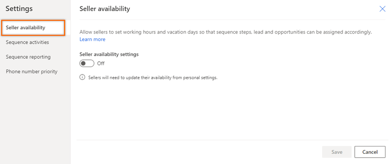
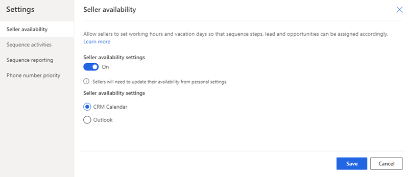

# Configure sales accelerator settings for sellers to personalize

The personalize sales accelerator settings allows sellers determine what happens when you complete an activity. 

## License and role requirements

| &nbsp; | &nbsp; |
|-----------------------|---------|
| **License** | Dynamics 365 Sales Premium or Dynamics 365 Sales Enterprise More information: [Dynamics 365 Sales pricing](https://dynamics.microsoft.com/sales/pricing/) |
| **Security roles** | System Administrator    More information: [Predefined security roles for Sales](security-roles-for-sales.md)|
|||

## What can you configure?

As an administrator or sequence manager, you can configure and personalize the sequences through following options to further allow sellers customize their experience:

- [Seller availability](#seller-availability)
- [Sequence activities](#sequence-activities)
- [Sequence reporting](#enable-sales-accelerator-reports)
- [Phone number priority](#phone-number-priority) 

## Seller availability

Configure the seller availability options to allow sellers to set working hours and vacation days so that sequence steps, lead and opportunities can be assigned accordingly.

Follow these steps:

1. Sign in to your sales app, and in the lower-left corner of the page, go to **Change area** > **Sales Insights settings**.    
2. On the site map, under **Sales accelerator**, select **Sequence**.    
3. On the **Sequences** page, select **Settings**.    

    >[!div class="mx-imgBorder"]
    >        

4. On the **Settings** page, select **Seller availability**.      

    >[!div class="mx-imgBorder"]
    >   

5. Configure the following options: 
    - Select the **Seller availability settings**  toggle to enable the option that allows sellers to configure the working hours.
    - From the **Select a calendar** option, choose a calendar type from which the sellers can configure the work hours vacation days so that leads and opportunities are assigned based on their availability. 
        - **CRM calendar**: To allow sellers configure the work hours and vacation days through the Dynamics 365 calendar in personal settings. By default, this option is selected. More information [Configure your work availability](personalize-sales-accelerator.md#configure-your-work-availability). 
        - **Outlook**: To allow sellers configure the work hours and vacation days through the Outlook calendar. Before you select this option, verify that the [server-side synchronization of email, appointments, contacts, and tasks](/power-platform/admin/set-up-server-side-synchronization-of-email-appointments-contacts-and-tasks?context=/dynamics365/context/sales-context) is configured for your organization.

    >[!div class="mx-imgBorder"]
    >   

6. Select **Save**.

## Sequence activities

Configure the linking of sequence steps and activities to automatically create linked activities for sellers' upcoming sequence steps. Linked activities are added to seller timelines for the next sequence step.

Follow these steps:

1. Sign in to your sales app, and in the lower-left corner of the page, go to **Change area** > **Sales Insights settings**.    
2. On the site map, under **Sales accelerator**, select **Sequence**.    
3. On the **Sequences** page, select **Settings**.    

    >[!div class="mx-imgBorder"]
    >        

4. On the **Settings** page, select **Sequence activities**.      

    >[!div class="mx-imgBorder"]
    >   

5. Turn on the toggle to create linked activities.   
        
    Select the **Exclude phone call activities** check box to avoid creating a duplicate phone call activity when you're using Dynamics 365 Channel Integration Framework as your phone system. If you don't select this option, a duplicate phone call activity will be created on the timeline and a duplicate activity will be created when the step is waiting to be completed on the record.    

    >[!div class="mx-imgBorder"]
    >     
 
6. Configure the activities and steps, you can choose how the actions that sellers perform on steps will affect the linked activities and sequence steps.
    
    | Action | Description |
    |--------|-------------|
    | When seller sends an email | When you select this check box and sellers send an email through the timeline, the sequence step that's related to this activity is automatically marked as complete.|
    | When seller marks a phone call activity record as complete | When you select this checkbox and make a phone call through the timeline, the sequence step that's related to this activity is automatically marked as complete. |
    | When seller marks a phone call sequence step as complete | When sellers complete a phone call activity in the sequence step, you can choose to enter the status of the activity or enter a default value that has been defined for your organization. |
    
    >[!NOTE]
    >Select the **Lock settings so sellers can't modify them** check box to not to let sellers update the sequence activities configurations.

7. Select **Save**.

## Sequence reporting 

[!INCLUDE [cc-beta-prerelease-disclaimer](../includes/cc-beta-prerelease-disclaimer.md)]

Enable the sales accelerator reports to help your sales manager view and understand their team's historical operational metrics, key performance indicators (KPIs), and sequence stats page.   

Follow these steps:

1. Sign in to your sales app, and in the lower-left corner of the page, go to **Change area** > **Sales Insights settings**.    
2. On the site map, under **Sales accelerator**, select **Sequence**.    
3. On the **Sequences** page, select **Settings**.    

    >[!div class="mx-imgBorder"]
    >        

4. On the **Settings** page, select **Sequence reporting**.      

    >[!div class="mx-imgBorder"]
    >        

5. Turn on the toggle.   
6. On the confirmation message, select **Enable**. 

The reports are enabled. By default, the users with sales manager and sequence manager roles can view the reports. To grant view access to other roles, provide read access at the organizational level for the sales acceleration reports table. More information: [Security roles and privileges](/power-platform/admin/security-roles-privileges)

>[!NOTE]
>After you enable the option, the application might take up to 24 hours to display the data in the reports. Subsequently, the reports are refreshed every 24 hours. You can view the last updated date in the upper-right corner of the sales acceleration reporting page.

To know how sales managers use,   
-	Metrics and KPIs, go to [Understand sales acceleration reporting](understand-sales-acceleration-reporting.md).
-	Sequence stats, go to [Understand sequence stats](understand-sequence-stats.md).

## Phone number priority

When a phone system is configured in your organization, sellers can make calls directly through the sales accelerator feature. Under Phone number priority, select the phone numbers for **Default**, **Fallback1**, and **Fallback2**. When sellers initiate calls through a sequence step or the work list, the softphone chooses the phone numbers in the order they're listed.
For example, you can select **Business Phone** in **Default**, **Mobile Phone** in **Fallback1**, and **Home Phone** in **Fallback2**. When sellers initiate a call, the number in the **Default** option is dialed, if it's available. If it isn't available, the call goes to the next option.

Follow these steps:

1. Sign in to your sales app, and in the lower-left corner of the page, go to **Change area** > **Sales Insights settings**.    
2. On the site map, under **Sales accelerator**, select **Sequence**.    
3. On the **Sequences** page, select **Settings**.    

    >[!div class="mx-imgBorder"]
    >        

4. On the **Settings** page, select **Phone number priority**.      
    
    >[!div class="mx-imgBorder"]
    >      

5. Select phone number options for **Default**, **Fallback1**, and **Fallback2**.
6. Select **Save**.

>[!NOTE]
>For opportunities, the phone number priority will be applied to the primary contacts.

[!INCLUDE[cant-find-option](../includes/cant-find-option.md)] 

### See also

[Personalize sales accelerator](personalize-sales-accelerator.md)

[!INCLUDE[footer-include](../includes/footer-banner.md)]

