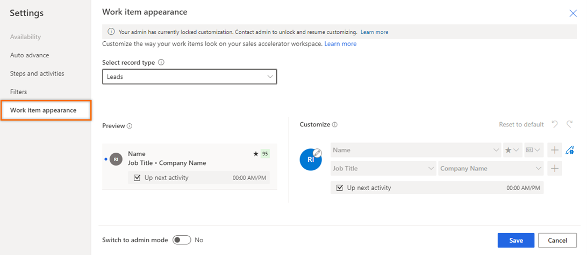
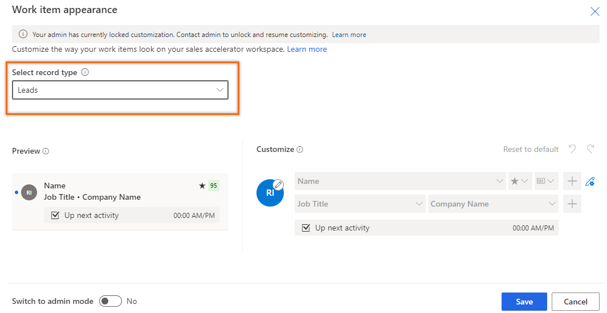
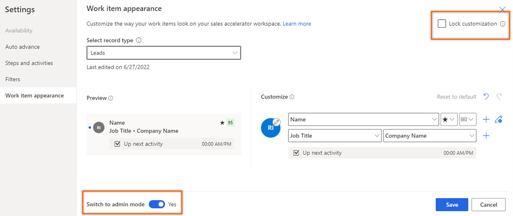
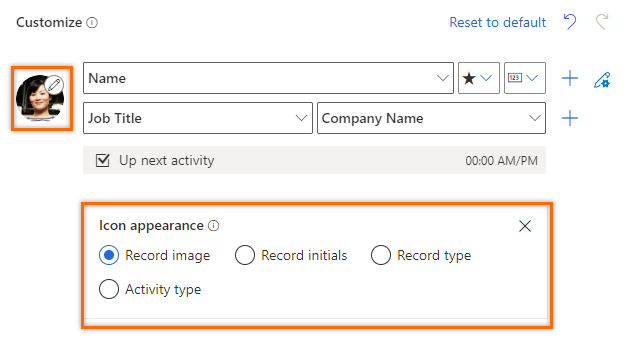
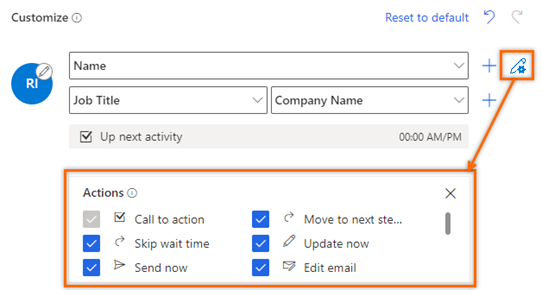

# Customize work list cards

Customize work list cards for different entity types to get contextual information on the work list in sales accelerator.

[!INCLUDE[cc-early-access](../includes/cc-early-access.md)] 

## License and role requirements

| Requirement type | You must have |  
|-----------------------|---------|
| **License** | Dynamics 365 Sales Premium, Microsoft Relationship Sales, or Dynamics 365 Sales Enterprise   More information: [Dynamics 365 Sales pricing](https://dynamics.microsoft.com/sales/pricing/) |
| **Security roles** | Any primary sales role, such as salesperson or sales manager   More information: [Primary sales roles](security-roles-for-sales.md#primary-sales-roles)|

## Who can customize work list cards?  

To efficiently achieve a task, sellers need relevant information for different entities that are displayed on the work list card. Customization of work list cards provides the capability to display the most relevant and important information in the work list cards. Depending on your business requirements, each entity type can have different information displayed on the work list card.   

According to your role, you can customize work list cards as described below:    
-	As an administrator, you can customize the work list cards for yourself and for your organization. Also. you can allow sellers to override the customization that you’ve made.
-	Other sales primary roles, you can customize the work list cards for yourself, and the changes won't affect the work list cards of other sellers. 

## Customize the work list card

In this example, let’s customize the Lead work list card.

1. Sign in to the Dynamics 365 Sales Hub app, and go to **Change area**  > **Sales**.

2. From the site map, under **My Work**, select **Sales accelerator**.    

3.	On the work list page, go to search area and select **More options** > **Settings**.

    >[!div class="mx-imgBorder"]
    >     

4.	On the **Settings** page, select **Work item appearance**. 

    >[!div class="mx-imgBorder"]
    >     

5.	From the Select record type list, choose the record type. In this example, the Leads record type is chosen. 
 
    >[!div class="mx-imgBorder"]
    >     

    Let’s understand the configuration page in detail:
    
    | Section | Description |
    |---------|-------------|
    | Preview | You can view how the customized card will look in the work list. |
    | Customization | You can customize the work list card. More information: [Customize the card](#customize-the-card).  |
    | Switch to admin mode | Turn on the toggle to customize the cards. In this example, you observe that the customizations are disabled.  An administrator must enable the **Lead** record type to edit. The customizations you make here are available for the entire organization. |
    | Lock customization | Clear the selection to let sellers in the organization to further change the customization you make to suit their needs. When selected, customizations are locked, and sellers can’t customize the work items further. This option is displayed only when the **Switch to admin mode** option is turned on. |

    >[!div class="mx-imgBorder"]
    >     

6.	Customize the card.      
    
    - **Work item icon**: Select the edit icon and then choose one of the following options:   
        
        | Option | Description |
        |--------|-------------|
        | Record image | Displays the photo of the contact. |
        | Record initials | Displays the initials of the contact’s first and last name. For example, **Kenny Smith** is displayed as **KS**. |
        | Record type | Displays the icon of the record type. For example, lead record displays the lead icon. |
        | Activity type | Displays the current activity icon of the record. For example, for a lead record, the current activity is to make a phone call, the icon is displayed as phone. |   
        
        >[!div class="mx-imgBorder"]
        >  
        
    - **Work list card content**: Select the attributes from the list on the field to display the content. For example, for an account record type you want to display name on the top line. Select the attribute Name from the list on the field. You can perform the following action to configure:   
         
        | Action | Description |
        |--------|-------------|
        | Add a field in a row | Hover over the field and then select **More options** > **Add a field**. You can have up to three fields in a row. |
        | Add an icon in a row | Hover over the field and then select **More options** > **Add an icon**. You can have up to three icons in a row. |
        | Add a row to the card | Select the add icon (+) corresponding to a row. You can’t add more than four rows to a card.|
        | Display action for the card | Select the gear icon () and then choose the action that you want to display for the work list item. The actions selected here are displayed when the More options icon is selected on the work list item according to the activity.  |
        | Delete a field or icon | Hover over the field or icon and then select **More options** > **Remove**. |
        | Reset to default configuration | Select **Reset to default** to reset the work list card to the default configurations. |
        
7. Select **Save**.     
The work list card is customized.

[!INCLUDE[cant-find-option](../includes/cant-find-option.md)] 

### See also

[Prioritize your sales pipeline by using the work list](prioritize-sales-pipeline-through-work-list.md)   

