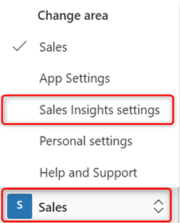
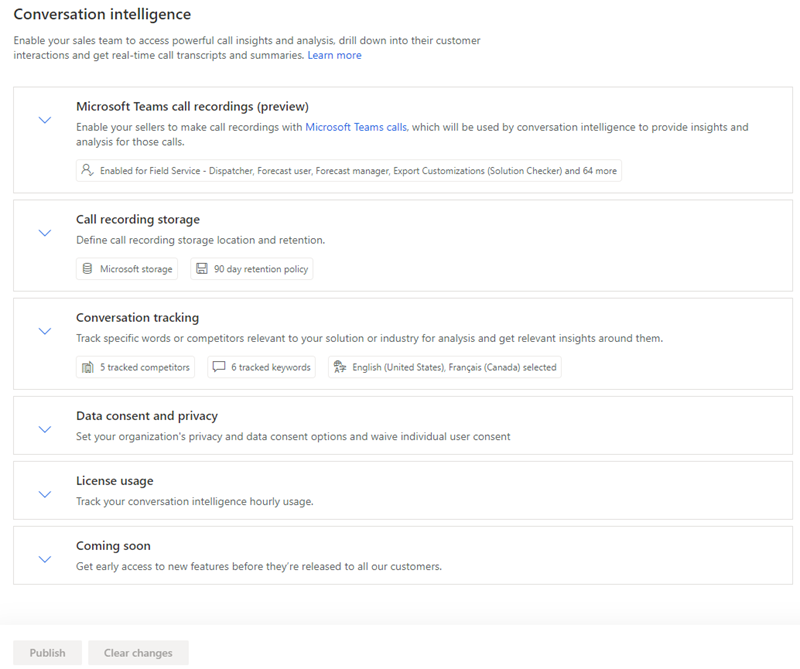

# Data retention and deletion policy for conversation intelligence (Sales app)

When you configure conversation intelligence, sales call recordings of sellers are processed and analyzed to provide necessary insights such as overall customer sentiments, sentiment trends, and identify keywords that customers have used during calls. 

## License and role requirements

| Requirement type | You must have |  
|-----------------------|---------|
| **License** | Dynamics 365 Sales Premium or Dynamics 365 Sales Enterprise  More information: [Dynamics 365 Sales pricing](https://dynamics.microsoft.com/sales/pricing/) |
| **Security roles** | System Administrator    More information: [Predefined security roles for Sales](security-roles-for-sales.md)|

## Configure Call recording storage, Data consent and privacy

1.    Review the prerequisites. To learn more, see [Prerequisites to configure conversation intelligence](prereq-sales-insights-app.md).   
2. Go to **Change area** in the lower-left corner of the page and select **Sales Insights settings**.  
    > [!div class="mx-imgBorder"]
    >   
3.    In the configuration page, under **Productivity**, select **Conversation intelligence**.  

        > [!div class="mx-imgBorder"]
        > 
1.    On the **Settings** page, select the sections as required:    
    - Select the **Call recording storage** section to configure [data retention policy](#call-recording-storage) for your organization.
    - Select the **Data consent and privacy** section to configure [data consent and privacy](#data-consent-and-privacy) for your organization.  
    
### Call recording storage

The **Call recording storage** section allows you to configure the data retention policy to determine how long you want to keep the analyzed call recording data in conversation intelligence by specifying a time limit. When you specify a retention time limit, the application keeps the call recording data for the specified time limit. The application deletes the data when the time limit is reached.   
For example, retention time limit is set 30 days. At any given time, application keeps the call data from the time it's analyzed to 30 days. On the 31st day, the application deletes the analyzed call data.   
Choose the storage option as described in the following table:     

| Option | Description |
|--------|-------------|
| Storage for call recordings | Select an option to store your call recordings for analysis: <ul><li>**Microsoft provided storage**: Select this option if you want to use the storage provided by Microsoft. By default, this option is selected, and we recommend that you use this storage.</li><li>**Your own Azure storage**: Select this option if you want to use your custom Azure storage. After you select this option, enter the **Storage connection string** and **Container name**.</li></ul> |
| Retention policy | Choose a retention time limit. The application keeps call recording data for the specified time limit, and deletes it when the time limit is reached. <li> For **Microsoft provided storage**, the available retention periods are 30 days and 90 days. </li> <li> For **Your own Azure storage**, the retention period is available from 30 days until 10 years. Use this storage type if your organization requires longer retention periods. | 

> [!div class="mx-imgBorder"]
> 

### Data consent and privacy

- **Waive individual user consent**: Select this option to automatically provide your organization's users with access to conversation intelligence. You provide consent on behalf of your organization's users of Microsoft Dynamics 365 online services to activate, configure, and enable functionality that transmits your data to external systems.    
- **Allow read-only access to data**: Select this option to allow Microsoft to improve the quality of insights through manual (human) read-only access to your organization's data in conversation intelligence. More information: [Terms and Conditions](https://go.microsoft.com/fwlink/?linkid=521839). 

    > [!div class="mx-imgBorder"]
    > 

[Learn more about Microsoft Dynamics 365 and data privacy](/dynamics365/get-started/privacy).

>[!IMPORTANT]
>This feature is intended to help sales managers or supervisors enhance their team's performance. This feature is not intended for use in making, and should not be used to make, decisions that affect the employment of an employee or group of employees, including compensation, rewards, seniority, or other rights or entitlements. Customers are solely responsible for using Dynamics 365, this feature, and any associated feature or service in compliance with all applicable laws, including laws relating to accessing individual employee analytics and monitoring, recording, and storing communications with end users. This also includes adequately notifying end users that their communications with sales persons may be monitored, recorded, or stored and, as required by applicable laws, obtaining consent from end users before using the feature with them. Customers are also encouraged to have a mechanism in place to inform their sales persons that their communications with end users may be monitored, recorded, or stored.

[!INCLUDE[cant-find-option](../includes/cant-find-option.md)] 

### See also

[Introduction to administer conversation intelligence](intro-admin-guide-sales-insights.md#administer-conversation-intelligence)  
[Prerequisites to use conversation intelligence](prereq-sales-insights-app.md)  
[Dynamics 365 Sales and privacy laws and regulations](dynamics-365-sales-privacy.md)  
[Sales Insights and privacy laws](embedded-intelligence-privacy.md)  

[!INCLUDE[footer-include](../includes/footer-banner.md)]
