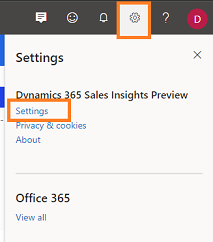

# Data retention and deletion policy in conversation intelligence

When you configure conversation intelligence, sales call recordings of sellers are processed and analyzed to provide necessary insights such as overall customer sentiments, sentiment trends, and identify keywords that customers have used during calls.

## License and role requirements

| Requirement type | You must have |
|-----------------------|---------|
| **License** | Dynamics 365 Sales Premium or Dynamics 365 Sales Enterprise  More information: [Dynamics 365 Sales pricing](https://dynamics.microsoft.com/sales/pricing/) |
| **Security roles** | System Administrator    More information: [Predefined security roles for Sales](security-roles-for-sales.md)|

## Configure data retention and access

1.    Review the prerequisites. To learn more, see [Prerequisites to configure conversation intelligence](prereq-sales-insights-app.md).

2. Sign in to the [Conversation intelligence app](https://sales.ai.dynamics.com/).
  
3.    Select the **Settings** icon on the top-right of the page and then select **Settings**.  
    > [!div class="mx-imgBorder"]
    >   
4.    On the **Settings** page, select **Privacy**.  
5.    In the Privacy page, configure the following options as required:  
    - **Read-only access to data**: Select this option to allow Microsoft to improve the quality of insights through manual (human) read-only access to your organization's data in conversation intelligence.
    - **Delete contact's data**: Use this option to delete a contact's data by using the contact ID provided in Dynamics 365. Enter the contact ID in the text box and then select **Delete data**. 
    - **Retention policy**: Choose a retention time limit. The application keeps call recording data for the specified time limit, and deletes it when the time limit is reached. The retention period is available from 30 days until 10 years.
    
    > [!div class="mx-imgBorder"]
    >   

5. Select **Save**.

[Learn more about Microsoft Dynamics 365 and data privacy](/dynamics365/get-started/privacy).

>[!IMPORTANT]
>This feature is intended to help sales managers or supervisors enhance their team's performance. This feature is not intended for use in making, and should not be used to make, decisions that affect the employment of an employee or group of employees, including compensation, rewards, seniority, or other rights or entitlements. Customers are solely responsible for using Dynamics 365, this feature, and any associated feature or service in compliance with all applicable laws, including laws relating to accessing individual employee analytics and monitoring, recording, and storing communications with end users. This also includes adequately notifying end users that their communications with sales persons may be monitored, recorded, or stored and, as required by applicable laws, obtaining consent from end users before using the feature with them. Customers are also encouraged to have a mechanism in place to inform their sales persons that their communications with end users may be monitored, recorded, or stored.

[!INCLUDE[cant-find-option](../includes/cant-find-option.md)] 

### See also

[Introduction to administer conversation intelligence](intro-admin-guide-sales-insights.md#administer-conversation-intelligence)  
[Prerequisites to use conversation intelligence](prereq-sales-insights-app.md)  
[Dynamics 365 Sales and privacy laws and regulations](dynamics-365-sales-privacy.md)  
[Sales Insights and privacy laws](embedded-intelligence-privacy.md)  

[!INCLUDE[footer-include](../includes/footer-banner.md)]
