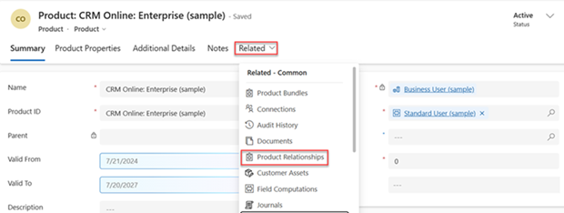
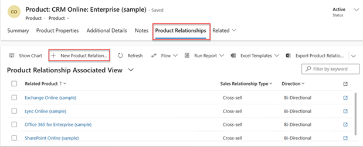

# Define related products to increase sales 

Improve your opportunities to increase sales by adding related products as suggestions for up-sell, cross-sell, accessories, or substitutes in Dynamics 365 Sales.

## License and role requirements
| Requirement type | You must have |  
|-----------------------|---------|
| **License** | Dynamics 365 Sales Premium, Dynamics 365 Sales Enterprise, or Dynamics 365 Sales Professional  More information: [Dynamics 365 Sales pricing](https://dynamics.microsoft.com/sales/pricing/) |
| **Security roles** | Sales Manager, Sales Professional Manager, or Vice President of Sales   More information: [Predefined security roles for Sales](security-roles-for-sales.md)|

## What are related products?

A related product could be an accessory, cross-sell, substitute, or up-sell. For example, for a [!INCLUDE[pn_microsoft_surface](../includes/pn-microsoft-surface.md)] Pro product, you can add [!INCLUDE[pn_microsoft_surface](../includes/pn-microsoft-surface.md)] Book as an up-sell product so that when your sales agent is adding [!INCLUDE[pn_microsoft_surface](../includes/pn-microsoft-surface.md)] Pro to any opportunity, quote, order, or invoice,  [!INCLUDE[pn_microsoft_surface](../includes/pn-microsoft-surface.md)] is suggested as the up-sell option.  

 The related products are displayed as suggestions to your sales agents during opportunity or order management. These suggestions help your sales agents recommend related products and bundles/kits to the customers, and increase product sales.

> [!NOTE]
> You can add related products to a product or product bundle, but not to product families.  
  
  
## Add related products (Sales Hub)

1. Depending on the sales app that you're using, do one of the following:
 
    -  If you're using the Sales Hub app, 
        1. Select **Change area**  at the lower-left corner of the site map, and then select **App Settings**. 
        1. In the **Product Catalog** area, select **Families and Products**. 
   - If you're using the Sales Professional app,
       - Select **Products** from the site map.  
  
3. Open a product you want to define related products for. The product must be in the **Draft**, **Active** or **Under Revision** state. 

4. Select the **Related** tab, and then select **Product Relationships**.

    > [!div class="mx-imgBorder"]
    > 

    On the **Product Relationships** tab, you’ll see the list of products if the product has existing related products.

5. Select **New Product Relationship**. 
 
    > [!div class="mx-imgBorder"]
    > 

6. In the **New Product Relationship** form, enter the following details: 

   - **Related Product**. Select a product that you want to add as a related product to the existing product record you're working on. 
    
   - **Sales Relation Type**. Select whether you want to add the product as an up-sell, cross-sell, accessory, or substitute product. 
    
   - **Direction**. Select whether the relationship between the products will be uni-directional or bi-directional. When you select Uni-Directional, the product that you select in Related Product will be shown as a recommendation for the existing product but not vice-versa. 

7. Select **Save** or **Save & Close**. 

> [!NOTE]
> 
> Currently, product suggestions are not supported in the Sales Hub app. 

  
## Typical next steps  
  [Publish a product or bundle to make it available for selling](publish-product-bundle-make-available-selling.md)  
  
  [Set up a product catalog: Walkthrough](set-up-product-catalog-walkthrough.md)  

[!INCLUDE [cant-find-option](../includes/cant-find-option.md)]

### See also  
 [Create a product family](create-product-family.md)

[!INCLUDE[footer-include](../includes/footer-banner.md)]
