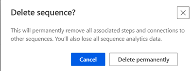

# Delete a sequence 

You can delete sequences that your organization no longer needs, and they'll be deleted permanently from the app. You can delete active or inactive sequences. When you delete an active sequence, the records that were connected with the sequence will be disconnected from it.

## License and role requirements
| Requirement type | You must have |  
|-----------------------|---------|
| **License** | Dynamics 365 Sales Enterprise, Dynamics 365 Sales Premium, or [Microsoft Relationship Sales](https://dynamics.microsoft.com/en-in/sales/relationship-sales/)  More information: [Dynamics 365 Sales pricing](https://dynamics.microsoft.com/sales/pricing/) |
| **Security roles** | System Administrator or Sequence Manager    More information: [Predefined security roles for Sales](security-roles-for-sales.md)|

## To delete a sequence

1. Sign in to your sales app.   
2. Go to **Change area** in the lower-left corner of the page and select **Sales Insights settings**.   
3. Under **Sales accelerator**, select **Sequences**.        
4. On the **Sequences** page, hover over the sequence you want to delete, and then select **More options** > **Delete**.  
1. In the confirmation message that appears, select **Delete permanently**.      
    
    >[!NOTE]
    >If you are deleting a sequence that is the active state, a confirmation message is displayed that the sequence will be deactivated and deleted. Select **Deactivate and delete**.
    
    > [!div class="mx-imgBorder"]
    > 

[!INCLUDE[cant-find-option](../includes/cant-find-option.md)] 

### See also

[Sequences](create-manage-sequences.md)     
[Create and activate a sequence](create-and-activate-a-sequence.md)

[!INCLUDE[footer-include](../includes/footer-banner.md)]
