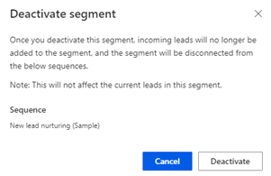
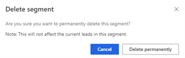

# Delete or deactivate segments 

You can deactivate or delete a segment that's no longer required in your organization. Deactivation retains the segment in the application, the records that were already connected to it remain connected but future records will not be connected to it. When a segment is deleted, segment records that are already connected to a sequence won't be affected. 

## License and role requirements
| Requirement type | You must have |
|-----------------------|---------|
| **License** | Dynamics 365 Sales Premium or Dynamics 365 Sales Enterprise More information: [Dynamics 365 Sales pricing](https://dynamics.microsoft.com/sales/pricing/) |
| **Security roles** | System Administrator or Sequence Manager    More information: [Predefined security roles for Sales](security-roles-for-sales.md)|

## To delete or deactivate a segment 

1.	Sign in to your Dynamics 365 Sales Hub app.
2.	Go to **Change area** in the lower-left corner of the page, and select **Sales Insights settings**.
3.	Under **Sales accelerator**, select **Segments**.

4. On the **Segments** page, choose a record type from the **Record type** list.

    The **Segments** page opens with the list of available segments for the selected record type.   

    :::image type="content" source="media/sa-segment-edit-list-lead-segments.png" alt-text="Screenshot of segment page with a list of segments for the selected record type."::: 

4.	Hover over the segment, select **More options**, and then do one of the following:

    -	Select **Deactivate**, and in the confirmation message that appears, select **Deactivate**.

        >[!NOTE]
        >If there are any sequences attached to the segment, the names of the sequences are displayed in the message.

        >[!div class="mx-imgBorder"]
        >

        The segment is deactivated in the application.

    -	Select **Delete**, and in the confirmation message that appears, select **Delete permanently**.

        >[!NOTE]
        >If there are any sequences attached to the segment, the names of the sequences are displayed in the message.

        >[!div class="mx-imgBorder"]
        >

        The segment is removed permanently from the application.

[!INCLUDE[cant-find-option](../includes/cant-find-option.md)] 

### See also

[Create and activate a segment](create-and-activate-a-segment.md)   

[!INCLUDE[footer-include](../includes/footer-banner.md)]

