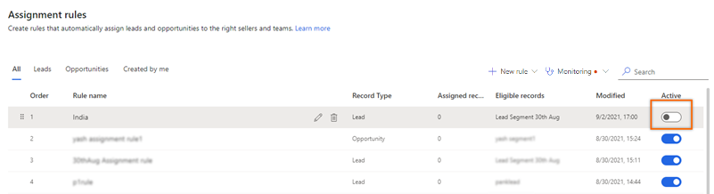
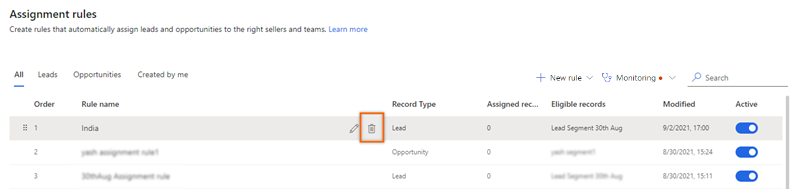

# Delete or deactivate assignment rules 

You can deactivate or delete an assignment rule that's no longer required in your organization. Deactivation keeps the rule, but it won't be used to assign leads to any sellers in the future. Deleting the rule removes it from the application, but leads that were already assigned to sellers through the rule won't be affected. 

## License and role requirements
| Requirement type | You must have |
|-----------------------|---------|
| **License** | Dynamics 365 Sales Premium or Dynamics 365 Sales Enterprise  More information: [Dynamics 365 Sales pricing](https://dynamics.microsoft.com/sales/pricing/) |
| **Security roles** | System Administrator or Sequence Manager    More information: [Predefined security roles for Sales](security-roles-for-sales.md)|

## To delete or deactivate an assignment rule   

>[!NOTE]
>In this procedure, we are using lead as an example to delete or deactivate an assignment rule. Similarly, you can use this procedure to delete or deactivate opportunity assignment rule. 

1.	Sign in to your Dynamics 365 Sales Hub app.    
2.	Go to **Change area** in the lower-left corner of the page, and select **Sales Insights settings**.   
3. Under **Sales accelerator**, select **Assignment rules**.    
4.	On the **Assignment rules** page, in the **Rules** tab, select the rule and do one of the following:   
    -	To deactivate the rule, turn off the toggle in the **Active** column.    

        >[!div class="mx-imgBorder"]
        >

    -	To delete the rule, select the rule and then select the delete icon.    

        >[!div class="mx-imgBorder"]
        >    

        In the confirmation message that appears, select **Delete permanently**.    

        >[!div class="mx-imgBorder"]
        >

[!INCLUDE[cant-find-option](../includes/cant-find-option.md)] 

### See also

[Manage assignment rules](create-manage-assignment-rules.md)    
[Create and activate an assignment rule](create-and-activate-assignment-rule.md)

[!INCLUDE[footer-include](../includes/footer-banner.md)]
