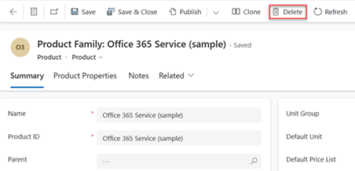
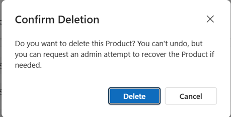

# Delete a family, product, or bundle (Sales Hub) 

To stop selling a product, bundle, or family, delete it. If you delete a parent family, its child products, families, and bundles are also deleted.

> [!IMPORTANT]
>  You can't restore a deleted product record. If you don't want to delete a product record but want to temporarily remove it from the catalog, then [retire the product record](retire-product.md).

## License and role requirements

| Requirement type | You must have |  
|-----------------------|---------|
| **License** | Dynamics 365 Sales Premium, Dynamics 365 Sales Enterprise, or Dynamics 365 Sales Professional   More information: [Dynamics 365 Sales pricing](https://dynamics.microsoft.com/sales/pricing/) |
| **Security roles** | Sales Manager, Sales Professional Manager, or Vice President of Sales   More information: [Predefined security roles for Sales](security-roles-for-sales.md)|

## Delete a product record

1. Depending on the sales app that you're using, do one of the following:
 
    -  If you're using the Sales Hub app, 
        1. Select **Change area**  at the lower-left corner of the site map, and then select **App Settings**. 
        1. In the **Product Catalog** area, select **Families and Products**. 
   - If you're using the Sales Professional app,
       - Select **Products** from the site map.  
  
3. Select a product family, product, or bundle record you want to delete, and on the command bar, select **Delete**.  

   > [!div class="mx-imgBorder"]
   > 

4. In the **Confirm Deletion** dialog box, select **Delete**.

   
   
>[!NOTE]
>Products or bundles can't be deleted if they are associated with an existing quote, order, or invoice.  

[!INCLUDE [cant-find-option](../includes/cant-find-option.md)]

### See also  
 [Set up a product catalog: Walkthrough](../sales-enterprise/set-up-product-catalog-walkthrough.md)   
 [Create a product family](../sales-enterprise/create-product-family.md)

[!INCLUDE[footer-include](../includes/footer-banner.md)]
