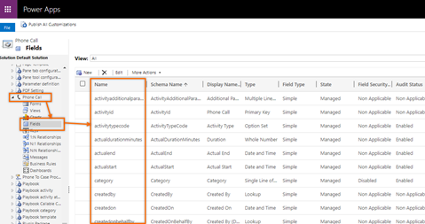

# Customize quick campaign and campaign activity distribution forms 

As a developer, use this reference documentation for customizing the quick campaign and distribute campaign activity forms. 

> [!IMPORTANT]
>- Customization of quick campaign and campaign activity distribution forms is not available in the application by default. Contact Microsoft Support to enable this feature for your organization.
>- Out of the box fields in the form can't be removed using this customization.  

## License and role requirements
| Requirement type | You must have |
|-----------------------|---------|
| **License** | Dynamics 365 Sales Premium or Dynamics 365 Sales Enterprise  <br>More information: [Dynamics 365 Sales pricing](https://dynamics.microsoft.com/sales/pricing/) |
| **Security roles** | System customizer <br>  More information: [Predefined security roles for Sales](../security-roles-for-sales.md)|


## Action parameters  

The **marketingformdisplayattributesset** action expects the following input parameters:

| Parameter name | Required? | Type | Description |
|----------------|----------|------|-------------|
| ```entitylogicalname``` | Yes | Edm.String | Specifies the name of the table for custom form.<br>**Note:** Each `entitylogicalname` must have only one record in the application. If there is more than one record, the application considers the record based on which it was first created. To view the list of records, make a GET API call:<br>```GET [Organization URI]/api/data/v9.0/marketingformdisplayattributesset```<br>```HTTP/1.1``` |
| ```displayattributelist``` | Yes | Edm.String | Specifies the list of columns to be displayed in custom form. <br> You can get the column names from system customizations. For example, to view the column names of **Phone Call**, go to **Advance settings** > **Customizations** > **Customize the system** > **Tables** > **Phone Call** > **Fields** and the names are listed under **Name** column. <br><br>**Note:** Attributes with the following data types are not supported:<br><ul><li>Status</li><li>Status reason</li><li>Image</li><li>Owner</li><li>Unique identifier</li><li>Customer</li><li>Multi select option set</li></ul>|
| ```name``` | Yes | Edm.String | Specifies the name of **Marketing Form Display Attributes**. To view this table, go to **Advance settings** > **Customizations** > **Customize the system** > **Tables**. |


## Action example

```html
POST [Organization URI]/api/data/v9.0/marketingformdisplayattributesset
HTTP/1.1
Accept: application/json
Content-Type: application/json; charset=utf-8
OData-MaxVersion: 4.0
OData-Version: 4.0
{
    "entitylogicalname" : "phonecall",
    "displayattributelist" : "[\"lastonholdtime\", \"transactioncurrencyid\", \"owningbusinessunit\", \"isregularactivity\", \"actualdurationminutes\", \"subcategory\"]",
    "name" : "Phone Call"
}
```

### Response  

```json
HTTP/1.1 204 No Content
OData-Version: 4.0
```

### See also

[Create a quick campaign using in-app marketing (Sales)](../create-quick-campaign-using-app-marketing-sales.md)    
[Add an activity to a campaign using in-app marketing (Sales)](../add-activity-campaign-using-app-marketing-sales.md)

[!INCLUDE[footer-include](../../includes/footer-banner.md)]
