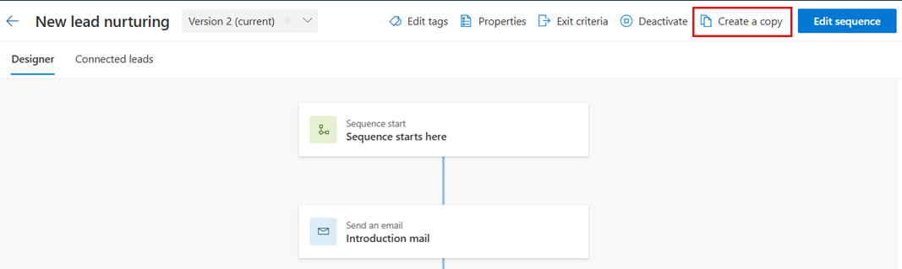
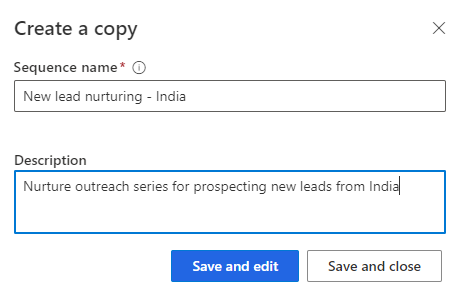

# Clone and edit a sequence 

If your organization changes its selling process, you might want to edit a sequence to reflect the changes. You can only edit a sequence that's in an inactive state, so you must deactivate or create a copy of it.

## License and role requirements
| Requirement type | You must have |
|-----------------------|---------|
| **License** | Dynamics 365 Sales Enterprise, Dynamics 365 Sales Premium, or [Microsoft Relationship Sales](https://dynamics.microsoft.com/en-in/sales/relationship-sales/)  More information: [Dynamics 365 Sales pricing](https://dynamics.microsoft.com/sales/pricing/) |
| **Security roles** | System Administrator or Sequence Manager    More information: [Predefined security roles for Sales](security-roles-for-sales.md)|

## Clone a sequence

Cloning a sequence makes it easier to add or remove steps, and save the changes to create new sequence. Also, cloning pulls down a full copy of the sequence data that you're cloning at that point in time, including all steps and configurations. After you make the changes, you can save and activate the cloned sequence and apply it to records.

1. Sign in to your sales app.   
1. Go to **Change area** in the lower-left corner of the page and select **Sales Insights settings**.   
1. Under **Sales accelerator**, select **Sequence**.   
1. Open the sequence that you want to clone and select **Create a copy**.

    >[!TIP]
    >Alternatively, hover over a sequence, and then select **More options** > **Create a copy**.    
    
    > [!div class="mx-imgBorder"]
    >   

1. On the **Create a copy** dialog, enter the name of the sequence and description.    

    > [!div class="mx-imgBorder"]
    >    

1. Select one of the buttons:   
    - **Save and edit**: Select this button to open the sequence editor and add steps as necessary. To edit a sequence, see [Edit a sequence](#edit-a-sequence).
    - **Save and close**: Select this button to save and create the sequence. 

## Edit a sequence
   
1. Sign in to your sales app.   
1. Go to **Change area** in the lower-left corner of the page and select **Sales Insights settings**.   
1. Under **Sales accelerator**, select **Sequences**.     
1. On the **Sequences** page, select and open the sequence that you want to edit.    

    >[!NOTE]      
    >If the sequence is **Active** state, you can one of the following actions to edit.  
    >- Deactivate or [create a copy](#clone-a-sequence)
    >- Select **Edit sequence**. More information: [Edit an active sequence and view version history](edit-active-sequence.md)  

1. Do one of the following activities:   
    - To add an activity, perform **step 7** from [Create and activate a sequence](create-and-activate-a-sequence.md).       
    - To edit an activity, select the activity and the details open in the right pane.   
        Make the edits you want, and then select **Save**.      
1. (Optional) If you want the sequence to be available to connect with records, select **Activate**.    
1. Save and exit the sequence designer.

[!INCLUDE[cant-find-option](../includes/cant-find-option.md)] 

### See also

[Sequences](create-manage-sequences.md)

[!INCLUDE[footer-include](../includes/footer-banner.md)]
