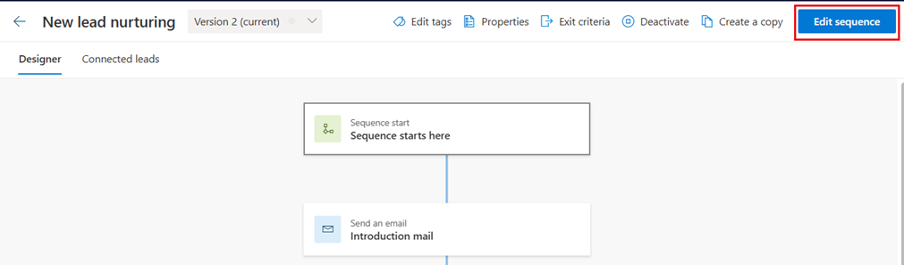
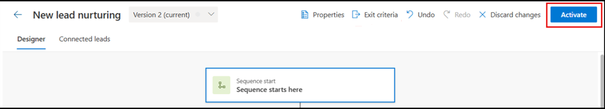
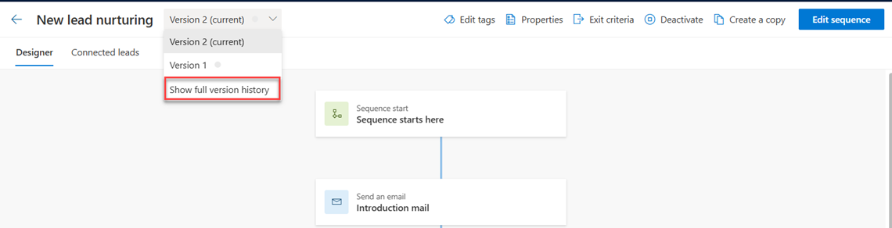
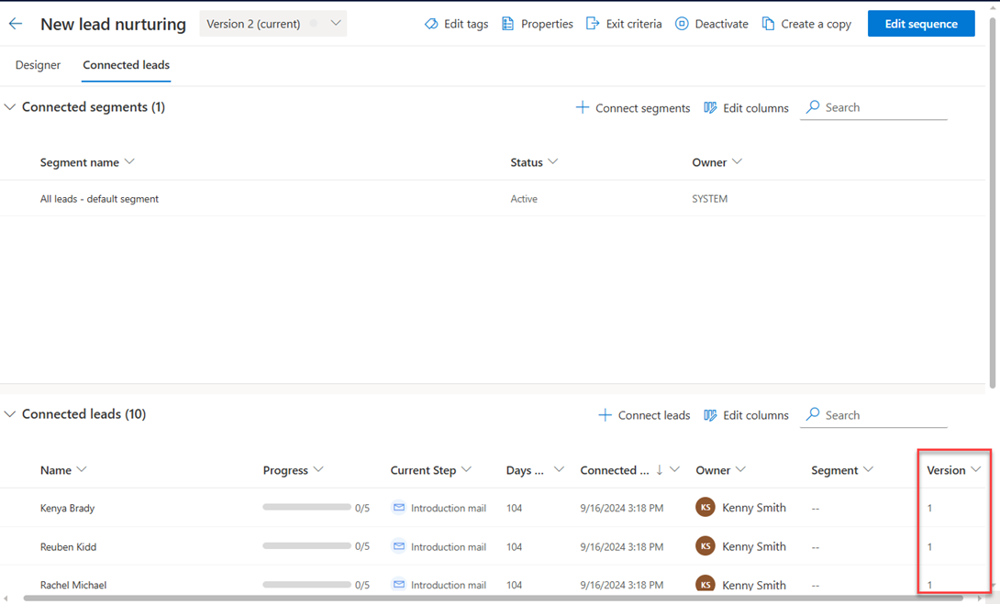

# Edit an active sequence and view version history 

When you've changed the process of an active sequence, you can create a new version of the sequence without deactivating it. You can update a sequence multiple times, and when you connect a record to the sequence, the record will be connected to the latest version.

>[!IMPORTANT]
>The records that were connected to a previous version of the sequence remain connected to that previous version.

## License and role requirements
| Requirement type | You must have |
|-----------------------|---------|
| **License** | Dynamics 365 Sales Enterprise, Dynamics 365 Sales Premium, or [Microsoft Relationship Sales](https://dynamics.microsoft.com/en-in/sales/relationship-sales/)  More information: [Dynamics 365 Sales pricing](https://dynamics.microsoft.com/sales/pricing/) |
| **Security roles** | System Administrator or Sequence Manager    More information: [Predefined security roles for Sales](security-roles-for-sales.md)|

## Edit an active sequence

1.	Sign in to your Dynamics 365 Sales Hub app.   
2.	Go to **Change area** in the lower-left corner of the page, and select **Sales Insights settings**.   
3.	Under **Sales accelerator**, select **Sequences**.   
4.	On the **Sequences** page, open the sequence that is in active state.    
5.	On the sequence view page, select **Edit sequence**.

    > [!div class="mx-imgBorder"]
    >     
 
1. On the confirmation message, select **OK**.

    > [!div class="mx-imgBorder"]
    >     

    A version is created for the sequence.
 
6.	Edit the sequence as required, and then select **Activate**.

    > [!div class="mx-imgBorder"]
    >      

7.	On the confirmation message, provide a description of the change, and then select **Save**.

    > [!div class="mx-imgBorder"]
    >      
 
A new version of the existing sequence is created and saved.

## View version history and associated records

Viewing the version history helps you to understand the number of versions that have been created for a sequence, and view the records that are connected to each version.    

1.	Open the sequence.

1.	To view the version history, select **Version history**.   

    A list of versions that exist for the sequence is displayed on the right pane.

    > [!div class="mx-imgBorder"]
    > 

    The current selected version is highlight with a Blue line corresponding to the version name.  

    >[!NOTE]
    >If there are no leads connected to the sequence, and you created a new version, only the latest version is displayed in the list.

1.	To view the version of the sequence to which a record is connected, go to the **Connected *records*** tab. In this example, we selected the **Connected leads** tab.    

    A list of leads that are connected to the sequence is displayed, along with the version to which they're connected.   

    > [!div class="mx-imgBorder"]
    >      
 

[!INCLUDE[cant-find-option](../includes/cant-find-option.md)] 

### See also

[Edit a sequence](edit-a-sequence.md)    
[Create and activate a sequence](create-and-activate-a-sequence.md)

[!INCLUDE[footer-include](../includes/footer-banner.md)]
