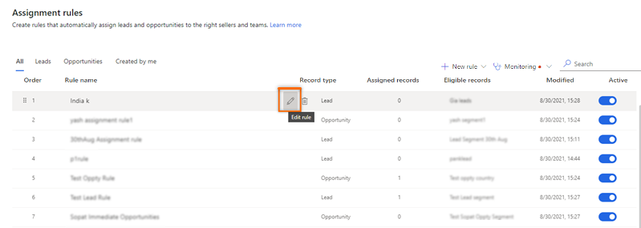
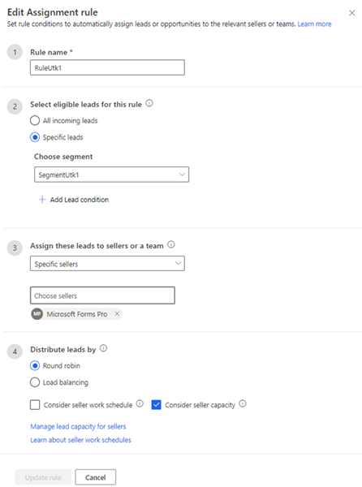

# Edit assignment rules 

To modify your process for automatically assigning leads or opportunities to sellers, you can update the conditions that you've defined in the rule.  

## License and role requirements
| Requirement type | You must have |
|-----------------------|---------|
| **License** | Dynamics 365 Sales Premium or Dynamics 365 Sales Enterprise  More information: [Dynamics 365 Sales pricing](https://dynamics.microsoft.com/sales/pricing/) |
| **Security roles** | System Administrator or Sequence Manager    More information: [Predefined security roles for Sales](security-roles-for-sales.md)|

## To edit an assignment rule 

>[!NOTE]
>In this procedure, we are using lead as an example to edit an assignment rule. Similarly, you can use this procedure to edit opportunity assignment rule. 

1.	Sign in to your Dynamics 365 Sales Hub app.    
2.	Go to **Change area** in the lower-left corner of the page, and select **Sales Insights settings**.   
3. Under **Sales accelerator**, select **Assignment rules**.    

4.	On the **Assignment rules** page, from the **Rule** tab, select the rule and then select the pencil icon to edit.   

    >[!div class="mx-imgBorder"]
    >    

    The **Create assignment rule** pane opens.

    >[!div class="mx-imgBorder"]
    >    

5.	Edit the information according to your needs, and then select **Update rule**.

The changes will be applied to new leads that are created in the future in the application. The leads that were already assigned through the rule won't change.

[!INCLUDE[cant-find-option](../includes/cant-find-option.md)] 

### See also

[Manage assignment rules](create-manage-assignment-rules.md)    
[Create and activate an assignment rule](create-and-activate-assignment-rule.md)

[!INCLUDE[footer-include](../includes/footer-banner.md)]
