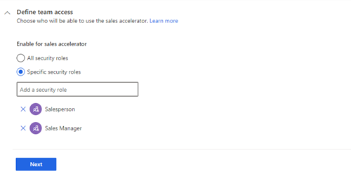
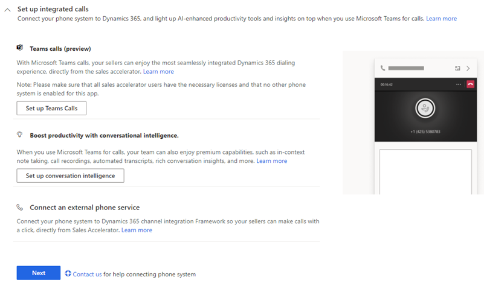

# Configure the sales accelerator

Enable and configure the sales accelerator to create sequences and connect records, and view daily work list items.

## License and role requirements

| &nbsp; | &nbsp; |  
|-----------------------|---------|
| **License** | Dynamics 365 Sales Premium or Dynamics 365 Sales Enterprise  More information: [Dynamics 365 Sales pricing](https://dynamics.microsoft.com/sales/pricing/) |
| **Security Role** | System Administrator    See [Predefined security roles for Sales](security-roles-for-sales.md)|
|||

## Configuration steps

The sales accelerator feature helps sellers in your organization increase their sales productivity and prioritize activities for the day through the work list available in your sales app. An administrator or a sales manager uses the sequence designer to create a sequence of activities&mdash;separated by time intervals&mdash;including emails, phone calls, and tasks. Sequences are connected to relevant records, so sellers can follow the best practices that have been defined in the sequence for the record types that are assigned to them. The sequence is then applied to record types and assigned to a seller automatically, according to your organization's sales strategies.  

> [!NOTE]
> - To configure sales accelerator for assignment rule with your enterprise license, see [Configure sales accelerator for assignment rules](sales-accelerator-assignment-rules.md).
> - You can also set up sales accelerator through quick setup (with the Dynamics 365 Sales Enterprise license). In this case, you'll get 1,500 sequence-connected records per month. To set up sales accelerator through quick setup, you must go to the **Get started with digital sales** page under **App Settings**. More information: [Set up sales accelerator](digital-selling.md#set-up-sales-accelerator)

As an administrator, you must enable and configure the sales accelerator in your organization to make it available for sales managers and sellers to use. Follow these steps:

1. [Review the prerequisites and recommendations](#review-the-prerequisites-and-recommendations).
2. [Set up the sales accelerator](#set-up-the-sales-accelerator).

## Review the prerequisites and recommendations

### Prerequisites

Ensure that you meet the following requirement:

- Enable advanced Sales Insights features. More information: [Install and configure premium Sales Insights features](intro-admin-guide-sales-insights.md#install-and-configure-premium-sales-insights-features)

### Recommendations

For the best experience of the sales accelerator, enable and configure [predictive lead scoring](configure-predictive-lead-scoring.md) and [predictive opportunity scoring](configure-predictive-opportunity-scoring.md) to display predictive scores for each record in the work list. Displaying the score helps your sellers to prioritize leads and opportunities based on their predicted likelihood to convert.

## Set up the sales accelerator

1. Sign in to your sales app, and in the lower-left corner of the page, go to **Change area** > **Sales Insights settings**.
2. On the site map, under **Sales accelerator**, select **Setup**.    
    The sales accelerator configuration page opens.      
    For the first-run experience, go to step 3. If the feature has already been configured and you want to update the configuration, go to step 4.    
3. If you're configuring the feature for the first time in your organization, select **Get started**.     
    >[!div class="mx-imgBorder"]
    >    

    A dialog box appears with the option to install sample data to explore the feature. Installing the sample data is relevant only for your sandbox or trial environments. Adding the sample data might take a few minutes. However, you can choose to ignore the sample data installation and add it later when required. More information: [Manage sample data](manage-sample-data.md)    
    
    >[!IMPORTANT]
    >To prevent unwanted results, sample data is available only for non-production environments.
    
    >[!div class="mx-imgBorder"]
    >        

    The configuration page opens.        
 
4. In the **Define team access** section, select roles to grant permissions to use sales accelerator features.     
    Choose one of the following options to grant permissions:     
       
    | Security roles | Description |
    |----------------|-------------|
    | All security roles | Select this option to give access to view the Sales Hub app to all the security roles in your organization. |
    | Specific security roles | Select this option to specify security roles to give access to view the Sales Hub app to just a few users. Use the lookup box to add the security roles. |    

    >[!div class="mx-imgBorder"]
    >   

5. In the **Choose content and layout** section, select the record types and their corresponding related forms that are used in your organization, as required.      

   >[!div class="mx-imgBorder"]
   >   

    1. Select **Add record type**, and then select the dropdown list to choose the records that you want to add. The selected record type will display the **Sequence (up next)** widget. Sales managers use the record types to configure the sequence that will be assigned to records to be displayed in the app. You can select record types such as **Accounts**, **Contacts**, **Leads**, **Opportunities**, and custom.    
        >[!NOTE]
        >- To view the custom records types in the list, enable the options **Activities**, **Connections**, and **Sending email (If an email field does not exist, one will be created)** under **Communication & Collaboration** in **Settings > Customizations** > **Customize the System** > **Components** > **Entities**.
        >- To add the **Up next** widget to your custom entity form, see [Add the Up next widget to an entity form](add-upnext-widget-form.md).     
        
    2. Repeat step a to add more record types. In the example, the record types **Contacts**, **Leads**, **Accounts**, and **Orders** are added.   
        
        >[!div class="mx-imgBorder"]
        >         
        
        > [!NOTE]
        > - You can remove the records types that are no longer required to have automated activities associated with them. Select the **X** icon corresponding to the record type to remove it from the list. However, if the records in the deleted record type are associated with a sequence, these records will continue to be associated with the sequence.   
        > - To know how records are populated in the work list, see [View my records by using the work list](prioritize-sales-pipeline-through-work-list.md#view-my-records-through-work-list).
     
    3. Select **Next**

6. In the **Set up integrated calls** section, connect a phone system such as, Microsoft Teams to let sellers call directly from sales accelerator feature.   
     
    - **Teams calls (preview)**: Configure the Microsoft Teams calls for your organization to let sellers call directly from sales accelerator feature. Select **Setup Teams calls**.       
    More information: [Configure Microsoft Teams dialer (Preview)](configure-microsoft-teams-dialer.md)
    - **Boost productivity with conversational intelligence**: Configure conversation intelligence for sellers and sales managers to get in-context note taking, call recordings, automated transcripts, rich conversation insights, and more. Select **Set up conversation intelligence**.        
    More information: [First-run setup experience of Microsoft Teams for conversation intelligence](fre-setup-ci-sales-app.md)
    - **Connect an external phone service**: To use a different phone system in your organization to allow sellers call through the sales accelerator feature, use Dynamics 365 Channel Integration Framework. More information: [Integrate a sample softphone dialer with Dynamics 365 Sales](integrate-sample-softphone.md)    
    The priority of the phone system that's selected for the sales accelerator depends on the ranking that's defined in the Dynamics 365 Channel Integration Framework configuration.      
       
    >[!div class="mx-imgBorder"]
    >       

7. Enable the **Sales accelerator reports** option to help your sales manager view and understand their team's historical operational metrics, key performance indicators (KPIs), and sequence stats page.   
    [!INCLUDE [cc-beta-prerelease-disclaimer](../includes/cc-beta-prerelease-disclaimer.md)]
    
    >[!div class="mx-imgBorder"]
    >        

    By default, the users with sales manager and sequence manager roles can view the reports. To grant view access to other roles, provide read access at the organizational level for the sales acceleration reports table. More information: [Security roles and privileges](/power-platform/admin/security-roles-privileges)

    >[!NOTE]
    >After you enable the option, the application might take up to 24 hours to display the data in the reports. Subsequently, the reports are refreshed every 24 hours. You can view the last updated date in the upper-right corner of the sales acceleration reporting page.

    To know how sales managers use,   
       -	Metrics and KPIs, go to [Understand sales acceleration reporting](understand-sales-acceleration-reporting.md).
       -	Sequence stats, go to [Understand sequence stats](understand-sequence-stats.md).
    
8. Save and publish the configuration.
    A status message is displayed at the top of the page with details including the time and user who published the configurations.
    >[!div class="mx-imgBorder"]
    >

The sales accelerator is ready to use in your organization for the selected security roles.

## Customizations

By default, the **Up next** widget is displayed on the **Default Main** and **Sales Insight** forms. To add the **Up next** widget to other forms, follow the process specified in [How do I add the Up next widget to an entity form?](faqs-sales-insights.md#sales-accelerator)

[!INCLUDE [cant-find-option](../includes/cant-find-option.md)]

>[!NOTE]
>To know how to add work list site map to your custom app, see [How to add work list site map to your custom app](faqs-sales-insights.md#how-to-add-work-list-site-map-to-your-custom-app).

### See also

[Create and manage sequences](create-manage-sequences.md)     
[What is the sales accelerator?](sales-accelerator-intro.md)  
[Sales accelerator FAQs](faqs-sales-insights.md#sales-accelerator)

[!INCLUDE[footer-include](../includes/footer-banner.md)]
