# Configure the sales accelerator

Enable and configure the sales accelerator to create sequences and connect records, and view daily work list items.

[!INCLUDE [trial-cta-note](../includes/trial-cta-note.md)]

## License and role requirements
| Requirement type | You must have |  
|-----------------------|---------|
| **License** | Dynamics 365 Sales Premium or Dynamics 365 Sales Enterprise  More information: [Dynamics 365 Sales pricing](https://dynamics.microsoft.com/sales/pricing/) |
| **Security roles** | System Administrator    More information: [Predefined security roles for Sales](security-roles-for-sales.md)|

## How does the sales accelerator help a sales team?

The sales accelerator is an engagement platform that helps a sales team understand customers' needs and respond in the following ways: 

- Engage with customers by using multiple channels within one workspace.
- Minimize the time spent on searching for the next best customer to reach out to.
- Gather information from multiple sources and let sellers focus on how to best approach their customers. 
- Sell smartly, by building a strong and prioritized pipeline, offering context, and surfacing automated recommendations throughout a sales sequence that helps to expedite the sales process.

> [!NOTE]
> - To configure the sales accelerator for assignment rules with your Dynamics 365 Sales Enterprise license, go to [Configure sales accelerator for assignment rules](sales-accelerator-assignment-rules.md).
> - You can also set up the sales accelerator through quick setup (with the Dynamics 365 Sales Enterprise license). In this case, you'll get 1,500 sequence-connected records per month. To set up sales accelerator through quick setup, go to the **Get started with digital sales** page under **App Settings**. More information: [Set up sales accelerator](digital-selling-sales-accelerator.md#set-up-sales-accelerator)

       
> [!VIDEO https://go.microsoft.com/fwlink/?linkid=2190823]

## First-run setup 

Enable the sales accelerator by quickly providing access to security roles and selecting the record types to be shown in the work list.

>[!NOTE]
>By default, sales accelerator is available in the Sales Hub app with limited functionalities. Your Sales teams can view the work list items created through timeline for contact, opportunity, lead, and account records. To experience the full capabilities of sales accelerator, purchase the Sales Premium license and configure the features such as sequences and segments. 

1. Sign in to your sales app, and in the lower-left corner of the page, go to **Change area** > **Sales Insights settings**.
2. Under **Sales accelerator**, select **Workspace**.     
    The sales accelerator workspace setup page opens. 

    >[!div class="mx-imgBorder"]
    >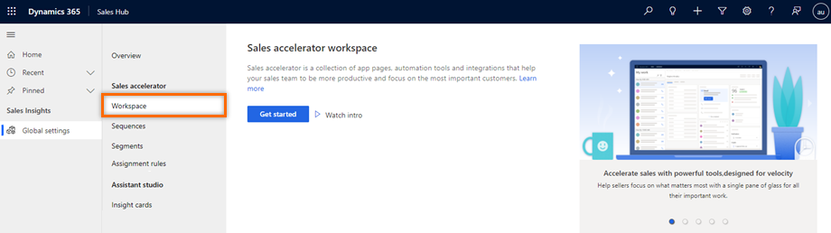   

3.	Select **Quick setup**.

    The **Sales accelerator quick setup** pane opens.

    >[!div class="mx-imgBorder"]
    >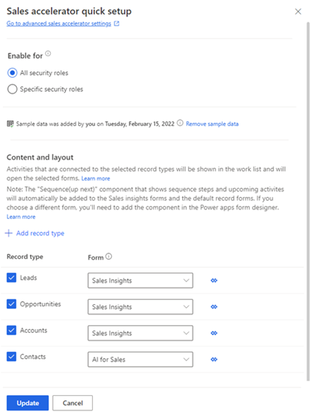   

4.	In the **Enable for** section, select roles to grant permissions to use sales accelerator features. Choose one of the following options to grant permissions.
       
    | Security roles | Description |
    |----------------|-------------|
    | All security roles | Select this option to give access to view sales accelerator features to all the security roles in your organization. |
    | Specific security roles | Select this option to specify security roles to give access to view the sales accelerator to just a few users. Use the lookup box to add the security roles. |

5.	(Optional) Select **Add sample data** to explore the sales accelerator feature with the provided sample data.

    Installing the sample data is relevant only for your sandbox or trial environments. Adding the sample data might take a few minutes. More information: [Manage sample data](manage-sample-data.md)

    >[!IMPORTANT]
    >To prevent unwanted results, sample data is available only for non-production environments.

    >[!div class="mx-imgBorder"]
    >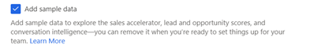

6.	In the **Record type and form** section, select the record types and their corresponding related forms to view in the work list, as required by your organization. By default, leads, opportunities, accounts, and contacts are selected.

    >[!div class="mx-imgBorder"]
    >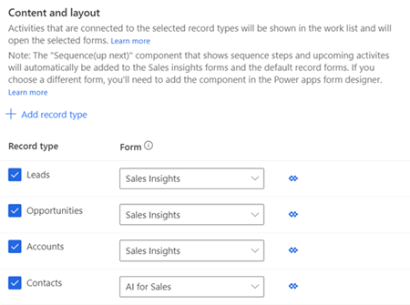   

    1. To add a record type, select **Add record type**, and then select the dropdown list to choose the records that you want to add. 

    2. From the dropdown list, choose a form to which you want to add the Sequence (up next) widget. Sales managers use the record types to configure the sequence that will be assigned to records to be displayed in the app.  

       >[!NOTE]
       >- To view the custom records types in the list, go to  **Settings** > **Customizations** > **Customize the System** > **Components** > **Entities**. Under **Communication & Collaboration**, enable the options **Activities**, **Connections**, and **Sending email (If an email field does not exist, one will be created)**.
       >- To add the **Up next** widget to your custom entity form, see [Add the Up next widget to an entity form](add-upnext-widget-form.md).  

    3. Repeat steps a and b to add more record types.
        
       >[!NOTE]
       >- You can remove the record types that you no longer need to associate automated activities with. Select the **X** icon corresponding to the record type to remove it from the list. However, note that if the records in the deleted record type are associated with a sequence, these records will continue to be associated with the sequence.   
       >- To know how records are populated in the work list, go to [View my records by using the work list](prioritize-sales-pipeline-through-work-list.md#view-my-records-through-work-list).

7.	Select **Update**.

The sales accelerator workspace is enabled and ready to use in your organization.

## Manage access and record type

After the first-run setup of the sales accelerator, you can manage security roles, sample data, and record types.

1. Sign in to your sales app, and in the lower-left corner of the page, go to **Change area**  > **Sales Insights settings**.

2. Under **Sales accelerator**, select **Workspace**.

   The sales accelerator workspace setup page opens. 

   >[!div class="mx-imgBorder"]
   >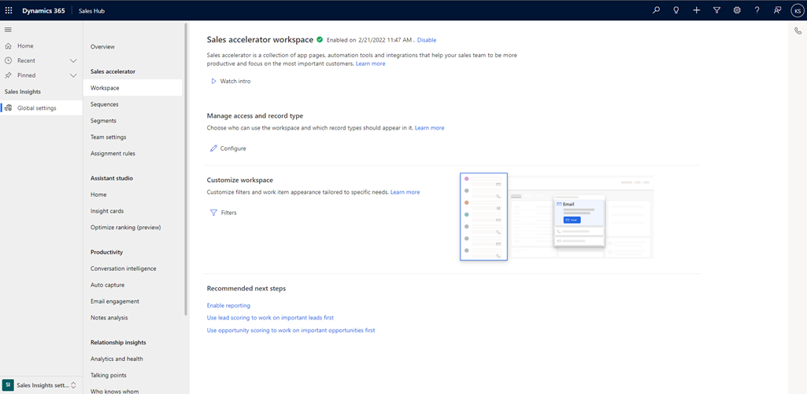   

3.	In the **Manage access and record type** section, select **Configure**. 

    The **Manage access and record type** page opens.

    >[!div class="mx-imgBorder"]
    >   

4.	Update the information as required, and then select **Publish**.  
    For more information, go to steps 5 through 7 in [First-run setup](#first-run-set-up), earlier in this article.

## Customize the workspace for sellers

As an administrator, you can filter work items in the workspace to short-list the ones that serve your sellers' specific needs.

For example, if sellers want to filter work items based on currency type for leads, you can add a filter by selecting the record type as **Lead** and the field as **Currency**. Sellers can then use this filter to refine work items and view leads with a specific currency type, such as **US dollar**.

To know how sellers can use custom filters, go to [Custom filters](prioritize-sales-pipeline-through-work-list.md#custom-filters).   

You can manage custom filters by creating, disabling, and deleting the filters:

1. Sign in to your sales app, and in the lower-left corner of the page, go to **Change area**  > **Sales Insights settings**.

2. Under **Sales accelerator**, select **Workspace**.

    The sales accelerator workspace setup page opens. 

    >[!div class="mx-imgBorder"]
    >   

3.	In the **Customize workspace** section, select **Filtering and sorting**.

    The **Filters** page opens.

    >[!div class="mx-imgBorder"]
    >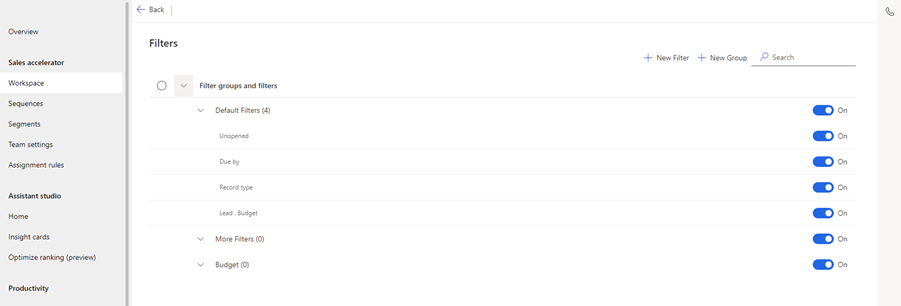   

    You can perform the following tasks:    
    -	[Add filters](#add-filters)
    -	[Add groups](#add-groups)
    -	[Hide filters](#hide-filters)
    -	[Delete custom filters and groups](#delete-custom-filters-and-groups)
    -	[Edit the name of custom filters and groups](#edit-name-of-custom-filters-and-groups)
    -	[Move filters to a group](#move-filters-to-a-group)

### Add filters

1.	On the **Filters** page, select **New filter**.    

2.	In the **New filter** dialog box, enter the following information.

    | Parameter | Description |
    |-----------|-------------|
    | Record | Select the type of record that you want to use to filter the work list. You can select only the record types that were added during content and layout configuration when you set up the sales accelerator.  For more information, go to step 7 in [First-run set up](#first-run-set-up). |
    | Field | Select a field based on which sellers can enter a value to filter the work list. The fields displayed in the list are the basic attributes of the selected record type. |
    | Filter name | Enter a name for the filter. By default, the name is selected as *record type.field*. For example, **Lead.Currency**. | 
    | Nest filter under | Select a group to which you want to add the filter. Grouping filters helps sellers to easily identify and apply filters. If you don't select a group, the filter is added to the default **More filters** group. To know how to create groups, go to [Add groups](#add-groups). |

    >[!div class="mx-imgBorder"]
    >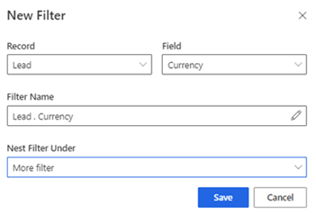   

3.	Save and publish the filters.

The filter is created and added to the filters list.

### Add groups

Filter groups help you to organize filters in a meaningful way for sellers to easily identify them.

1.	Use one of the following ways to create groups:

    -	On the **Filters** page, select **New group**.
    -	While creating a filter, in the **Nest filter under** dropdown list, select **Create new filter group**.

2.	In the **Create new filter group** dialog box, enter the name of the group.

    >[!div class="mx-imgBorder"]
    >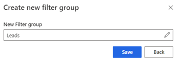
 
3.	Save and publish the group.

The group is created, and you can add filters to the group.

### Hide filters

You can hide any filter from the filter list. After hiding a filter, sellers can't view the filter in their list. 

1.	On the **Filters** page, go to the filter that you want to hide and turn off the toggle. 

    >[!NOTE]
    >To hide a group, turn off the toggle for the group.
 
    >[!div class="mx-imgBorder"]
    >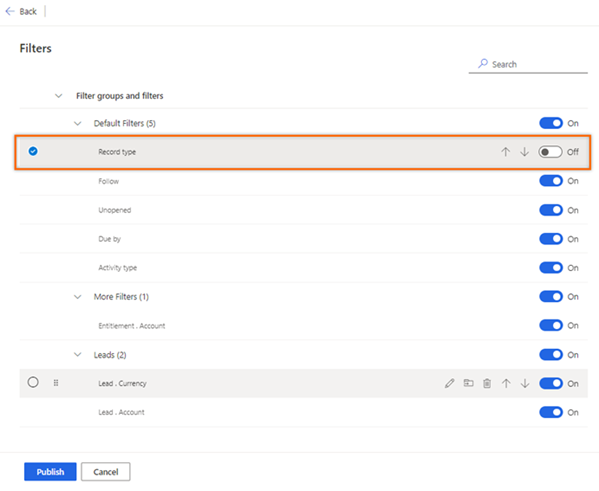   

2.	Select **Publish**.  

The filter is hidden from the list that sellers use. However, the filter will be available in the application, and you can turn on the toggle to activate it again.

### Delete custom filters and groups

You can delete filters that are no longer required in your organization.

>[NOTE]
>You can't delete the filters or groups that are available out of the box.

1.	On the **Filters** page, select the filter, and then select **Delete** ().
 
    >[!NOTE]
    >To delete all filters in a group, select the group, and then select the delete icon.  

    >[!div class="mx-imgBorder"]
    >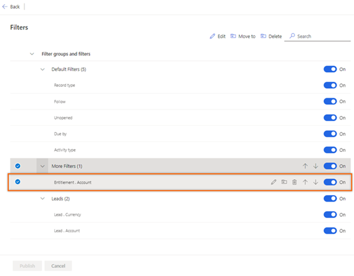   

2.	In the confirmation message, select **Delete permanently**.

3.	Select **Publish**.   

The filter is permanently deleted from the list. 

### Edit the names of custom filters and groups

>[NOTE]
>You can't edit the names of the out-of-the-box filters or groups.  

1.	Select the filter or group, and then select **Edit** ().   

    The name opens in an inline editor.

    >[!div class="mx-imgBorder"]
    >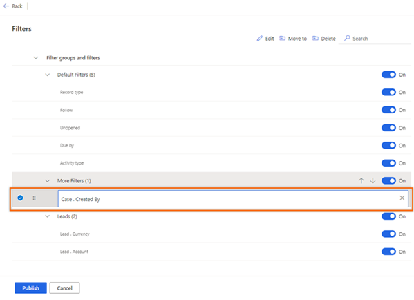   

2.	Update the name as required, and then publish the filter list.

### Move filters to a group

>[NOTE]
>You can't move the out-of-the-box filters to a group.  

1.	Select the filter, and then select **Move to** ().
 
    >[!div class="mx-imgBorder"]
    >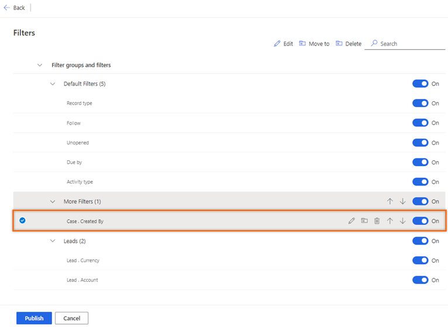   

2.	In the **Move filter** dialog box, from the **Filter group** list, choose the group name.

    >[!div class="mx-imgBorder"]
    >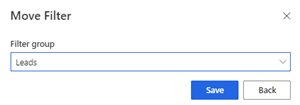   
 
3.	Save and publish the filter list.

The filter is moved to the filter list of the selected group.

## Recommendations

For the best experience of the sales accelerator, enable and configure [predictive lead scoring](configure-predictive-lead-scoring.md) and [predictive opportunity scoring](configure-predictive-opportunity-scoring.md) to display predictive scores for each record in the work list. Displaying the score helps your sellers to prioritize leads and opportunities based on how likely they're to be converted.

## Customizations

By default, the **Up next** widget is displayed on the **Default Main** and **Sales Insight** forms. To add the **Up next** widget to other forms, follow the process specified in [How do I add the Up next widget to an entity form?](faqs-sales-insights.md#sales-accelerator)

>[!NOTE]
>To know how to add the work list site map to your custom app, go to [How to add work list site map to your custom app](faqs-sales-insights.md#how-to-add-sales-accelerator-site-map-to-your-custom-app).

## Disable sales accelerator

You can disable the sales accelerator workspace, if it's no longer required in your organization.    

1. On the **Sales accelerator workspace** page, select **Disable**.

    >[!div class="mx-imgBorder"]
    >   

2. On the confirmation message, select **Disable Sales accelerator**.

    >[!div class="mx-imgBorder"]
    >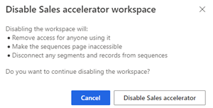   

The sales accelerator workspace is disabled in your organization. Also, sellers can't see the **Sales accelerator** sitemap entry under **My Work**.    
To configure the sales accelerator, go to [First-run setup](#first-run-set-up).

[!INCLUDE [cant-find-option](../includes/cant-find-option.md)]

### See also

[Create and manage sequences](create-manage-sequences.md)     
[Configure sales accelerator settings for sellers to personalize](customize-sales-accelerator-sellers.md)     
[What is the sales accelerator?](sales-accelerator-intro.md)

[!INCLUDE[footer-include](../includes/footer-banner.md)]
