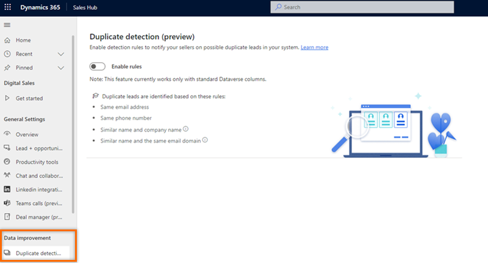
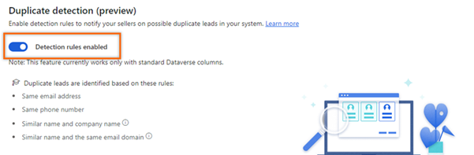

# Preview: Enable duplicate lead detection 

Enable duplicate lead detection to help your sellers identify and address potential duplicate leads.

[!INCLUDE [preview-disclaimer](../includes/preview-disclaimer.md)]

## License and role requirements
| Requirement type | You must have |  
|-----------------------|---------|
| **License** | Dynamics 365 Sales Premium or Dynamics 365 Sales Enterprise   More information: [Dynamics 365 Sales pricing](https://dynamics.microsoft.com/sales/pricing/) |
| **Security roles** | System Administrator   More information: [Predefined security roles for Sales](security-roles-for-sales.md)|

## What is duplicate detection?

>[!VIDEO https://www.microsoft.com/en-us/videoplayer/embed/RE4UpF6]

The duplicate detection capability helps sellers to check for potential duplicate leads in the app. When you enable this capability, the AI model uses the following rules to identify duplicates:

-	Same email address 
-	Same phone number
-	Similar lead name and company name 
-	Similar lead name and the same email domain   

Further, sellers can compare and remove the duplicate leads in the organization. More information: [Manage duplicate leads](manage-duplicate-leads.md)

>[!NOTE]
>- If the Microsoft Power Platform duplicate detection feature is enabled in your organization, a message is displayed as shown in the following image: 
>:::image type="content" source="media/lead-power-platform-duplicate-detection-enabled-message.png" alt-text="Screenshot showing message when the Microsoft Power Platform duplicate detection feature is enabled." lightbox="media/lead-power-platform-duplicate-detection-enabled-message.png":::
>- To know the difference between the Microsoft Power Platform and Sales duplicate detection features, go to [What is the difference between the duplicate detection capability in Microsoft Power Platform and duplicate detection of leads in Dynamics 365 Sales?](faqs-sales.md#what-is-the-difference-between-duplicate-detection-capability-of-power-platform-and-duplicate-detection-of-leads-in-dynamics-365-sales)
>- For an optimal experience of the duplicate detection of leads in Dynamics 365 Sales, disable the duplicate detection of leads in Microsoft Power Platform. More information [Turn duplicate detection rules on or off for the whole organization](/power-platform/admin/turn-duplicate-detection-rules-off-whole-organization)  

## Prerequisites

Before you enable the duplicate detection feature, verify that Dataverse search is enabled in your organization. The AI model that detects duplicate leads uses Dataverse search for better results. More information: [Configure Dataverse search for your environment](/power-platform/admin/configure-relevance-search-organization)

## Enable the duplicate detection feature

1.	At the lower-left corner of the Sales Hub app, select **Change area**  > **App Settings**.
2.	On the site map, select **Data improvement** > **Duplicate detection (preview)**.

    >[!div class="mx-imgBorder"]
    >    

3.	Turn on the **Enable rules** toggle.

    >[!div class="mx-imgBorder"]
    >    

[!INCLUDE [cant-find-option](../includes/cant-find-option.md)]

### See also

[Manage duplicate leads](manage-duplicate-leads.md)
