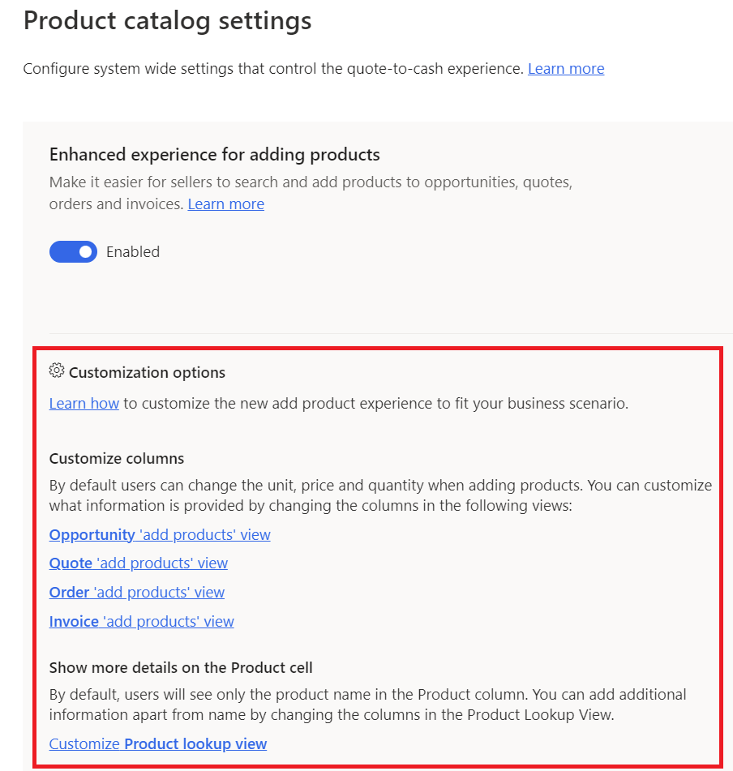

# Preview: Enable or disable the enhanced experience for adding products

Enable your salespeople to quickly find and add multiple products to an opportunity, quote, order, or invoice by enabling the enhanced add product experience.

## License and role requirements

|  | |
|-----------------------|---------|
| **License** | Dynamics 365 Sales Enterprise or Dynamics 365 Sales Premium  More information: [Dynamics 365 Sales pricing](https://dynamics.microsoft.com/sales/pricing/) |
| **Security roles** | System Administrator   See [Predefined security roles for Sales](security-roles-for-sales.md)|
|||

[!INCLUDE [cc-beta-prerelease-disclaimer](../includes/cc-beta-prerelease-disclaimer.md)]

## What's in the enhanced experience?

 By using the enhanced experience, salespeople can do the following:

- Quickly search for products and filter by product families.
- View product details inline.
- Compare products before selecting them.
- Add multiple products in one go.

[!INCLUDE [add-products-experience-on-mobile](../includes/add-products-experience-on-mobile.md)]

> [!IMPORTANT]
>
> - The enhanced experience for adding products is a preview feature. [!INCLUDE[cc-preview-features-definition](../includes/cc-preview-features-definition.md)]
> - [!INCLUDE[cc-preview-features-expect-changes](../includes/cc-preview-features-expect-changes.md)]
> - [!INCLUDE[cc-preview-features-no-ms-support](../includes/cc-preview-features-no-ms-support.md)]

## Enable or disable the enhanced experience

Depending on the Dynamics 365 Sales license that you have, select one of the tabs for specific information. 

# [Sales Premium and Sales Enterprise](#tab/SE)

If you have the Sales Hub app, follow the instructions in this tab. Otherwise, follow the instructions in the **Sales Professional** tab to configure the option in Power Platform.

1. In the Sales Hub app, select the **Change area** icon
    
    in the lower-left corner and then select **App Settings**.

2. Under **Product Catalog**, select **Product Catalog Settings**.

3. On the **Product Catalog Settings** page, toggle **Adding products (preview)** to enable or disable the preview.  
    If you enable the preview, you'll see additional options for customizing the new **Add products** dialog box.

    

     You can either add more columns to the grid or add more attributes to the **Product** column in the dialog box. For more information, see [Preview: Customize the Add Products dialog box](customize-add-products-dialog-box.md).
    
    If you disable the preview, the **Add products** option in the opportunity, quote, order, and invoice will switch back to **Quick create** form.

# [Sales Professional](#tab/SP)

If you're using a custom app or Sales Professional app, you can enable or disable the enhanced experience from **System Settings** in Power Platform.

1. In your app, select **Settings** , and then select **Advanced Settings**.

   

   The **Business Management settings** page opens in a new browser tab.

2. On the navigation bar, select **Settings**, and then select **Administration**.

3. Select **System Settings**.

4. In the **System Settings** dialog box, go to the **Sales** tab and set **Enhanced add product experience** to **Yes** to enable the enhanced experience. Set it to **No** to disable. 

5. Select **OK**.

---

[!INCLUDE [cant-find-option](../includes/cant-find-option.md)]

### See also

[Add products to an opportunity by using the enhanced experience](add-products-enhanced-experience.md)  
[Add products to a quote, order, or invoice by using the enhanced experience](add-products-qoi-enhanced.md)
