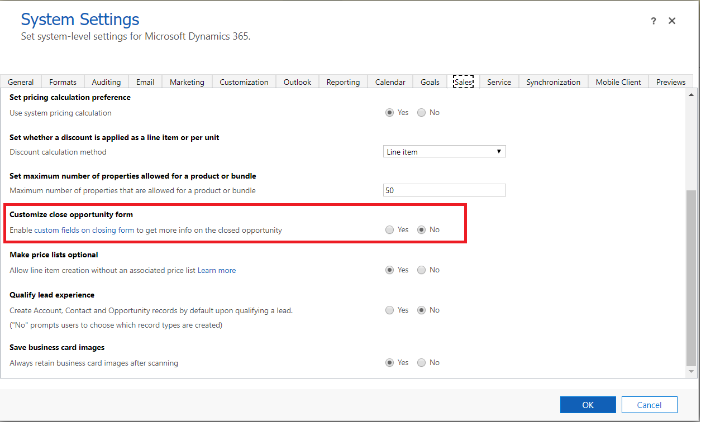

# Enable customization of the Opportunity Close form 

Enable system customizers to customize the opportunity close experience so that sellers can capture details about why an opportunity was closed.

## License and role requirements
| Requirement type | You must have |  
|-----------------------|---------|
| **License** | Dynamics 365 Sales Premium, Dynamics 365 Sales Enterprise, or Dynamics 365 Sales Professional  More information: [Dynamics 365 Sales pricing](https://dynamics.microsoft.com/sales/pricing/) |
| **Security roles** | System Administrator   More information: [Predefined security roles for Sales](security-roles-for-sales.md)|

## Enable customization

To allow users in your organization to capture more relevant details about an opportunity closing, a system administrator can enable the customization of the Opportunity Close form.

> [!NOTE]
> The capability to customize the **Opportunity Close** form is supported only in the sales app built on Unified Interface.

Depending on the Dynamics 365 Sales license you have, select one of the following tabs for specific information:

# [Sales Premium and Sales Enterprise](#tab/SE)

If you have the Sales Hub app, follow the instructions in this tab. Otherwise, follow the instructions in the **Sales Professional** tab to configure the option in Power Platform.

1. In lower-left corner of the screen, select **Change area**  and then select **App Settings**. 

1. In the site map, select **Overview**, and on the **Overview** page, select **Manage** for **Custom fields on closing form**.
1. On the **Opportunity Closing** page, turn the **Custom fields on closing form** toggle to **Yes**.
1. Select **Save**.

# [Sales Professional](#tab/SP)

1.  In your app, on the navigation bar, select the **Settings** icon , and then select **Advanced Settings**.

    The **Business Management settings** page opens in a new browser tab.

1.  On the navigation bar, select **Settings**, and then select **Administration**.

2.  Select **System Settings**.

3.  In the **System Settings** dialog box, on the **Sales** tab, set **Customize close opportunity form** to **Yes**.

    > [!div class="mx-imgBorder"]
    > 

4.  Select **OK**.
---

If you're using a custom app, in addition to enabling the customization of opportunity close form, you must also add the Opportunity Close entity to the custom app in the app designer. For more information, see [Add Opportunity Close entity to the custom app module](customize-opportunity-close-experience.md#add-entity-to-app) to learn how to add to entity to the app.

[!INCLUDE [cant-find-option](../includes/cant-find-option.md)]

### See also

[Customize the Opportunity Close form](customize-opportunity-close-experience.md)  
[Close opportunities as won or lost](close-opportunity-won-lost-sales.md)

[!INCLUDE[footer-include](../includes/footer-banner.md)]
