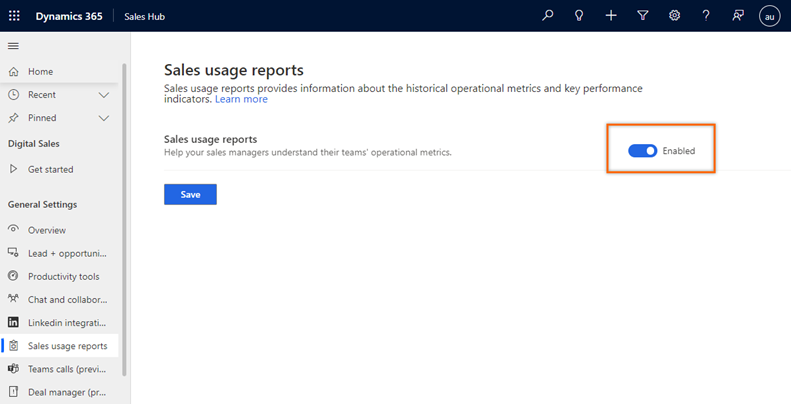

# Enable sales usage reports

Sales usage reports provide a historical view of operational metrics and key performance indicators in Dynamics 365 Sales. This helps sales managers to view and analyze their team's operational metrics such as opportunities and leads usage, and make decisions that improve sales performance.

## License and role requirements
| Requirement type | You must have |
|-----------------------|---------|
| **License** | Dynamics 365 Sales Premium or Dynamics 365 Sales Enterprise More information: [Dynamics 365 Sales pricing](https://dynamics.microsoft.com/sales/pricing/) |
| **Security Role** | System Administrator    See [Predefined security roles for Sales](security-roles-for-sales.md)|

## Enable the reports

As an administrator, enable the sales usage reports in your organization for sales managers to use. 

>[!NOTE]
>- Sales usage reports are not available on Government Community Cloud (GCC).
>- When enabled, the reports can take up to 24 hours to be displayed. Thereafter, reports are refreshed every 24 hours. 

1.	Sign in to your sales app, and in the lower-left corner of the page, go to **Change area** > **App settings**.    

2.	On the site map, select **General settings** > **Sales usage reports**.
 
3.	On the **Sales usage reports** page, turn on the toggle to enable the reports.

    >[!div class="mx-imgBorder"]
    >        
 
4.	Select **Save**.    

The reports are enabled. The application might take up to 24 hours to display the reports. 

[!INCLUDE[cant-find-option](../includes/cant-find-option.md)] 

### See also

[View and understand the sales usage reports](view-understand-sales-usage-reports.md)

