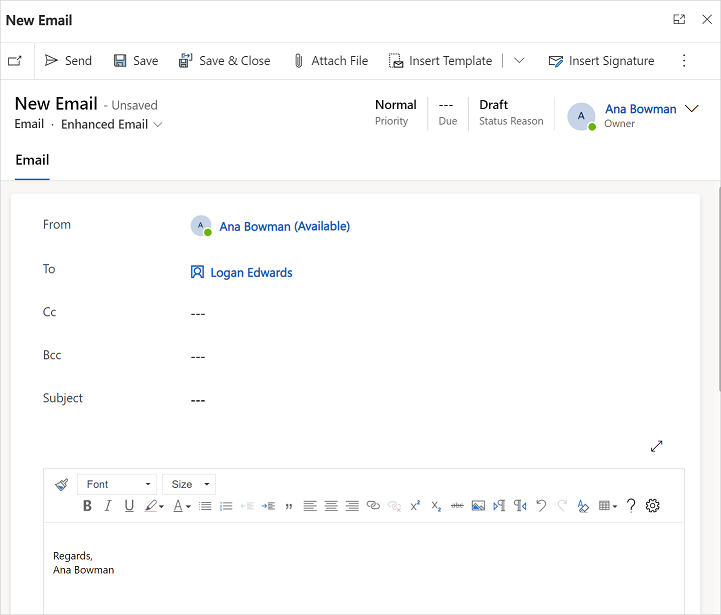

# Send email using the enhanced email experience 

The enhanced email experience in customer engagement apps allows users to compose an email without leaving the record they're working on.

## License and role requirements

| &nbsp; | &nbsp; |
|-----------------------|---------|
| **License** | Dynamics 365 Sales Premium, Dynamics 365 Sales Enterprise, or Dynamics 365 Sales Professional  More information: [Dynamics 365 Sales pricing](https://dynamics.microsoft.com/sales/pricing/) |
| **Security Role** | Salesperson and above    See [Predefined security roles for Sales](security-roles-for-sales.md)|
|||

## What can I do with email experience?

Using the enhanced email experience, you can:

- Navigate to different pages without losing the email content.
- Minimize the email window to get back to the records you were working on.
- Expand the email editor pop-up window to see more email options.
- Simultaneously open three email compose pop-up windows.
- Search for and apply a predefined template to an email you're composing.
- Insert attachments to email.

> [!NOTE]
> - System administrators must [enable the enhanced email experience](set-up-enhanced-email.md) before you can use it.
> - The enhanced email experience is available only for email activities created from the **Timeline** section of any customer engagement app.
> - The enhanced email pop-up window opens only when the height and width of your screen size is at least 400 x 650 pixels or greater. If lower, you will be taken to the standard form instead of the enhanced email experience. 
> - If you try to navigate to a record (by selecting a record in the lookup field) while working in the Enhanced Email form, an error message is displayed. You cannot navigate to another record from within the Enhanced Email form.

## Compose an email using the enhanced experience

1. In the **Timeline** section of the account, contact, lead, or opportunity records, select **+** and then under **Activities**, select **Email**.

   A new email pop-up window opens. 

   > [!div class="mx-imgBorder"]
   > 

   The **From** and **To** fields are automatically populated based on the user and the account and contact of the original record.

2. Write your email from scratch or select **Insert Template** to search for and apply a template. 

3. Select **Attach file** if you want to add attachments.

4. Select **Insert signature** to search for and add your signature.

5. When you're done, select **Send**. 

For more information about the email functionality, see [Understand the email experience](../customer-service/customer-service-hub-user-guide-email-overview.md).

[!INCLUDE [cant-find-option](../includes/cant-find-option.md)]

### See also

[Set up enhanced email](set-up-enhanced-email.md) 
[Troubleshooting issues with email](ts-email.md)

[!INCLUDE[footer-include](../includes/footer-banner.md)]
