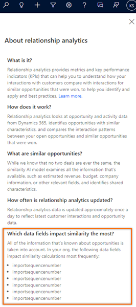

# Frequently asked questions for Sales Premium

## Licenses and storage

### What's the difference between Sales Premium and Sales Insights?  

Sales Premium refers to the license and Sales Insights refers to the capabilities. The Sales Premium license includes both Sales Enterprise and Sales Insights capabilities. The basic Sales Insights capabilities are also available with the Sales Enterprise license. For a detailed comparison of the capabilities in each license, go to the **Compare Dynamics 365 Sales plans** section on the [Pricing](https://dynamics.microsoft.com/sales/pricing/) page.  

### Where can I find the comparison chart for Dynamics 365 Sales licenses?  

The following license options are available for Dynamics 365 Sales:
- Sales Premium
- Sales Enterprise
- Sales Professional

For a detailed comparison of capabilities available with each license, go to the **Compare Dynamics 365 Sales plans** section on the [Pricing](https://dynamics.microsoft.com/sales/pricing/) page.

### After I installed Sales Insights, I see a spike in the data usage. How much storage data does Sales Insights need?  

When you install Sales Insights, corresponding analytics tables are created for contacts, opportunities, leads, accounts, and activityparty tables. The storage requirement for these analytics tables is directly proportional to the amount of data in Dataverse. The tables are stored as files in the managed data lake and will be counted against your total file storage quota. For more information on storage capacity, see [New Microsoft Dataverse storage capacity](/power-platform/admin/capacity-storage).


## General

### In which region is Sales Premium available?  
Sales Premium is available in the following regions:

-    Asia Pacific (APJ)
-    Canada (CAN)
-    Europe, the Middle East, and Africa (EMEA)
-  France (FRA)
-    Great Britain (GBR)
-    India (IND)
-    Japan (JPN)
-    North America (NAM)
-    Oceania (OCE)
- South America (SAM)
-  Switzerland (CHE)

> [!NOTE]
> Currently, Sales Premium is not available in the following datacenters&mdash; Germany, South Africa, UAE, Government Community Cloud (GCC), including USG, Department of Defense (DoD), and China.

### In which region are the features available? 
Sales Premium features are available in the following regions:   

| Feature | NAM | EMEA | GBR | APJ | CAN | IND | JPN | OCE | CHE | FRA | SAM |
|---------|-----|------|-----|-----|-----|-----|-----|-----|-----|-----|-----|
| Assistant | Yes | Yes | Yes | Yes | Yes | Yes | Yes | Yes | Yes | Yes | Yes |
| Auto capture | Yes | Yes | Yes | Yes | Yes | Yes | Yes | Yes | Yes | Yes | Yes |
| Conversation intelligence | Yes | Yes | Yes | Yes | Yes | Yes | Yes | Yes | Yes | Yes | Yes |
| Notes analysis | Yes | Yes | Yes | Yes | Yes | Yes | Yes | Yes | Yes | Yes | Yes |
| Premium forecasting | Yes | Yes | Yes | Yes | Yes | No | Yes | Yes | Yes | No | Yes |
| Predictive lead scoring | Yes | Yes | Yes | Yes | Yes | Yes | Yes | Yes | Yes | Yes | Yes |
| Predictive opportunity scoring | Yes | Yes | Yes | Yes | Yes | Yes | Yes | Yes | Yes | Yes | Yes |
| Relationship analytics | Yes | Yes | Yes | Yes | Yes | Yes | Yes | Yes | Yes | Yes | Yes |
| Sales accelerator | Yes | Yes | Yes | Yes | Yes | Yes | Yes | Yes | Yes | Yes | Yes |
| Talking points | Yes | Yes | Yes | Yes | Yes | Yes | Yes | Yes | Yes | Yes | Yes |
| Who knows whom | Yes | Yes | No | No | Yes | No | No | No | No | Yes | No |

### Which version of Exchange is supported for features in Sales Premium?   
The Sales Premium features support the following versions of Exchange:

| Feature | Exchange Online | Exchange Server 2013 and above | Is Exchange required? |
|---------|-----------------|--------------------------------|-----------------------|
| Relationship analytics and health | Yes | No | No |
| Assistant | Yes | No | No |
| Email engagement | Yes | Yes | Yes |
| Who knows whom | Yes | No | Yes |
| Talking points | Yes | No | Yes |

>[!NOTE]
>- The assistant and relationship analytics can work without Exchange. However, the information displayed in relationship analytics will not contain Exchange data and the assistant will not display cards that are based on Exchange data. 
>- For relationship analytics, support for Exchange Online is available only in North America (NAM) and Europe, the Middle East, and Africa (EMEA).
>- For who knows whom, the organization's Office 365 data location must be in one of the following locations and not in your region specific data canter location:
>   - Global Geography 1 – EMEA (Austria, Finland, France, Ireland, Netherlands).
>   - Global Geography 2 – Asia Pacific	(Hong Kong SAR, Japan, Malaysia, Singapore, South Korea).
>   - Global Geography 3 – Americas (Brazil, Chile, United States).<br>
> To learn more on data center locations, see [Data Center Locations](/microsoft-365/enterprise/o365-data-locations?view=o365-worldwide#data-center-locations&preserve-view=true).

### What languages are supported now? 

Sales Premium supports the following languages:

| Feature | Language supported |
|---------|--------------------|
| Assistant, Assistant studio, Auto capture, Email engagement, Predictive lead scoring, Predictive opportunity scoring, Premium forecasting, Relationship analytics, Sales accelerator, and Who knows whom | Arabic, Basque, Bulgarian, Catalan, Chinese Simplified (PRC), Chinese Traditional (Hong Kong SAR), Chinese Traditional (Taiwan), Croatian, Czech, Danish, Dutch, English, Estonian, Finnish, French, Galician, German, Greek, Hebrew, Hindi, Hungarian, Indonesian, Italian, Japanese, Kazakh, Korean, Latvian, Lithuanian, Malay, Norwegian, Polish, Portuguese (Brazil), Portuguese (Portugal), Romanian, Russian, Serbian (Cyrillic), Serbian (Latin), Slovakian, Slovenian, Spanish, Swedish, Thai, Turkish, Ukrainian, and Vietnamese. |
| Notes analysis | English, French, German, Italian, and Dutch for machine learning models. |
| Talking points and Exchange insight cards in Assistant | Only English - United States (en-US) for machine learning models. |
| Activity-content based Auto capture |- For contact suggestions, the body of emails and meetings are analyzed in English and French.<br>- For activity suggestions, the body of emails and meetings are analyzed in English, French, German, Italian, Dutch, and Norwegian. |
| Conversation intelligence | Chinese Simplified (PRC), Dutch, English, French, German, Italian, Japanese, Portuguese, Portuguese (Brazil), Spanish, Hebrew, Danish, Swedish, Finnish, and Arabic. |

To learn more, see [Infrastructure availability PDF](https://aka.ms/dynamics_365_international_availability_deck)

### Where is my organization's data stored?  

Depending on the region where your organization is hosted, data is stored in the following locations:   

| Region | Primary Azure data center location  | Secondary Azure data center location |
|--------|-------------------------------------|--------------------------------------|
| Asia Pacific (APJ) | South East Asia (Singapore) | East Asia (Hong Kong) |
| Canada (CAN) | Canada Central (Toronto) | Canada East (Quebec City) |
| Europe, the Middle East, and Africa (EMEA) | West Europe (Netherlands) | North Europe (Ireland) |
| France (FRA) | France Central (Paris) | -- |
| Great Britain (GBR) | UK South (London) | UK West (Cardiff) |
| India (IND) | Central India (Pune) | South India (Chennai) |
| Japan (JPN) | Japan East (Tokyo, Saitama) | Japan West (Osaka) |
| North America (NAM) | East US (Virginia) | West US 2 (Washington) |
| Oceania (OCE) | Australia East (New South Wales) | Australia Southeast (Victoria) |
| South America (SAM) | Brazil South | Brazil Southeast |
| Switzerland (CHE) | Switzerland North | Switzerland West |

More information: [Azure Regional Pairs](/azure/best-practices-availability-paired-regions#azure-regional-pairs)

## Digital sales

### What is digital sales?

If you are a customer using a Dynamics 365 Sales Enterprise, Microsoft Relationship Sales, or Customer Engagement plan, you can now get started with three new Dynamics 365 Sales Premium features to help enhance your digital selling programs. We are adding conversation intelligence, sales accelerator with sequences, and predictive scoring at a limited capacity to get you started. More information: [Digital selling capabilities in Sales Enterprise](digital-selling.md)

### What's the capacity limit in using digital sales?

When you set up Sales Premium features using your Dynamics 365 Sales Enterprise license, the features are available with the following capacity limits:

- Sales accelerator provides access to the workspace and up to 1500 records connected to any defined sequence per environment per month. Manual activities not connected to a sequence will also be displayed without a capacity limit.
- Users who access and utilize conversation intelligence will be able to do so with 3 hours per user per month.
- View up to 1500 leads or opportunity records scored per environment per month with predictive scoring.

### How to get full capacity of digital sales?

If you need more capacity, upgrade to Dynamics 365 Sales Premium. More information: [Dynamics 365 Sales pricing](https://dynamics.microsoft.com/sales/pricing/)

## Assistant

### Why am I getting insufficient permissions alert while using an Insight card?

If you see an alert about having insufficient permissions to use an Insight card, take these steps:    
1. Go to **Settings** > **Security** > **Security Roles**.   
2. Choose the user role viewing the insight cards.    
3. Select the **Core Records** tab.    
4. Set the privileges to Read and Write access for **Action card** and **Action card User Settings**.     
   

### Why am I getting contact administrator error while authenticating credentials in assistant studio?

The error is occurring due to your organization’s policies to restrict third-party tools to access user information. To resolve the issue, you can provide consent for yourself through the [Azure portal](https://portal.azure.com) for third-party tools to access your data. To provide consent for the entire organization, contact your tenant administrator. Select the enterprise application as **Dynamics 365 Sales Insights** in Azure portal while providing the consent. To learn more, see [Grant admin consent in Enterprise apps](/azure/active-directory/manage-apps/grant-admin-consent#grant-admin-consent-in-enterprise-apps).

## Sales accelerator     

### How do I add the Up next widget to an entity form?      

>[!NOTE]
>You can add the **Up next** widget only to managed entity forms.     

To add the **Up next** widget to a managed entity form, follow these steps:   
1.	Go to **Settings** > **Solutions** and the create an empty solution. For example, **AddWidget**.    
2.	Add a **Form** to the solution.    
3.	Save the changes and publish the customizations.   
4.	Export the created **AddWidget** solution as **UnManaged**.    
5.	Delete the Solution **AddWidget** from the organization.    
6.	Extract the zip file of the downloaded solution.    
7.	Change the ```<Managed>``` value to 1 in the file ```Solution.xml``` and then save.     
    ```<Managed>1</Managed>```    
8.	Open the ```customizations.xml``` file and remove the parameter ```<systemform unmodified="1">```.     
9.	Choose the ```<column>``` under **Summary** tab, where you want to add the widget.    
10.	Add the ```<section>``` tag as following:    
    ```
    <section name="CadenceWidget" showlabel="false" showbar="false" id="{<NEW_GUID_G1>}" IsUserDefined="0" layout="varwidth" columns="1" labelwidth="115" celllabelalignment="Left" celllabelposition="Left" labelid="{<NEW_GUID_G2> }">
      <labels>
          <label description="Cadence Widget" languagecode="1033" />
      </labels>
      <rows>
          <row>
              <cell id="{<NEW_GUID_G3>}" showlabel="false" colspan="1" rowspan="6" labelid="{<NEW_GUID_G4> }">
                  <labels>
                      <label description="Cadence widget" languagecode="1033" />
                  </labels>
                  <control id="CadenceWidgetControl" classid="{F9A8A302-114E-466A-B582-6771B2AE0D92}"  uniqueid="{<NEW_GUID_G5>}" isunbound="true">
                      <parameters />
                  </control>
              </cell>
          </row>
          <row />
          <row />
          <row />
          <row />
          <row />
      </rows>
    </section>
    ```      
11.	Replace all the ```<NEW_GUID_G>``` occurrences by generating a new GUID for each place.     
12.	For ```<controlDescriptions>``` node, add a child node as following:    
    ```
    <controlDescription forControl="{<GUID_G5>}">
    <customControl formFactor="2" name="MscrmControls.AcceleratedSales.CadenceWidgetControl">
        <parameters />
    </customControl>
    <customControl formFactor="0" name="MscrmControls.AcceleratedSales.CadenceWidgetControl">
        <parameters />
    </customControl>
    <customControl formFactor="1" name="MscrmControls.AcceleratedSales.CadenceWidgetControl">
        <parameters />
    </customControl>
    </controlDescription>
    ```     
13.	Replace the ```<GUID_G5>``` in ```customizations.xml``` with the **GUID_G5** generated from **step 11**.    
14.	Save the changes and zip the folder.     
15.	Open Dynamics 365 and go to **Settings** > **Solutions**.     
16.	Import the zipped solution.    
17.	Publish all customizations.    
18.	Verify that the **Up next** Widget successfully shows up on the form.

### How to add sales accelerator site map to your custom app    

Use the site map designer from the app designer to add the sales accelerator site map to your custom app. More information: [Add the sales accelerator site map entry to custom app](add-sales-accelerator-sitemap-entry-custom-app.md).

## Relationship analytics and health   
    
### What is the frequency of KPI updates?
KPIs are updated every 24 hours, potentially fewer.​  

### What are the signals in relationship health?​
Relationship health looks at activity, recency, engagement, and sentiment of activities between sellers and customers.​ 

### Is the Office 365 consent mandatory for the Relationship Intelligence feature to work?
 
No, it’s not mandatory. You’ll get the basic relationship analytics and health score based on the data in Dynamics 365. When you provide the consent in Office 365 to use the Exchange data, you’ll get more accurate and complete relationship information. 

### What happens If I select Exchange checkbox but the Office 365 admin hasn’t provided the consent?

The data from Exchange will not be collected until the consent is provided. Work with your Office 365 administrator to get the consent. More information: [Provide consent for collecting data from Office 365](provide-consent-office365.md).

###  I see that the Exchange checkbox is selected though I hadn't selected it or provided the required consent for it in the past.

With the recent changes to the relationship intelligence feature, the Exchange checkbox is selected by default for all the existing customers. However, no data will be collected from Exchange until your Office 365 administrator provides consent. You can clear the checkbox if you aren’t planning to integrate with Exchange. 
  

### Can I influence the relationship health score?​   
An administrator can influence the relationship health score by changing the weight of activity types and the expected level of communications with customers.

### How are similar won deals identified? <a name="similar-won-deals-fields"></a>  
AI models are used to identify the factors that impact the identification of similar won deals. The factors may differ from organization to organization based on the custom and out-of-the-box fields.   
To view the fields that determine the similar won deals at that point in time, select the information icon corresponding to any section heading and a side pane opens with the field information.

> [!div class="mx-imgBorder"]
>    


## Predictive lead/opportunity scoring   

### What do I need in order to use lead/opportunity scoring?​

Install [!INCLUDE[pn_dynamics_sales_insights](../includes/pn-dynamics-sales-insights.md)] and use standard lead entity or standard opportunity entity.​   
To build a lead score model, a minimum of 40 qualified and 40 disqualified leads are required.    
To build an opportunity scoring model, a minimum of 40 won and 40 lost opportunities are required.    
Verify that the leads and opportunities are created on or after January 01, in the previous year.

### Can I customize the model?​

Yes, you are able to modify which attributes are selected to train the model. That said, the out-of-the-box model automatically selects the attributes it determines is most relevant for your business.

### Can I create multiple models for leads/opportunities?​

Yes, you can add and publish multiple models that are specific to each line of business in your organization.

### What is the difference between score and grade?​

The score is generated by the machine learning model. <br>
The grade is just grouping scores in four buckets that the admin can configure.

## Notes analysis

### What does Notes analysis look at for the intent?​   
Notes analysis looks at notes and posts on the timeline for the intent that may indicate a record should be created. Notes analysis looks for meeting requests, meetings, tasks, and contacts.

## Auto capture

### How long does the application take to display captured suggestions?

- For activities, the suggestions are displayed immediately.   
- For contacts, the application may take up to four hours to display suggestions.

## Talking points

### What do I need in order to use Talking points?​

Talking points require Microsoft 365 Exchange and a configured server-side sync (SSS) profile (mailbox need not be enabled for SSS).​


### What do Talking points look at for the conversation starters?​   
Talking points look at the inbox of the signed-in user for emails from the contact list that includes conversational topics relating to sports, entertainment, and health.​

### How is my privacy protected?
User privacy is safeguarded because only emails from the signed-in user's mailbox are shown. Your colleagues won't be able to see those same talking points unless they were also a recipient of that email.​

### How long will it take for results to appear?
It takes a few seconds to display the results.​

## Who knows whom

### What do I need in order to use Who knows whom?
Who knows whom requires Microsoft 365 Exchange. The graph is built only on user accounts situated in the United States. Geo availability will expand as Sales Insights becomes available in more regions. Server-side sync is required for email introduction requests. ​

### How long will it take for results to appear?
It takes about one to three days for results to populate the graph the first time. Later, updates take three to six days, depending on the new activities included in the graph.​

### ​Who will be included in the graph?
Everyone in the tenant is included in the graph. Administrators or users have the option to opt out users or groups such as C-suite, M&A, finance, and so on. To opt out of the connection graph, see [Opt out of connection graph](who-knows-whom.md#opt-out-of-the-connection-graph).​

### ​How are the connections weighted?
The connection strength is weighted by a combination of how well the signed-in user knows the intermediary, and how well the intermediary knows the target contact or lead. This means that a salesperson might not see the same results as another salesperson does, because they know different people in the organization.

### What is the source of the data?
Who knows whom has the following data sources:
-	**Dynamics 365**: The lead or contact email ID that is used to query Exchange Online to find who in the tenant has communication with sellers.
-	**Exchange Online**: The feature evaluates the collaboration, communication, and business relationships of sellers within the Office 365 organization to determine connection strength. This includes recent email interactions, sellers' contacts, and the organization directory.

### Where is the data stored?
The insights are generated within the Exchange Online system, so we follow the same data security principles as Exchange Online. More information: [Security and compliance for Exchange Online](/exchange/security-and-compliance/security-and-compliance)

### What is the data retention policy, and where is it set?
The service is fully GDPR-compliant. Dynamics 365 won't cache any data on its side, and the data is queried every time a page is loaded with who knows whom.

### How do I opt out?
You can choose to opt out of the connection graph. More information: [Opt out of the connection graph](who-knows-whom.md#opt-out-of-the-connection-graph).

### How does an Exchange administrator exclude users?
The Exchange administrator can provide the Azure AD group that contains all the users that they want to exclude (for example, CEOs or vice presidents). 

### What level of access do administrators have?
The Dynamics 365 administrator must enable the feature in Dynamics 365 Sales, and the Exchange administrator must enable it in Exchange Online. Enabling the feature establishes a connection between Dynamics 365 Sales and Exchange Online, so data can be exchanged between the systems. If any of the administrators disable it, the data won't be visible on the who knows who widget.

## Conversation Intelligence

### How long does it take for data updates to reflect in the app?
The data is refreshed periodically and could take up to 12 hours to reflect. We continue to make improvements to reduce this delay.

### Can sellers (or non-managers) use this app?
Yes, the application is also available for sellers and can view their conversational insights.

### Is an admin needed to enable the app for my organization?
Yes. Administrator must configure the application for you to use. If administrator didn't configure the application, you can explore the application with the demo data that is provided.

### Which telephony system do you support?
The application is independent of telephony systems. If you have stereo call recordings (two-channel stereo), we process them at scale to generate insights​.

### What does the onboarding experience include?​** <br>
As part of the onboarding experience, you must provide the access key to the Azure blob location where you upload your call recording files for processing. You must adhere to standard metadata format (in JSON) of conversation intelligence and upload that along with every call recording file. Apart from this, you must share trackers that you care about along with the competitive brands and products for conversation intelligence to track these words across calls.

### How is the sentiment model built?
Conversation intelligence transcribes the calls into text and generates sentiment from the text in the conversation.

### I have mono-channel recording files. Can I still use conversation intelligence?
No, we DO NOT process mono-channel call recording files. We only support stereo-type call recording files.

### How long does it take to see the results?
Conversation intelligence takes a few minutes to process and display the data on the dashboard, depending on the size of the call recording files and format. You must have at least 10 call recording files to process and display the data.

### Do you retain the call recordings?
No. The call recordings are deleted as soon as the audio file is processed​.

### See also

[Overview](overview.md)  
[Introduction to administer Sales Premium](intro-admin-guide-sales-insights.md)


[!INCLUDE[footer-include](../includes/footer-banner.md)]
