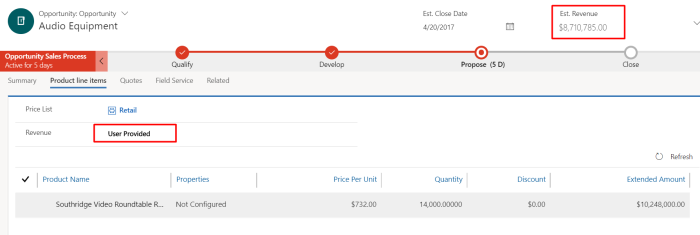
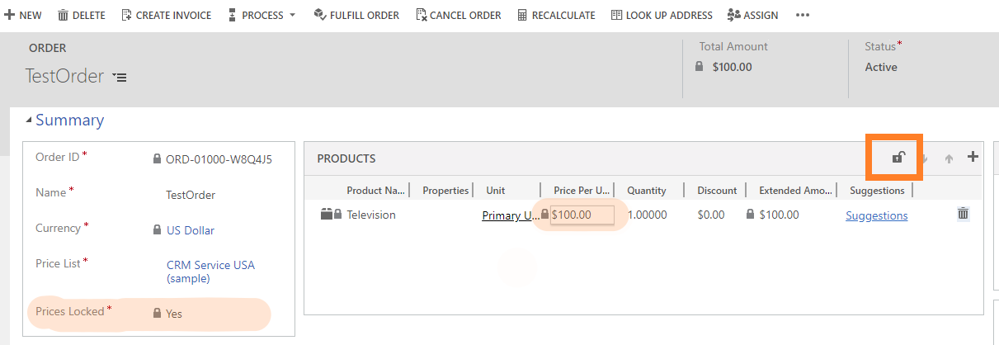
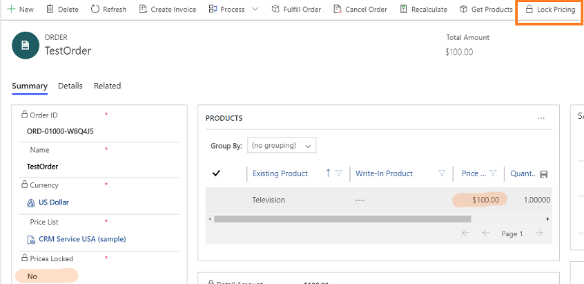

# Frequently asked questions for Dynamics 365 Sales 

## Licenses

### What's the difference between Sales Premium and sales insights?  

Sales Premium refers to the license and sales insights refers to the capabilities. The Sales Premium license includes both Sales Enterprise and premium sales insights capabilities. The basic sales insights capabilities are also available with the Sales Enterprise license. For a detailed comparison of the capabilities in each license, go to the **Compare Dynamics 365 Sales plans** section on the [Pricing](https://dynamics.microsoft.com/sales/pricing/) page.  

### Where can I find the comparison chart for Dynamics 365 Sales licenses?  

The following license options are available for Dynamics 365 Sales:
- Sales Premium
- Sales Enterprise
- Sales Professional

For a detailed comparison of capabilities available with each license, go to the **Compare Dynamics 365 Sales plans** section on the [Pricing](https://dynamics.microsoft.com/sales/pricing/) page.

### Where can I find the Sales Professional and sales insights documentation?

To provide a unified experience across all the Sales offerings, we have merged the documentation for Sales Enterprise, Sales Professional, and sales insights into this unified Sales documentation. The license and role requirements section at the top of pages indicate whether the feature and content are applicable to the license that you have. If you have bookmarked any of the old URLs, they would be automatically redirected to the corresponding pages in the unified documentation.  

## Entity: Activity

### Why are the **Follow** and **Unfollow** buttons displayed together on the command bar?

This is by design. If you go to an entity in Unified Interface and select a record, the **Follow** and **Unfollow** buttons are displayed together on the command bar no matter which state the selected record is in, followed or not followed.

### If the SchedulingEngine feature is enabled for appointments, why am I redirected to the default tab in an appointment when I save it from a non-default tab?

This is by design. When you save an appointment from a non-default tab, you are redirected to the default environment when the appointment is saved.

### If the SchedulingEngine feature is enabled for appointments, why are appointments saved automatically even if the system administrator has added a custom script to stop auto-save?

If your system administrator has added a custom script to prevent the default save option for appointments, the system will still override the custom script and save the appointments automatically.

### If the SchedulingEngine feature is enabled for appointments, why does the **Open Record Set** button disappear when an appointment is saved?

When you select **Save** to save an appointment, the **Open Record Set** button disappears. When you refresh the page, the button reappears. More information: [Open Record Set](/powerapps/user/navigation#record-set-navigation)

### Why are the synchronized appointments from Outlook shown as unsaved in Dynamics 365?

When you create an appointment or edit any existing appointment in Outlook and synchronize it with Dynamics 365, the appointment is created in Dynamics 365 but is shown as unsaved. You can disable the auto-save option in Dynamics 365 to see the synchronized appointments from Outlook saved into Dynamics 365.

### Why can't I see the What's new functionality in Unified Interface?

This is by design. The What's new functionality is only available in the legacy web client. The equivalent in Unified Interface is to insert the Timeline control (with posts enabled) on the dashboard:

1. In your app, select **Settings** , and then select **Advanced Settings**.

   The **Business Management** page opens in a new browser tab.

2. On the navigation bar, select **Settings**, and then under **Customization**, select **Customizations**.

3. Select **Customize the System**.

4. Under **Components** in the solution explorer, select **Dashboards**.

5. Select and open the dashboard to which you want to add the Timeline control.

6. On the toolbar at the top of the page, select **Timeline**.

7. In the **Timeline Control Properties** dialog box, update the values as required, and then select **OK**.

8. Save the dashboard, and publish the customization.

## Entity: Opportunity

### When can I edit the **Est.Revenue** value in the **Opportunity** form?

To edit the value of estimated **Revenue** in the **Opportunity** form, the **Revenue** must be configured as **User Provided** and the opportunity must be in an **Open** state. 

   > [!div class="mx-imgBorder"]
   > 

## Entities: Opportunity, Quote, Invoice, and Order

> [!NOTE]
> In this section, we use the entity **Opportunity** to frame the questions. However, these questions are also true for these other entities: **Quote**, **Invoice**, and **Order**.

### Why does a view other than **Opportunity Product Inline Edit View** lose the inline editing functionality and why can't I see grid actions such as move up, move down, and lock icons in the legacy web client if a view other than **Opportunity Product Inline Edit View** is selected for the **Opportunity Product** subgrid in the **Opportunity** form?

This is a by-design behavior in the legacy web client. However, this behavior is changed in Unified Interface. We recommend that you use Unified Interface to experience the inline edit view. To verify whether a grid is editable, go to **Grid control properties**.

   > [!div class="mx-imgBorder"]
   > 

   > [!NOTE]
   > - In Unified Interface, the behavior of the grid columns **Price Per Unit** and **Quantity** as editable or non-editable is independent of the view that is selected.  
   > - An editable grid doesn’t guarantee that all columns are editable; it depends on the **Pricing**.

###  Why is the amount not calculated automatically in the **Amount** fields of opportunity, quote, order, or invoice records?

The value in the **Est. Revenue** and **Total Amount** fields of an opportunity is updated only the following conditions are met:

- Your organization is configured to use system pricing calculation. To verify whether system pricing calculation is enabled, make sure that the **Use system pricing calculation** setting in **System Settings** is set to **Yes**. More information: [System Settings dialog box - Sales tab](system-settings-sales-tab.md) 

- The opportunity is refreshed (either when you select the **Refresh** button on the command bar or open the record) or when you select the **Recalculate Opportunity** button on the command bar.

The value in the **Est. Revenue** or **Total Amount** field isn't updated without the opportunity being refreshed or recalculated.

### Why are some fields editable while some are locked in the Product subgrid in the Opportunity, Quote, Order, and Invoice records?

There are certain restrictions on inline editing based on the type of products in the subgrid:

-   If the product in the subgrid is an individual product and an existing product from the product catalog, all fields except the Quantity and Discount are locked for editing.

-   If the product in the subgrid is an individual product and a write-in product from the product catalog, all fields except the Product Name, Quantity, and Discount are locked for editing.

-   If the product in the subgrid is a product bundle or an optional product of a bundle, all fields except Quantity and Discount are locked for editing.

-   If the product in the subgrid is a required product from an existing product bundle, all fields in the subgrid view are locked for editing.

## Entities: Opportunity Product, Quote Product, Order Product, and Invoice Product 

> [!NOTE]
> In this section, we use the entity **Opportunity Product** to frame the questions. However, these questions are also true for these other entities: **Quote Product**, **Order Product**, and **Invoice Product**.

### How can I configure the value of the default **Pricing** to **Override Price** on the **Opportunity Product** form?

To configure the value of the default **Pricing** as **Override Price** in the **Opportunity Product** form: 
1. Go to **Settings** > **Customizations** > **Customize the System**.
2. Select **Entities** > **Opportunity Product** > **Fields**.
3. Select the **ispriceoverridden** field and configure the **Default Value** to **Override Price**.
4. Save and publish the customizations.

  > [!div class="mx-imgBorder"]
  > 
 
## Entities: Order and Invoice

> [!NOTE]
> In this section, we use the entity **Order** to frame the questions. However, these questions are also true for the entity **Invoice**.

### How can I change the default value for the **Prices Locked** field in the **Order** form?

You can change the default value for the **Prices Locked** field in the **Order** form through customizations or the inline editable grid:
  1. Go to **Settings** > **Customizations** > **Customize the System**.
  2. Select **Entities** > **Order** > **Fields**.
  3. Select the **ispricelocked** field, and then set **Default Value** to **No**.
  4. Save and publish the customizations.

### For a particular **Order** form, how can I change the state of **Prices Locked** field?

You can change the state for the **Prices Locked** field through the inline editable grid. Select the **Lock** icon on the editable grid, and the state of the **Prices Locked** field changes accordingly. 

In the legacy web client: 
  > [!div class="mx-imgBorder"]
  > 

In Unified Interface:
  > [!div class="mx-imgBorder"]
  > 

### When can I change the values in the **Pricing Per Unit** column in the **Products** grid?

The **Prices Locked** (ispricelocked) field controls the prices specified on the **Order** form and locks them from any further updates.

These tables define the behavior of **PricePerUnit** in the **Products** subgrid and **Order** product form: 

**For existing products**:
 
|Configuration| In editable grid – **PricePerUnit** column value| In non-editable grid – **PricePerUnit** column value| **Order** product form|
|-------------|-------------|-------------|-------------|
|**Prices Locked** is Yes|Non-editable|Non-editable|Non-editable|
|**Prices Locked** is No and **Pricing** is Override Price|Editable|Non-editable|Editable|
|**Prices Locked** is No and **Pricing** is Use Default|Non-editable|Non-editable|Non-editable|

**For write-in products**:

|Configuration| In editable grid – **PricePerUnit** column value| In non-editable grid – **PricePerUnit** column value| **Order** product form|
|-------------|-------------|-------------|-------------|
|**Prices Locked** is Yes|Non-editable|Non-editable|Non-editable|
|**Prices Locked** is No|Editable|Non-editable|Editable|
   
### What is the result of changing the product price in **Pricelist** on the **PricePerUnit** of the **Order** product form?

The following table defines the effect of changing the product price in **Pricelist** on the **PricePerUnit** of the **Order** product form:

|Entity state|IsPriceLocked|Pricing|Is the value of **PricePerUnit** on the **Order** product form changed?|
|------------|-------------|-------|----------------------------------------------------------------------|
|Editable|Yes|Default or Override|No|
|Editable|No|Default|Yes|
|Editable|No|Override|No|
|ReadOnly|Yes or No|Default or Override|No|

## Forecasting

### Who owns the forecast?

A forecast owner is the user who owns a specific level in the forecast hierarchy. When creating the forecast configuration, the forecast manager or administrator selects a field that should be used for assigning the owner to each level in the forecast hierarchy.
By default, the following user field is selected based on the forecast template:        

- For **Org chart forecast**, the **User** field is selected.      
- For **Territory forecast**, the **Manager** field is selected.    
  
If you select a field other than the default, a column is created in the forecast grid. For example, if you select **Manager** as the user lookup field for an org chart forecast, the **Manager** field will be added to the forecast grid.

**To view the forecast owner:**

1. In the Sales Hub app, select **App Settings**.
1. Under **Performance management**, select **Forecast configuration**.
1. Select a forecast configuration, and then select the **Permissions** step.
1. Verify the **User lookup field** to determine who owns the forecasts in the selected forecast configuration:  

    :::image type="content" source="media/user-security-field.png" alt-text="Screenshot of User lookup field in the Permissions tab":::
    
    For example, in an org chart forecast, if you select **User** as the owner, each user in the hierarchy will be the owner of the hierarchy under them. In a territory-based forecast, a user could own more than one hierarchy if they own multiple territories.  
 
    In the following illustration, the managers own all the forecasts in their hierarchy and individual sellers own their specific forecasts.

    :::image type="content" source="media/forecast-hierarchy-owner.png" alt-text="Screenshot illustrating the forecast owner at different levels in the forecast hierarchy":::

### What are the configurations that I can edit once a forecast is published?  

You can edit the following configurations for a forecast once it's published:     
-	On the [General](define-general-properties-scheduling-forecast.md) page, you can edit forecast title and default underlying records view. 
-	On the [Permissions](provide-permissions-forecast.md) page, you can add security roles and provide them with permission to view or edit forecast. 
-	On the [Layout](choose-layout-and-columns-forecast.md) page, you can edit column titles, descriptions, and whether or not they show up on the grid. 
-	On the [Drill-down](configure-manage-drill-downs.md) page, you can add, delete, or update drill-downs.
-	On the [Snapshots](/dynamics365/ai/sales/manage-snapshots-forecast) page, you can enable or disable daily snapshots for the forecast.
-	On the [Advanced](forecast-configure-advanced-settings.md) page, you can enable or disable auto-hide parent row, multi-currency selection, and customize access to edit fields in the underlying records grid.    
When you save and publish the configuration, the changes will be applied immediately to the forecast. If you update data (simple columns and adjust fields), these changes may take up to two hours to reflect in the forecast. 

### Can I manually set the forecast category of an opportunity as **Won** or **Lost**?   
  
Technically, you can. The opportunity form and editable grids, other than the grid in the forecast, allow the selection of **Won** or **Lost** as forecast categories. However, this will interfere with your forecast and rollup values, and is not an ideal practice. For example, if you manually set the value of an opportunity to **Won** without closing the opportunity, the opportunity might not even show up in the forecast. By default, forecasts are configured to show an opportunity as **Won** only when the actual revenue and actual close date are available. The best practice is to close the opportunity as **Won** or **Lost** and have the forecast category automatically updated. More information: [Close opportunities as won or lost](close-opportunity-won-lost-sales.md).

[!INCLUDE[footer-include](../includes/footer-banner.md)]
