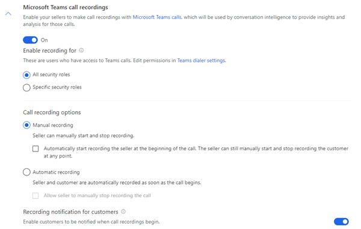
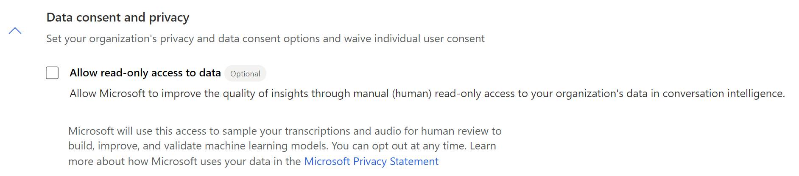

# First-run setup experience of Microsoft Teams for conversation intelligence

You can configure conversation intelligence with Microsoft Teams. After you sign in to your sales app as an administrator, you can configure the complete application&mdash;enable Microsoft Teams call recording for conversation intelligence, select storage, grant app permissions, and define organization-level tracked keywords and competitors to be used by conversation intelligence.

After configuring conversation intelligence, a sales manager or a seller can view the data and settings that are relevant to them. More information: [Configure sales team-level settings](configure-sales-team-level-settings.md)

> [!NOTE]
> You can also enable call recording through quick setup (with the Dynamics 365 Sales Enterprise license). In this case, you'll get three hours of conversation intelligence per user, per month. To also enable call recording through quick setup, you must go to the **Get started with digital sales** page under **App Settings**. More information: [Microsoft Teams calls with conversation intelligence](digital-selling-microsoft-teams-calls.md)

## License and role requirements

| Requirement type | You must have |  
|-----------------------|---------|
| **License** | Dynamics 365 Sales Premium or Dynamics 365 Sales Enterprise  More information: [Dynamics 365 Sales pricing](https://dynamics.microsoft.com/sales/pricing/) |
| **Security roles** | System Administrator    More information: [Predefined security roles for Sales](security-roles-for-sales.md)|

## Microsoft Teams for conversation intelligence

Using Teams together with conversation intelligence in Dynamics 365 Sales helps organizations transform customer interactions into revenue. Calling with Teams allows business-critical insights to be surfaced both in real-time (during the call) and post-call. These insights are seamlessly tied to the relevant Dynamics 365 records.

### Review the prerequisites

Review the following requirements before you configure Teams call recording for conversation intelligence:

- Your organization has a Teams phone system installed with a valid license to use it. More information: [Set up Phone System in your organization](/microsoftteams/setting-up-your-phone-system)
- You have a license to use Teams. More information: [Microsoft Teams add-on licenses](/microsoftteams/teams-add-on-licensing/microsoft-teams-add-on-licensing?tabs=small-business)
 
### Enable calling with Teams 

Before you configure Teams with conversation intelligence, you must enable the Teams dialer for your organization. More information: [Configure Microsoft Teams dialer](/dynamics365/sales-enterprise/configure-microsoft-teams-dialer)

> [!NOTE]
> To set up the phone system and Teams for your organization, contact your Teams administrator. 

### Configure Microsoft Teams call recording

1.	Sign in to Dynamics 365 Sales Hub.

2.	Select the **change area**  in the lower-left corner of the page, and then select **Sales Insights settings**.  

3.	On the site map, under **Productivity**, select **Conversation intelligence**.     
    The conversation intelligence home page opens.  
    > [!div class="mx-imgBorder"]
    >     

4.	Turn on **Microsoft Teams call recordings** and then configure the other settings as described in the following table.

    | Option | Description |
    |--------|-------------|
    | Enable recording for | Specifies the security roles that have the permission to record calls by using the Teams dialer. By default, this permission is granted to all the security roles in your organization. To allow only specific roles to record calls, select **Specific security roles**, and then use the lookup to select the roles.  **Tips:** <ul><li>To implement the feature in your entire organization, select all security roles.</li><li>For a phased implementation in your organization, create different security roles for each group of users and then assign the security role accordingly.</li></ul> **Note:** <ul><li>Ensure that the users who need to record calls are assigned to the selected security roles. More information: [Assign a security role to a user](/power-platform/admin/assign-security-roles)</li><li>Ensure that the selected security roles have read privileges to **Recording** records under the **Custom Entities** tab in manage security roles page. More information: [Security roles and privileges](/power-platform/admin/security-roles-privileges)</li></ul>|
    | Call recording options | Select an option for initiating call recordings: <ul><li>**Manual recording**: Select this option to allow sellers to manually start or stop the recording when a call is initiated. Also, you can select the checkbox to record only the seller automatically when the call is initiated. However, sellers can start or stop the recording of the customer anytime during the call. </li><li>**Automatic recording**: Select this option if you want to automatically record calls when a call is initiated. Also, you can select the checkbox to allow sellers to manually stop the recording at anytime during the call.</li></ul>|
    | Recording notification for customers | Turn on this toggle to notify customers when the call recording is initiated. This notification lets customers know that that Teams is recording the call.|  
    
    >[!NOTE]
    >You only need to configure Teams call recording settings, storage selection, and conversation tracking for first-time onboarding to conversation intelligence. All remaining steps are optional. You can choose to configure them now or later, as needed.

5.	(Optional) Under **Call recording storage**, configure the storage-related options as described in the following table.

    | Option | Description |
    |--------|-------------|
    | Storage for call recordings | Select an option to store your call recordings for analysis: <ul><li>**Microsoft provided storage**: Select this option if you want to use the storage provided by Microsoft. By default, this option is selected, and we recommend that you use this storage.</li><li>**Your own Azure storage**: Select this option if you want to use your custom Azure storage. After you select this option, enter the **Storage connection string** and **Container name**.</li></ul>More information: [Configure conversation intelligence to connect call data](configure-conversation-intelligence-call-data.md) |
    | Retention policy | Choose a retention time limit. The application retains call recording data for the specified time limit, and deletes the data when it reaches the time limit. More information: [Data retention and access through Privacy settings](data-retention-deletion-policy.md). |   

    > [!div class="mx-imgBorder"]
    > 

    >[!NOTE]
    >For Microsoft-provided storage, the available retention periods are 30 days and 90 days. If your organization requires longer retention periods, please consider using your own storage.

6.	Under **Business settings**, configure the following settings:
- In the **Conversation tracking** section, add the keywords and competitors that your organization wishes to track during calls. Each tracked keyword and competitor can only contain up to 50 characters.
   > [!Note]
   > Adding keywords and competitors is a required global setting that will be applied to all sales calls in the organization. To enable conversation intelligence, you must set at least one global keyword and at least one global competitor. You can update these keywords and competitors later if necessary. More information: [Configure keywords and competitors in conversation content](configure-keywords-competitors.md)
   
- In the **Automated summaries** section, leave the **Enable call summary** option selected to let your sellers view the notes after their calls. More information: [View and understand call summary page in the Sales Hub app](view-and-understand-call-summary-sales-app.md) 
- In the **My languages** section, add languages used by sellers during calls with customers. This selection helps ensure accurate transcription, keyword tracking, analysis, insights, and KPIs.

    
    > [!div class="mx-imgBorder"]
    > 

7.	(Optional) In the **Data consent and privacy** section, you can select the checkbox to allow Microsoft to improve the quality of insights by giving read-only access to your organization's data in conversation intelligence.  

    > [!div class="mx-imgBorder"]
    > 

9.	(Optional) In the **New and upcoming features** section, select the preview features that you want to enable for your Dynamics 365 org.

    - [Enable call categorization for short calls (preview)](#enable-call-categorization-for-short-calls-preview)
    - [Hide personal data (preview)](#hide-personal-data-preview)

10.	Select **Publish**.  
    In the message that appears, read the terms and conditions and the privacy statement. Select **Get started**.  

Teams call recording with conversation intelligence is now configured and ready for use in your organization.  

#### Hide personal data (preview)

To comply with the Payment Card Industry (PCI) regulations, organizations must protect personal data shared by customers during calls. When you enable the option to hide personal data, credit card details such as, credit card number, expiry date, and CVV will be masked before saving a transcript. For more information, see 

[!INCLUDE [preview-disclaimer](../includes/preview-disclaimer.md)]

1. Follow steps 1 through 4 in the [Configure Microsoft Teams call recording](#configure-microsoft-teams-call-recording) to open the Teams call recording options.

1. Go to the **New and upcoming features** section, select **Hide credit card info in transcripts**.  

    This option ensures that the credit card information in the transcripts of all future calls are masked and saved. Currently, the credit card number mentions in the audio are not redacted.

    :::image type="content" source="media/hide-pii.png" alt-text="Screenshot of the hide personal data option."::: 

#### Enable call categorization for short calls (preview)

[!INCLUDE [preview-disclaimer](../includes/preview-disclaimer.md)]

If you have chosen **Automatic recording** to record all customer calls, you can enable call categorization to help your sales team to quickly identify calls that don't have useful content such as calls that went to voicemail and calls that were not answered. More information: [View categorization tag for short duration calls (Preview)](view-and-understand-call-summary-sales-app.md#view-categorization-tag-for-short-duration-calls-preview)

1. Follow steps 1 through 4 in the [Configure Microsoft Teams call recording](#configure-microsoft-teams-call-recording) to open the Teams call recording options.

1. Go to the **New and upcoming features** section, select **Call categorization (preview)**, select the type of calls you want the system to detect and tag.  

    :::image type="content" source="media/call-categorization-preview.png" alt-text="Screenshot of the New and upcoming features section with the toggle to enable preview features":::

[!INCLUDE[cant-find-option](../includes/cant-find-option.md)] 

### See also

[Introduction to administering conversation intelligence](intro-admin-guide-sales-insights.md#administer-conversation-intelligence)  
[Prerequisites to configure conversation intelligence](prereq-sales-insights-app.md)

[!INCLUDE[footer-include](../includes/footer-banner.md)]

