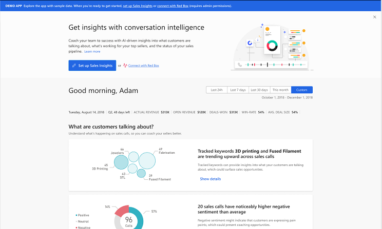
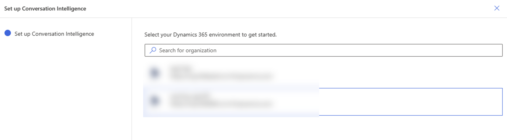
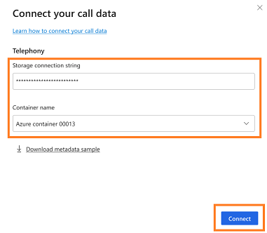
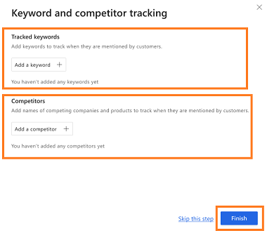

# First-run setup in conversation intelligence app

As an administrator, you can set up conversation intelligence&mdash;select storage, grant app permissions, and define organization-level tracked keywords and competitors&mdash;to suit your requirements.

## License and role requirements

| Requirement type | You must have |
|-----------------------|---------|
| **License** | Dynamics 365 Sales Premium or Dynamics 365 Sales Enterprise  More information: [Dynamics 365 Sales pricing](https://dynamics.microsoft.com/sales/pricing/) |
| **Security roles** | System Administrator    More information: [Predefined security roles for Sales](security-roles-for-sales.md)|

## Configure conversation intelligence

1.	Review the prerequisites. More information: [Prerequisites to setup conversation intelligence](prereq-sales-insights-app.md)  
2.	Sign in to the [Conversation intelligence app](https://sales.ai.dynamics.com/) as an administrator.  
    > [!div class="mx-imgBorder"]
    >    
3.	Select **Set up Conversation intelligence**.   
4.	In the **Connect your data** dialog, select the Power Platform environment that hosts Dynamics 365 Sales to connect with the application.  
    > [!div class="mx-imgBorder"]
    >     
    The application detects your environment.  
5.	In the **Terms and conditions** dialog, carefully read the [Microsoft privacy statement](https://privacy.microsoft.com/privacystatement), and read and select the checkbox for the [terms and conditions](https://www.microsoft.com/licensing/product-licensing/products). Select **Agree and continue**.  
    > [!div class="mx-imgBorder"]
    >   
    >[!NOTE]
    >Selecting the first checkbox allows Microsoft to collect your organization's data to improve the quality of insights. This is optional. 
    The application takes a few minutes to connect to your data, during which a progress dialog is displayed.
    > [!div class="mx-imgBorder"]
    >     
6.	In the **Connect your call data** dialog, enter the **Storage connection string** and **Container name**, and then select **Connect**. To learn more on how to get these **Storage connection string** and **Container name** values, see [Create a call recording repository in Azure](create-azure-repo.md)
    > [!div class="mx-imgBorder"]
    >    

8.	In the **Keyword and competitor tracking** dialog, add the keywords and competitors that you want to track on the call. You can update these keywords and trackers later if your organization's requirements change. More information: [Configure conversation content](../sales/configure-keywords-competitors.md)      
    > [!NOTE]
    > You can also skip adding the keywords and competitors at this point. You can always add them later.  
    
    > [!div class="mx-imgBorder"]
    >    
9.	Select **Finish** to complete the setup of conversation intelligence for your organization.
    The status message will be displayed at the top of the page.  
    > [!div class="mx-imgBorder"]
    > 

Now your conversation intelligence application is ready, and managers and sellers can use it to view this data.

[!INCLUDE[cant-find-option](../includes/cant-find-option.md)] 

### See also

[Introduction to administering conversation intelligence](intro-admin-guide-sales-insights.md#administer-conversation-intelligence)  
[Prerequisites to configure conversation intelligence](prereq-sales-insights-app.md)  
[Conversation Intelligence FAQs](faqs-sales-insights.md#conversation-intelligence)

[!INCLUDE[footer-include](../includes/footer-banner.md)]
