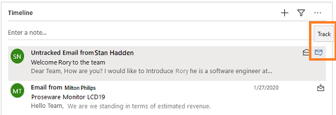

# Auto capture 

Use the auto capture to capture activities related to your emails and contacts, and display on timeline.

## What is auto capture? 

The activities captured by the auto capture feature are shown on the timeline in Dynamics 365 Sales. The feature finds activities by applying a set of rules that are specific to the record type. For example, when you look at an opportunity in Microsoft Dynamics 365 Sales, the timeline shows all the activities you've logged. Additionally, it shows suggestions for up to 50 recent emails and meetings from the last three days in your Outlook account that are related to the primary contact for the opportunity or its stakeholders.

>[!NOTE]
>The appointment suggestion starts appearing on the timeline three days prior to the actual meeting time.

The following images show how tracked and auto-captured (not yet tracked) emails and meetings are displayed on the timeline:

-	**Auto capture emails and meetings**: These emails and meetings were detected by auto capture as being relevant to the current record, but they're still private, so only you can see them. Compared to tracked messages, these messages are shown as untracked emails or meetings. The following image shows an untracked email.

    > [!div class="mx-imgBorder"]
    > 

    > [!NOTE]
    > From version 9.2.24031.00102, Dynamics 365 Sales follows [principle of least privilege access](/entra/identity-platform/secure-least-privileged-access), which blocks access to untracked emails and meetings for users who have [conditional access policies](/entra/identity/conditional-access/concept-conditional-access-policy-common?tabs=secure-foundation) on their tenants. If you don't see the untracked emails and meetings, contact your administrator to [verify whether the issue is due to conditional access policies on your tenant](/troubleshoot/dynamics-365/sales/troubleshoot-emails-issues#issue-unable-to-view-untracked-emails-and-meetings-in-auto-capture). Alternatively, your administrator can enable [Microsoft 365 Copilot for Sales in Outlook](/microsoft-sales-copilot/save-outlook-activities-crm) so that you can record individual activities or [server-side synchronization](/power-platform/admin/email-message-filtering-correlation) to track all emails and meetings automatically.

-	**Track link**: Select the **Track** icon on an untracked activity captured by auto capture, making it visible to everyone who has access to the timeline of this specific record.
The activities that auto capture finds are only visible to you, so other members of your sales team won't be able to see them in Dynamics 365 Sales. When you select the **Track** link on any auto-captured message, you turn it into a tracked email message, which saves the activity into the Dynamics 365 Sales database and makes it visible to other members of your team. It might take a few minutes for an activity to go from not being tracked to tracked, during which time it shows a **Tracking pending** message.

    > [!div class="mx-imgBorder"]
    > 

-	**Tracked emails and meetings**: The envelope symbol indicates that this email or meeting is already being tracked, so it's already imported into Sales and is being shared with your team.

    > [!div class="mx-imgBorder"]
    > 

As with other types of activity tiles shown on the timeline, you can select the tile to expand or collapse the content on the tile.

## Which activities are captured?

Auto capture queries your Outlook account and looks for activities related to the record you're looking at. The following table summarizes how auto capture identifies related activities.

|Entity type|Matches these field values to the To, CC, or From address of each email and meeting |  
|-----------------|--------------------------------------------------------------------------------------|  
|Account|**Email** address of the listed **Primary Contact**.   **Email** addresses of the top 50 contacts that have the account as their parent account.   All **Email** addresses defined for the account record itself.|  
|Opportunity|**Email** address listed for the **Opportunity Contact**.   **Email** address of any contact in the **Stakeholders** list.   All **Email** addresses defined for the opportunity record itself.  **Email** addresses of contacts of the account that is linked to the opportunity.  If the opportunity is associated with a lead, **Email** address of the contact in the lead.|  
|Lead|**Email** address listed in the **Contact** section.   All **Email** addresses defined for the lead record itself.|  
|Contact|All **Email** addresses defined for the contact record.|  
|Custom entities|For *account* fields: the email address for the **Primary Contact** of the account, plus all **Email** addresses defined for the account record itself.   For *contact* fields: all **Email** addresses defined for the contact record.   For *customer* fields that refer to a contact: all **Email** addresses defined for the contact record.   For *customer* fields that refer to an account: the **Email** address of the listed **Primary Contact**, plus all **Email** addresses defined for the account record itself.|  

## Related information

[Enable and configure auto capture](configure-auto-capture.md)

[!INCLUDE[footer-include](../includes/footer-banner.md)]
