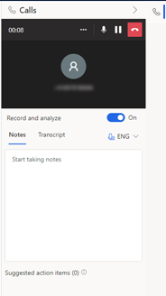

# Get real-time call data through Teams calls

Conversation intelligence with Teams calls gives you real-time call data analysis that includes overview, summary, transcription, insights, and action items. To use this feature, an administrator must configure Microsoft Teams in your organization. More information: [First-run setup experience for conversation intelligence in sales app](fre-setup-ci-sales-app.md) 

## License and role requirements
| Requirement type | You must have |
|-----------------------|---------|
| **License** | Dynamics 365 Sales Premium or Dynamics 365 Sales Enterprise   More information: [Dynamics 365 Sales pricing](https://dynamics.microsoft.com/sales/pricing/) |
| **Security roles** | Any primary sales role, such as salesperson or sales manager   More information: [Primary sales roles](security-roles-for-sales.md#primary-sales-roles)|

## View real-time analysis of call data
  
Before you start a call, choose the language of the call on the dialer.  

When a call is connected, the **Record** option appears. Turn on this option to get real-time analysis of the call.

You can perform the following actions during the call:  

- **Connect and edit the record**: On the **Details** tab, you can connect the record that's relevant to the call and edit it if required. You can also view the phone call activity.

-	**Take notes**: On the **Notes** tab, you can take meeting notes to summarize key points or any other important information about the call. The added notes are automatically saved to the activity’s timeline, and are also available in the **Call summary** tab of the phone call activity. For more information about activities, see [Track and manage activities](manage-activities.md). Automatic suggestions for action items detected during the call will appear in the **Suggested action items** section and can be added to the notes with a single click.  

    > [!div class="mx-imgBorder"]
    >   

-	**Transcript**: On the **Transcript** tab, a real-time transcript is displayed during the call, with a timeline showing who said what, when. The transcript helps you analyze the call. The defined keywords and competitors that were mentioned in the call are highlighted in bold text. More information: [Configure keywords and competitors](configure-keywords-competitors-sales-app.md)

After the call is ended, select **Full summary** to view the summary of the call. More information: [View and understand call summary](view-and-understand-call-summary-sales-app.md)

[!INCLUDE [cant-find-option](../includes/cant-find-option.md)]

### See also

[Configure Microsoft Teams dialer](configure-microsoft-teams-dialer.md)   
[Call using Microsoft Teams](call-using-microsoft-teams.md)   

[!INCLUDE[footer-include](../includes/footer-banner.md)]
