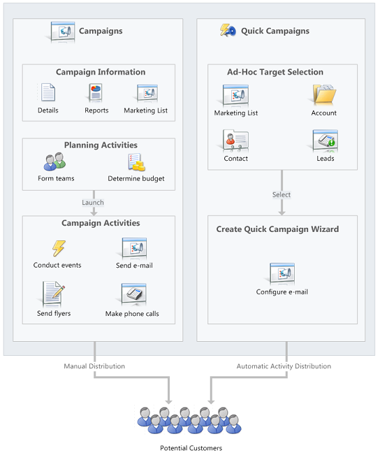

# Get started with in-app marketing

Promote your business and improve sales with targeted marketing campaigns in [!INCLUDE[pn-dyn-365-sales](../includes/pn-dyn-365-sales.md)]. Create activities for each campaign and assign them to different team members. Track customer response and costs for each campaign. Follow this step-by-step guide to get started with your marketing campaigns.  

> [!NOTE]
> In-app marketing is not fully supported in the Dynamics 365 app for Teams.
  
## License and role requirements
| Requirement type | You must have |  
|-----------------------|---------|
| **License** | Dynamics 365 Sales Premium, Dynamics 365 Sales Enterprise, or Dynamics 365 Sales Professional  More information: [Dynamics 365 Sales pricing](https://dynamics.microsoft.com/sales/pricing/) |
| **Security roles** | Any primary sales role, such as salesperson or sales manager   More information: [Primary sales roles](security-roles-for-sales.md#primary-sales-roles)|

## Import contacts, accounts, and leads  

Get your customer records into [!INCLUDE[pn-dyn-365-sales](../includes/pn-dyn-365-sales.md)], and add these to marketing lists so you can target your campaigns. [!INCLUDE[proc_more_information](../includes/proc-more-information.md)] [Import data](/power-platform/admin/import-data-all-record-types)  
  
## Create marketing lists  

You can group accounts, contacts, or leads into a targeted marketing list. You can create a marketing list easily with the search functionality in [!INCLUDE[pn-dyn-365-sales](../includes/pn-dyn-365-sales.md)], For example, you can find all of your customers in a particular area and add them to the member list. [!INCLUDE[proc_more_information](../includes/proc-more-information.md)] [Create a marketing list using in-app marketing](create-marketing-list-using-app-marketing-sales.md)  
  
## Understand the difference between a campaign and a quick campaign  

In the marketing area, use standard campaigns to manage the end-to-end process of a complete marketing campaign, which includes managing campaign and planning activities, distributing the activities to other team members, and tracking how the campaign did. Campaigns include extensive tracking features like detailed information, reports, and multiple marketing lists.  
  
In contrast to standard campaigns, you can use quick campaigns to automatically distribute a single activity to selected accounts, contacts, or leads, or to a single marketing list. The effects of a quick campaign are immediate.  
  
   
  
## Create a campaign or a quick campaign

 Depending on your requirements, you can track your marketing activities through a campaign or a quick campaign. [!INCLUDE[proc_more_information](../includes/proc-more-information.md)] [Create or edit a campaign using in-app marketing](create-edit-campaign-using-app-marketing-sales.md), [Create a quick campaign using in-app marketing](create-quick-campaign-using-app-marketing-sales.md)  
  
## Track a campaign response

 Record the replies you get from potential customers in response to a specific marketing campaign to make sure your team can act on the responses. Measure the success of specific campaign activities based on customer response rates. [!INCLUDE[proc_more_information](../includes/proc-more-information.md)] [Track a marketing campaign response using in-app marketing](track-marketing-campaign-response-using-app-marketing-sales.md)  
  
## See how your campaigns are doing with default marketing reports

Use one of the following reports to assist you in monitoring and analyzing marketing activities:  
  
- **Campaign Activity Status**: Use this report to track a campaign. The report displays a summary for one campaign.  
  
- **Campaign Comparison**: Use this report to identify your most and least successful campaigns.  
  
- **Campaign Performance**: Use this report to track the progress and status of your campaigns.  
  
## Let your customers unsubscribe from marketing communications  

You can enable customers to unsubscribe from email marketing communications that your organization sends them.

1. Add the unsubscribe link to your marketing campaign email. More information: [Distribute a campaign activity](add-activity-campaign-using-app-marketing-sales.md#distribute-a-campaign-activity)

2. On the **Marketing Settings** page, set the option **Set "Do Not Send Marketing Material" option when unsubscribe email is received** to **Yes**. More information: [Configure in-app marketing settings](configure-inapp-marketing.md)
  
When a member selects the unsubscribe link, the **Marketing Materials** setting for that member will be automatically set to **Do not send**.  They'll be removed from any future marketing email communications.

:::image type="content" source="media/contact-marketing-material.png" alt-text="Marketing Materials option on the Contacts page, Details tab.":::    

> [!NOTE]
> You can't add unsubscribe functionality to direct email or email templates.  

[!INCLUDE[cant-find-option](../includes/cant-find-option.md)] 
  
### See also

[Create a marketing list using in-app marketing](create-marketing-list-using-app-marketing-sales.md)   
[Create or edit a campaign using in-app marketing](create-edit-campaign-using-app-marketing-sales.md)   
[Create a quick campaign using in-app marketing](create-quick-campaign-using-app-marketing-sales.md)   
[Add an activity to a campaign using in-app marketing](add-activity-campaign-using-app-marketing-sales.md)   
[Add a marketing list, sales literature, or product to a campaign using in-app marketing](add-marketing-list-sales-literature-product-campaign-using-app-marketing-sales.md)   
[Track a marketing campaign response using in-app marketing](track-marketing-campaign-response-using-app-marketing-sales.md)   
[Troubleshoot issues with in-app marketing](/troubleshoot/dynamics-365/sales/troubleshoot-in-app-marketing-issues)

[!INCLUDE[footer-include](../includes/footer-banner.md)]
