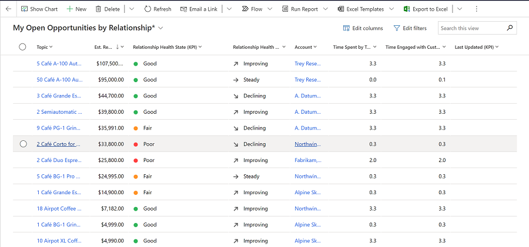

# Insights generated from Microsoft 365 data

Dynamics 365 Sales generates the following relationship insights using Microsoft 365 data:
 
- Relationship analytics and health
- Who knows whom 

## Relationship analytics and health

Relationship analytics provides a comprehensive view of KPIs and activity histories for any contact, opportunity, lead, or account. The feature also calculates the overall health and trend of each of your business relationships. With these insights, you can identify critical opportunities and customer relationships that need your attention. 

The KPI and health insights are generated based on the data in Dynamics 365 and optionally from Microsoft 365. When you allow Dynamics 365 to collect and use Microsoft 365 data, you'll get complete relationship information and more accurate insights. 

The following screenshot is an example of how relationship analytics data appears for an opportunity:

  

For more information on how to use this feature, see [Use relationship analytics to gather KPIs](relationship-analytics.md) and how to configure the feature, see [Configure relationship analytics and health](configure-relationship-analytics.md).

## Who knows whom

Who knows whom helps you identify colleagues within your organization who can introduce you to a lead or contact. This feature provides you with details such as names and email addresses of your colleagues who know the lead. With these details, you can contact your colleagues for help with getting introduced to a lead. Such introduction can increase the chances of a positive outcome during the interaction.

The following screenshot is an example of the who knows whom widget on a lead page:

:::image type="content" source="media/wkw_connection.png" alt-text="Who knows whom connection widget showing the contact details and connection strength":::

For more information on how to use this feature, see [How to get introduced to leads or contacts](who-knows-whom.md) and how to configure the feature, see [Configure who knows whom](configure-who-knows-whom.md).