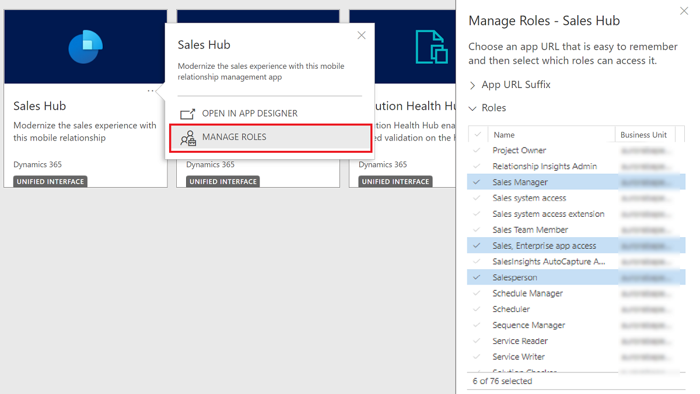
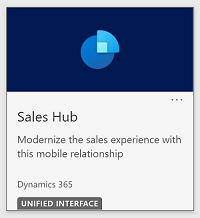

# Use the Sales Hub app to access Dynamics 365 Sales features

Can't wait to explore Dynamics 365 quickly? Use the free **Sales Hub** app, which is pre-installed and pre-configured with several core sales and sales insights features to help you get started quickly.

The **Sales Hub** app has a modern and interactive interface, designed to simplify your day-to-day sales activities. It shows you all the vital information in one place, and lets you focus on the key activities that require your attention.

**Sales Hub** is based on the Unified Interface framework. Some of the key highlights are:

-   Modern, seamless, and intuitive user interface

-   Adaptive UI that renders content according to the devices

-   Access to mobile app that lets you complete tasks on-the-go

-   Built with accessibility in mind

## Why should you use the Sales Hub app

**Sales Hub** is a Microsoft first-party app that is designed and configured for ideal seller experiences. When you use the Sales Hub app,

-   You get access to the preview features with minimal configuration.

-   You get access to the premium features, for a specific period, when they're made available.

-   You get access to standard sales and sales insights features almost instantly.

-   You can customize the app and configure the features as required.

-   You need not create custom documentation as the Microsoft documentation is based on the **Sales Hub** app.

**Note:** The **Sales Hub** app can coexist with the custom sales apps that you might have in your organization.

## Grant or revoke access to the Sales Hub app

As an administrator, you can decide which users or security roles should have access to the Sales Hub app. The app will honor the access permissions defined in the security role of the user. For example, if the security role allows access to only opportunities and quotes, the app will display only those entities for the user.

[!INCLUDE [preview-disclaimer](../includes/preview-disclaimer.md)]

If your organization has opted in for early access as described on the [Opt in to early access updates](/power-platform/admin/opt-in-early-access-updates) page, the **Sales Hub** app is enabled by default for the following roles:

-   System Administrator

-   System Customizer

-   Sales, Enterprise app access

-   Salesperson

-   Sales Manager

-   Vice President of Sales

As an administrator, you can either grant or revoke access to a security role or to specific users.

**To grant or revoke access:**

1.  On the **Published Apps** page, select the **More Options** icon in the **Sales Hub** card and select **Manage Roles**.

    

    The security roles that already have the access are highlighted in blue color as shown in the above screenshot.

2.  To grant or revoke access to all the users of a security role, select the security role in the **Manage Roles – Sales Hub** pane.

3.  To grant access to specific users, assign the **Sales, Enterprise app access** role to the users. To revoke access, remove the role for the user. For more information on adding or removing users from a security role, see [Assign security roles to users](security-roles-for-sales.md#assign-security-roles-to-users).

If you've granted access, the users will see the **Sales Hub** app in their published apps page. If you've revoked access, the app will be removed from published apps page of the users.

## Access the Sales Hub app

Access your Dynamics 365 Sales environment and select **Sales Hub** from **Published Apps** page.

**Note:** If you don't see the app, contact your administrator to grant you access. More information: [Grant access to the Sales Hub app](#grant-or-revoke-access-to-the-sales-hub-app)

For instructions on using the Sales Hub app on mobile devices, see [Sign in and sign out from the app](sales-mobile/use-sales-mobile-app.md#sign-in-and-sign-out-from-the-app)
