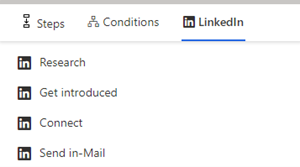

# Add LinkedIn activities to a sequence 

Use LinkedIn features to define activities for sequences in the sales accelerator to display steps in the work list and **Up next** widget.

## How do LinkedIn activities help?

In sequences, activities that are based on LinkedIn Sales Navigator allow sellers to diversify their day-to-day activities by including the social selling functions that are available in LinkedIn. You can use LinkedIn's vast network with recommended actions that your sellers can take to build deeper connections.

As an administrator or sequence manager, you can add the following activities to sequences:  

- [Complete the research](#complete-the-research)  
- [Get introduced](#get-introduced)  
- [Get connected](#get-connected)  
- [Send InMail](#send-inmail)  

>[!div class="mx-imgBorder"]
>

## Prerequisites  

Ensure that you meet the following requirements before configuring LinkedIn activities:

- LinkedIn Sales Navigator is configured in your organization. More information: [Install and enable LinkedIn Sales Navigator](/dynamics365/linkedin/install-sales-navigator)
- The latest version of the solution is installed. Go to **Advanced settings** > **Solutions**, and search for **msdyn_LinkedInSalesNavigatorAnchor**. The version number should be **3.0.1.1060** or later. 

## Complete the research

Sellers can use the **Research** activity to view a customer's LinkedIn profile, including contact and account information. This helps sellers to better understand customers before starting to work with them. More information: [Leads Module References](/linkedin/sales/display-services/leads-screenshots) and [Accounts Module References](/linkedin/sales/display-services/accounts-screenshots)

When the activity is displayed to the seller, the LinkedIn **Research** step is displayed in the **Up next** widget and work list. 

**To add the Research activity**

1. In the sequence designer page, select the **Add** (**+**) icon under a step.  
1. On the **Add an action or other element** dialog box, under the **LinkedIn** tab, select **Complete the research**.  
1. In the **Research** pane, enter a description for the activity.

    :::image type="content" source="media/sa-linkedin-activity-research-box.png" alt-text="Screenshot of Research activity selected.":::

1. Close the **Research** pane.  
   The LinkedIn search step is created and added to the sequence.

## Get introduced

Sellers can use the **Get introduced** activity to ask for an introduction to the customer from anyone within their network in LinkedIn who's already connected to the customer. More information: [Get Introduced](/linkedin/sales/display-services/leads-screenshots#get-introduced)

When this activity is displayed to the seller, the **Find intro person** step is displayed in the **Up next** widget and work list.

To add the Get introduced activity:

1. In the sequence designer page, select the **Add** (**+**) icon under a step.  
1. On the **Add an action or other element** dialog box, under the **LinkedIn** tab, select **Get introduced**.  
1. In the **Get introduced** pane, enter a description for the activity.  

    :::image type="content" source="media/sa-linkedin-activity-get-introduced-box.png" alt-text="Screenshot of Get introduced activity selected.":::

1. Close the **Get introduced** pane.  
   The LinkedIn get introduced step is created and added to the sequence.

## Get connected

Sellers can use the **Get connected** activity to send connection invites to customers along with personal messages, to help solidify customer relationships and add them to their network. More information: [Connect](/linkedin/sales/display-services/leads-screenshots#connect)

When this activity is displayed to the seller, the **Get connected** step is displayed in the **Up next** widget and work list.

To add the Connect activity:

1. In the sequence designer page, select the **Add** (**+**) icon under a step.  
1. On the **Add an action or other element** dialog box, under the **LinkedIn** tab, select **Get connected**.  
1. In the activity selection box, select the **LinkedIn** tab, and then select **Connect**.  
1. In the **Connect** pane, enter a description for the activity.  

    :::image type="content" source="media/sa-linkedin-activity-connect-box.png" alt-text="Screenshot of Connect activity selected.":::

1. Close the **Connect** pane.
    The LinkedIn get connected step is created and added to the sequence.

## Send InMail

The **Send InMail** activity allows sellers to directly message customers who they're not already connected to through LinkedIn. More information: [Send an InMail Message](https://www.linkedin.com/help/linkedin/answer/437)

When this activity is displayed to the seller, the Send InMail step is displayed in the Up next widget and work list. 

To add the Send InMail activity:

1. In the sequence designer page, select the **Add** (**+**) icon under a step.  
1. On the **Add an action or other element** dialog box, under the **LinkedIn** tab, select **Send InMail**.  
1. In the **InMail** pane, enter a description for the activity.  

    :::image type="content" source="media/sa-linkedin-activity-send-inmail-box.png" alt-text="Screenshot of Send InMail activity selected.":::

1. Close the **InMail** pane.  
    The LinkedIn send InMail step is created and added to the sequence.

[!INCLUDE [cant-find-option](../includes/cant-find-option.md)]

## Related information

[Create and activate a sequence](create-and-activate-a-sequence.md)  
[Add steps to sequence](steps-sequence.md)  
[Add condition steps to sequences](adaptive-sequence.md)  
[Add command steps to sequences](command-sequence.md)  
[Work with LinkedIn activities](work-with-linkedin-activities.md)
