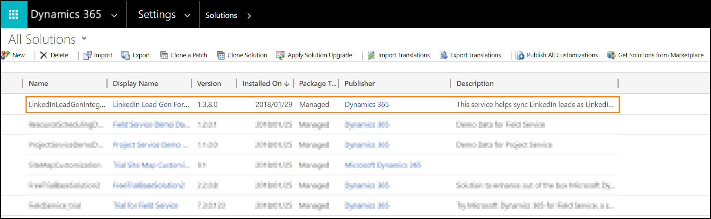

# Install Dynamics 365 Connector for LinkedIn Lead Gen Forms

> [!NOTE]
> LinkedIn lead generation capabilities will be removed on December 2, 2024. 

To enable the synchronization of lead data from [!include[LinkedIn](../../includes/pn-linkedin.md)] to Dynamics 365 apps, a system administrator needs to install the connector from [Microsoft AppSource](https://go.microsoft.com/fwlink/p/?linkid=850928).

> [!IMPORTANT]
> You can benefit from this connector when you use [!include[LinkedIn](../../includes/pn-linkedin.md)] advertising campaigns that generate leads, such as [Sponsored Content](https://business.linkedin.com/marketing-solutions/native-advertising/), [Sponsored InMail](https://business.linkedin.com/marketing-solutions/sponsored-inmail), or [Dynamic Ads](https://business.linkedin.com/marketing-solutions/dynamic-ads).

## Prerequisites

Review the following prerequisites before you install the connector:

- To install, update, or remove the solution, you’ll need global admin permissions in Microsoft 365, and be a system administrator or have a customizer security role in Dynamics 365 apps.  
- To sync leads from [!include[LinkedIn](../../includes/pn-linkedin.md)] and run campaigns on [!include[LinkedIn](../../includes/pn-linkedin.md)], you need access to a [!include[LinkedIn](../../includes/pn-linkedin.md)] Advertising Account that can manage ads by using [!include[LinkedIn](../../includes/pn-linkedin.md)] Campaign Manager.    
  More information: 
  - [Understanding LinkedIn's advertising tool](https://www.linkedin.com/help/lms/answer/56969)  
  - [Create an ad account in Campaign Manager as a new advertiser](https://www.linkedin.com/help/lms/topics/8121/8122/5749)  
  - [Add a user to a LinkedIn Ads account](https://www.linkedin.com/help/lms/answer/5753)  
- We recommend using the latest version of [!include[Edge](../../includes/pn-microsoft-edge.md)], [!include[Chrome](../../includes/tn-google-chrome.md)], [!include[Firefox](../../includes/tn-mozilla-firefox.md)], or [!include[Safari](../../includes/tn-apple-safari.md)].  

## Install and set up the connector

1. Open the connector app in [Microsoft AppSource](https://go.microsoft.com/fwlink/p/?linkid=850928).  
1. Select **Get it now**.  
1. Sign in to your Dynamics 365 system admin account.  
1. Review and accept the disclaimer, required permissions, and service terms and select **Get it now**. You need to be a global admin in this Microsoft 365 tenant to authorize S2S inbound. More information about S2S: [MSDN: Build web applications using Server-to-Server (S2S) authentication](/previous-versions/dynamicscrm-2016/developers-guide/mt790168(v=crm.8)).  
    The form takes you to Power Platform Admin Center to install the solution.  
1. Select the environment where you want to install the solution, read through the terms and conditions, and select the checkboxes. Select **Install**.
   It takes a few minutes to install the solution. To monitor the status of the installation, or update or remove a managed solution, go to the [Microsoft 365 admin center](https://admin.microsoft.com/).  
   More information: [TechNet: Use the Microsoft 365 admin center to manage your subscription](/power-platform/admin/use-office-365-admin-center-manage-subscription).  
1. In Dynamics 365 Sales, go to **Settings** > **Advanced Settings** > **Customization** > **Solutions** and select **LinkedIn Lead Gen Forms Connector** to see the solution details.  
     
    The solution creates the following security roles, which you can assign to users so that they can work with [!include[LinkedIn](../../includes/pn-linkedin.md)] Lead Gen Forms in Dynamics 365 apps. A third role, **LinkedIn Lead Gen S2S Inbound**, is an internal security role used by the solution to sync data.  
    - **[!include[LinkedIn](../../includes/pn-linkedin.md)] Lead Gen Forms Administrator**&mdash;Users with this role can configure lead matching strategies, [!include[LinkedIn](../../includes/pn-linkedin.md)] field mapping, and solution settings for the connector.

    - **[!include[LinkedIn](../../includes/pn-linkedin.md)] Lead Gen Forms Salesperson**&mdash;These users can authorize [!include[LinkedIn](../../includes/pn-linkedin.md)] user profiles to sync data to Dynamics 365, and view details about the synced submissions.  
1. Assign the security roles to users who need access to the **[!include[LinkedIn](../../includes/pn-linkedin.md)] Lead Gen** menu item. Learn more about assigning roles in [Assign a security role to a user](/power-platform/admin/assign-security-roles).

## Related information

[Upgrade or update a solution](/power-apps/maker/data-platform/update-solutions)  
[Configure a matching strategy to update leads from LinkedIn Lead Gen ads](configure-matching-strategy.md)  
[How to sync LinkedIn leads by using Dynamics 365 Connector for LinkedIn Lead Gen Forms](sync-linkedin-leads.md)  
