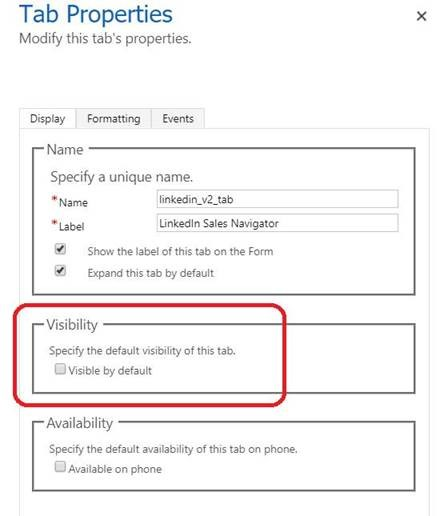

# Install and enable LinkedIn Sales Navigator

As an administrator, You can install and enable LinkedIn Sales Navigator for your organization.  

> [!IMPORTANT]
> Dynamics 365 Sales (on-premises) doesn't support LinkedIn Sales Navigator.

## Review prerequisites

Review the following prerequisites to install and enable LinkedIn Sales Navigator:

- You have a System Administrator security role in [!INCLUDE[pn-dynamics-365](../../includes/pn-dynamics-365.md)].  
- You can integrate LinkedIn Sales Navigator with Dynamics 365 Customer Engagement apps only and can't be integrated with a Microsoft Dataverse organization.
- You have a [Microsoft Relationship Sales subscription](https://dynamics.microsoft.com/sales/relationship-sales/) for Dynamics 365. Microsoft Relationship Sales (MRS) solution includes Dynamics Sales Enterprise and [LinkedIn Sales Navigator Advanced](https://business.linkedin.com/sales-solutions/sales-navigator-customer-hub/resources/crm) license. or 
    If you don't have MRS Solution or MRS Solution plus for LinkedIn Sales Navigator license, you need to sign up your team for [LinkedIn Sales Navigator Advanced](https://business.linkedin.com/sales-solutions/sales-navigator-customer-hub/resources/crm) or [LinkedIn Sales Navigator Advanced Plus](https://business.linkedin.com/sales-solutions/sales-navigator-customer-hub/resources/crm) license.

    > [!NOTE]
    > We recommend having a Microsoft Relationship Sales solution Plus license that includes Dynamics 365 Sales Enterprise and [LinkedIn Sales Navigator Advanced Plus](https://business.linkedin.com/sales-solutions/sales-navigator-customer-hub/resources/crm) license. To learn more, see the **Dynamics 365 Sales** section from the [Microsoft Dynamics 365 Licensing Guide](https://go.microsoft.com/fwlink/?LinkId=866544).

- You have to enable JavaScript in your browser.  
- You have to disable your pop-up blocker for the [!INCLUDE[pn-dynamics-365](../../includes/pn-dynamics-365.md)] domain.  

## Install LinkedIn Sales Navigator

1. To install, go to the **Install LinkedIn Sales Navigator for Dynamics 365** pane. There are three ways to navigate to the pane:

    - **App Settings**

        1.	Sign in to your Sales Hub app.

        1.	In the site map, at the lower-left, select the **Change area** icon , and then select **App Settings**.  

        1.	Under **General Settings**, select **LinkedIn integration** and then select **Enable LinkedIn integration**.  

    - **Advanced Settings**

        1. In your Sales Hub app, select **Settings** , and then select **Advanced Settings**.

            The **Business Management settings** page opens in a new browser tab.

        1. Select **LinkedIn Sales Navigator**.  

        1. On the LinkedIn integration page, select  **Enable LinkedIn integration**.  

    - **AppSource page**

        Go to the [LinkedIn Sales Navigator for Dynamics 365](https://appsource.microsoft.com/en-us/product/dynamics-365/mscrm.5ba43194-adc5-4c13-b40d-af04f549d5da) AppSource page, and then select **Get it now**.

    You're navigated to the Power Platform admin center page.  

1. On the **Install LinkedIn Sales Navigator for Dynamics 365** pane, choose your environment.

1. Select the check boxes for Microsoft and Dynamics 365 legal terms and privacy statements, and then select **Install**.

    The installation might take few minutes to complete.  

1. (Optional) To know the installation status, go to **Environments** > ***your environment*** > **Dynamics 365 apps** and verify that the status of **Dynamics 365 Sales LinkedIn Integration** solution is **Installed**.

1. (Optional) Validate the installation to help ensure that the installation in successful. More information: [Validate the installation](#validate-the-installation).

## Validate the installation

1. In your app, select **Settings** , and then select **Advanced Settings**.

    :::image type="content" source="../media/advanced-settings-option.png" alt-text="Screenshot of Advanced Settings link in the site map.":::

1. Go to **Settings** > **Customizations** > **Solutions**.

1. Verify that the following solutions are installed in your organization.

    - LinkedInSalesNavigatorControlsForUnifiedClient
    - LinkedIn
    - msdyn_LinkedInSalesNavigatorAnchor

    :::image type="content" source="media/verify-solution-installation.png" alt-text="Screenshot of LinkedIn sales navigator related solutions installed.":::

    >[!NOTE]
    >If the **LinkedInSalesNavigatorControlsForUnifiedClient** solution is not available in the list, follow the steps as described in the [LinkedInSalesNavigatorControlsForUnifiedClient solution is not available in the organization to configure LinkedIn Sales Navigator](/troubleshoot/dynamics-365/sales/lisn-unable-upgrade-lisn-solution) section.

After the installation is complete, [enable LinkedIn Sales Navigator](#enable-linkedin-sales-navigator).  

## Enable LinkedIn Sales Navigator

When enabled, the Sales Navigator controls appear on Account, Contact, Lead, and Opportunity pages by default. You can also customize other forms and entities to show Sales Navigator controls.  

1. Use one of the following ways to go to LinkedIn integration page.  

    - **App Settings**

        1.	Sign in to your Sales Hub app and go to **App Settings**.  

        1.	Under **General Settings**, select **LinkedIn integration**.  

    - **Advanced Settings**

        1. In your app, select **Settings** , and then select **Advanced Settings**.

            :::image type="content" source="../media/advanced-settings-option.png" alt-text="Screenshot of Advanced Settings link in the site map.":::

        1. On the **Business Management settings** page, select **LinkedIn Sales Navigator**.

1. On the **LinkedIn integration** page, toggle the following options to enable:  
    - **Sales navigator integration**: Allows you to see LinkedIn Sales Navigator controls on Account, Contact, Lead, and Opportunity forms.  
    - **Daily profile picture updates**: Allows you to see the latest profile pictures of your contacts that are updated in LinkedIn.  
    - **Personal and employment changes**: Allows you to see personal and employment changes of your contacts that are updated in LinkedIn.  
    - **Hide employment notification**: Allows you to hide the employment notification of your contacts that are updated in LinkedIn when sellers select **Ignore Update** on the **Verify Contact Details** pane.  

    :::image type="content" source="../media/enable-sales-hub-enable-linkedin-integration-options.png" alt-text="Screenshot of enabling the LinkedIn Sales Navigation options.":::

1. Select **Save**.

After you have enabled the LinkedIn Sales Navigator solution, [enable CRM sync and activity writeback](#enable-crm-sync-and-activity-writeback). 

## Enable CRM sync and activity writeback

By enabling the CRM sync and activity writeback, the Sales Navigator matches the Accounts, Leads, and Contacts in Dynamics 365 Sales. The sync also allows you to see the data created in LinkedIn Sales Navigator from Dynamics 365 Sales, including InMails and Messages.

To enable the CRM sync and activity writeback, follow the process as defined in [CRM Sync & Activity Writeback for Dynamics 365](https://business.linkedin.com/sales-solutions/sales-navigator-customer-hub/resources/ms-dynamics-sync-activity-writeback).

## Existing orgs that got updated with April 19 features

In the [April 19 release](/power-platform/admin/preview-october-2019-updates#when-will-the-2019-release-wave-2-features-be-enabled), we introduced changes to how the Sales Navigator controls are enabled. Here are a few things to consider if you don't plan to enable the integration:

- Three solutions related to the LinkedIn integration appear in the **All Solutions** view in **Settings** > **Customizations** > **Solutions**. Although these solutions are preinstalled, the functionality and data transfer between the two systems will be disabled unless you [enable LinkedIn Sales Navigator](#enable-linkedin-sales-navigator). Additionally, **CRM Sync** needs to be explicitly enabled on LinkedIn Sales Navigator Admin Settings page.

   > [!div class="mx-imgBorder"] 
   > 

- System customizers will see the new LinkedIn controls in Account, Contact, Lead, and Opportunity form editors. However, the visibility for these controls is turned off by default and users won't be able to see them on forms unless the feature is enabled by a system administrator. Customizers can remove these controls from pages as they'd remove any control that they consider too distracting.  

   > [!div class="mx-imgBorder"] 
   > 

- While using **Advanced Find**, users see the new entities introduced by these solutions (InMails, Messages, and Smart Links) even if the integration wasn't enabled. This is the intended behavior; users can ignore these entities if they aren't actively using LinkedIn Sales Navigator.

## Related information

[Overview for LinkedIn Sales Navigator solutions](integrate-sales-navigator.md)  
[Customize forms to show Sales Navigator controls](add-sales-navigator-controls-forms.md)  
[Work with Sales Navigator controls on forms](view-sales-navigator-forms.md)  
[See profile pictures](see-profile-pictures.md)
