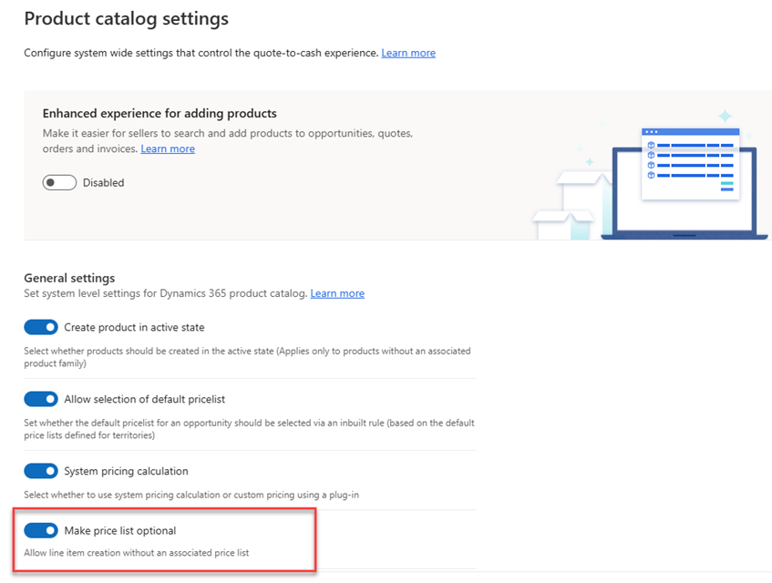

# Allow adding products without associated price list 

When adding products to opportunities, quotes, orders, or invoices, at times, salespeople need to specify the product prices ad hoc. You can allow salespeople to add products without associating a price list first.

## License and role requirements

| Requirement type | You must have |  
|-----------------------|---------|
| **License** | Dynamics 365 Sales Premium, Dynamics 365 Sales Enterprise, or Dynamics 365 Sales Professional  More information: [Dynamics 365 Sales pricing](https://dynamics.microsoft.com/sales/pricing/) |
| **Security roles** | System Administrator   More information: [Predefined security roles for Sales](security-roles-for-sales.md)|

## Make price list optional

Depending on the Dynamics 365 Sales license you have, select one of the following tabs for specific information: 

# [Sales Premium and Sales Enterprise](#tab/SE)

If you have the Sales Hub app, follow the instructions in this tab. Otherwise, follow the instructions in the **Sales Professional** tab to configure the option in Power Platform.

1.	In the lower-left corner of the screen, select **Change area** , and select **App Settings**.

2.	Under **Product Catalog**, select **Product Catalog Settings**.

3.  Turn on **Make price lists optional** and save the changes.

    

# [Sales Professional](#tab/SP)

1.  In your app, on the nav bar, select the **Settings** icon, and then select **Advanced Settings**.

    The Business Management settings page opens in a new browser tab.

2.  On the nav bar, select **Settings**, and then select **Administration**.

3.  Select **System Settings**.

4.  In the **System Settings dialog** box, on the **Sales** tab, set the **Make
    price lists optional** field to **Yes**.

    

---

[!INCLUDE [cant-find-option](../includes/cant-find-option.md)]

### See also
[Add products to an opportunity](add-products-opportunity.md)  
[Add products to a quote, order, or invoice](add-product-quote-order-invoice.md)

[!INCLUDE[footer-include](../includes/footer-banner.md)]
