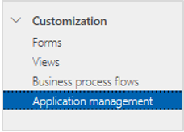
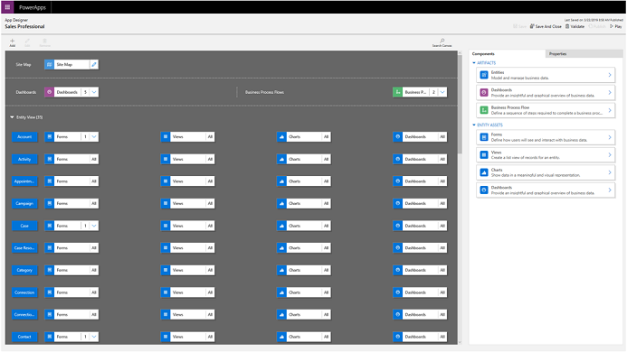

# Customize the Dynamics 365 Sales app

The Dynamics 365 Sales application is a modular app built to provide capabilities tailored for sales professionals and sales managers. As an administrator or customizer, you can easily customize the tables, dashboards, forms, views, charts, and business processes included in the Sales application using the app designer, without having to write any code.

## License and role requirements
| Requirement type | You must have |
|-----------------------|---------|
| **License** | Dynamics 365 Sales Premium, Dynamics 365 Sales Enterprise, or Dynamics 365 Sales Professional  More information: [Dynamics 365 Sales pricing](https://dynamics.microsoft.com/sales/pricing/) |
| **Security roles** | System Administrator or System Customizer   More information: [Predefined security roles for Sales](security-roles-for-sales.md)|

## Customize the app

Depending on the Dynamics 365 Sales license you have, select one of the following tabs for specific information:

# [Sales Premium or Sales Enterprise](#tab/sales)

**To customize the app**:

1. Select the app at the upper-right corner of the screen.

2. Go to the **Sales Hub** tile, select **More Options** (...), and then select **Open in App Designer**.

3. Add or edit components to the app, as required. More information: [Add or edit app components](/powerapps/maker/model-driven-apps/add-edit-app-components)

# [Sales Professional](#tab/salespro)

> [!IMPORTANT]
> This capability is introduced in the Dynamics 365 Sales Professional app version 9.1.0.0.

**To customize the app**:

1.	In the site map, select **Sales settings**.

2.	Under **Customization**, select **Application management**.

    

3.	Select **Edit Sales Professional app** to open the app designer.

    
 
    The Sales Professional app opens in the app designer in a new tab. 

    
 
4. Add or edit components to the app, as required. More information: [Add or edit app components](/powerapps/maker/model-driven-apps/add-edit-app-components)

---

[!INCLUDE[cant-find-option](../includes/cant-find-option.md)]

[!INCLUDE[footer-include](../includes/footer-banner.md)]
