# Manage sales teams in assignment rules 

Using sales team management in assignment rules, you can assign attributes to sellers and configure the maximum number of leads and opportunities that a seller can handle at once. When the rule is applied to a record, the attributes and capacity you've defined here will determine how the record is assigned.

You can use the **Team settings** page to:

-	[Grant permissions to use assignment rules](#grant-permissions-to-use-assignment-rules)
-	[Shortlist sellers through advanced filters](#shortlist-sellers-through-advanced-filters)
-	[Add attributes to sellers](#add-attributes-to-sellers).
-	[Set capacity for sellers](#set-capacity-for-sellers).
-	[Turn off record assignment to sellers](#turn-off-record-assignment-to-sellers).

Before you start using the sales teams designer, verify that the security roles that are assigned to your sellers were selected when the sales accelerator was configured. More information: step 4 in [Set up the sales accelerator](enable-configure-sales-accelerator.md)

## License and role requirements
| Requirement type | You must have |
|-----------------------|---------|
| **License** | Dynamics 365 Sales Premium or Dynamics 365 Sales Enterprise  More information: [Dynamics 365 Sales pricing](https://dynamics.microsoft.com/sales/pricing/) |
| **Security roles** | System Administrator or Sequence Manager    More information: [Predefined security roles for Sales](security-roles-for-sales.md)|

## Grant permissions to use assignment rules

Select roles to grant permissions to use the assignment rules features. 

1.	Sign in to your Dynamics 365 Sales Hub app.    
2.	Go to **Change area** in the lower-left corner of the page, and select **Sales Insights settings**.   
3.	Under **Sales accelerator**, select **Assignment rules**.      
4.	From the **Team** tab, select **Define team access**.

    >[!div class="mx-imgBorder"]
    >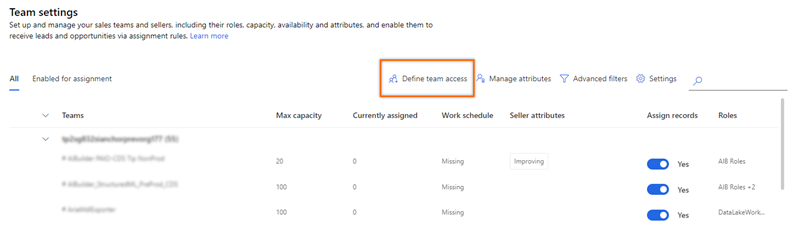  

    The **Define team access** dialog box opens.
    
    >[!div class="mx-imgBorder"]
    >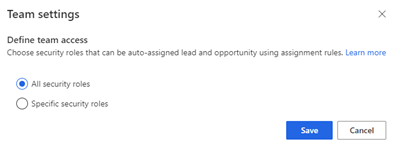  

5.	On the **Define team access** dialog box, choose one of the following options to grant permissions:

    | Security roles | Description |
    |----------------|-------------|
    | All security roles | Select this option to give access to view the Sales Hub app to all the security roles in your organization. |
    | Specific security roles | Select this option to specify security roles to give access to view the Sales Hub app to just a few users. Use the lookup box to add the security roles. |    

5.	Select **Save**.

## Configure seller availability

Enable the seller availability option to let sellers configure their work hours through Outlook or CRM calendar.

1.	Sign in to your Dynamics 365 Sales Hub app.    
2.	Go to **Change area** in the lower-left corner of the page, and select **Sales Insights settings**.   
3.	Under **Sales accelerator**, select **Assignment rules**.    
4.	From the **Team** tab, select **Settings**. 

    >[!div class="mx-imgBorder"]
    >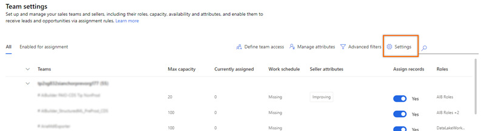  

    The **Seller availability** dialog box opens.
    
    >[!div class="mx-imgBorder"]
    >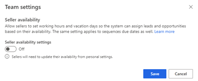  

5.	On the **Seller availability** dialog box, configure the following options: 
    - Turn on **Seller availability settings** to enable sellers to configure work hours.
    - From the Select a calendar option, choose one of the following calendar types that sellers can use to configure work hours and vacation days. Once configured, leads and opportunities are assigned based on seller availability. 
        - **CRM calendar**: : Allows sellers to configure work hours and vacation days using the Dynamics 365 calendar in personal settings. By default, this option is selected. More information [Configure your work availability](personalize-sales-accelerator.md#configure-your-work-availability). 
        - **Outlook**: Allows sellers to configure work hours and vacation days through the Outlook calendar. Sellers should have an Exchange license to use this option.
        
    >[!div class="mx-imgBorder"]
    >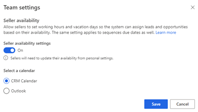  

5.	Select **Save**.

## Shortlist sellers through advanced filters

You can shortlist sellers from a huge list to apply attributes, set capacity, and more. The filters are based on the seller attributes such as account, city, country, region, sale amount, and other information. Only the sellers that match the criteria are displayed on the list, which helps in reducing the time taken to search for sellers.   
The filters you apply are available only for that session and can’t be saved. You must create a filter every time you sign in to your organization.

>[!NOTE]
>Before you apply the filters, verify that the sellers with required security roles are granted access to the auto-assignment of rules. [Grant permissions to use assignment rules](#grant-permissions-to-use-assignment-rules) 

**To create and apply filters**

1.	Sign in to your Dynamics 365 Sales Hub app.    
2.	Go to **Change area** in the lower-left corner of the page, and select **Sales Insights settings**.   
3.	Under **Sales accelerator**, select **Assignment rules**.    
4.	From the **Team** tab, select **Advanced filters**.

    >[!div class="mx-imgBorder"]
    >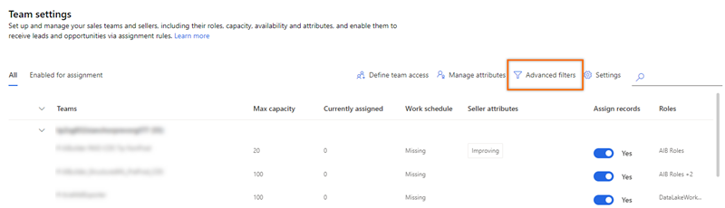  

    The **Filter by seller properties** pane opens.
    
    >[!div class="mx-imgBorder"]
    >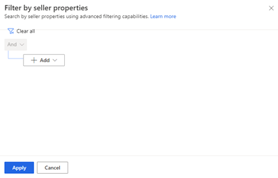  
    
5.	Select **Add** and then choose the filter options as described in the following table:

    | Filter option | Description |
    |---------------|-------------|
    | Add row | Add conditions for which the sellers should be listed. In the following example, we add a row to view sellers only from the city **Seattle**. 1.	Select the attribute **City** from the dropdown list in the first column. 2.	Select the operator as **Equals** from the dropdown list in the second column. 3. Enter the value as **Seattle** to filter by in the third column. :::image type="content" source="media/sa-ar-sales-team-advanced-filters-add-row.png" alt-text="Screenshot showing to add a row to advanced filter." lightbox="media/sa-ar-sales-team-advanced-filters-add-row.png":::  Similarly, you can create more conditions to further filter the sellers as required. |
    | Add group | Add multiple conditions as a group to filter sellers by using more than one field:  1.	Select **And** or **Or** to group the conditions. :::image type="content" source="media/sa-segment-condition-add-group.png" alt-text="Add conditions to the group." lightbox="media/sa-ar-sales-team-advanced-filters-add-row.png"::: 2.	Select the conditions that you want to add to the group. :::image type="content" source="media/sa-ar-sales-team-advanced-filters-group-add-and-condition.png" alt-text="Add a group condition to advanced filter." lightbox="media/sa-ar-sales-team-advanced-filters-group-add-and-condition.png"::: When you select **And**, the filter is applied to sellers that meet both criteria. When you select **Or**, the filter is applied to sellers that meet any of the filter criteria. For example, to filter sellers that were created by Kenny Smith and are from APAC region, select **And**. Similarly, you can create multiple groups and further filter the leads based on the conditions defined in the groups. |
    | Add related entity | Add a condition based on the attributes of related entities. Select an attribute from the **Related Entity** list in the topmost field, and then choose **Contains data** or **Does not contain** data. This enables the condition section. :::image type="content" source="media/sa-ar-sales-team-advanced-filters-group-add-related-entity-condition.png" alt-text="Add conditions through related entity." lightbox="media/sa-ar-sales-team-advanced-filters-group-add-related-entity-condition.png":::  |

    For more information on filters with grouped and nested conditions, see [Create or edit filters in model-driven app views](/powerapps/maker/model-driven-apps/create-edit-view-filters).
    
6.	After you define the filter criterion, select **Apply**.  
    
    The list is filtered based on the selected criterion 

## Add attributes to sellers

Attributes define the characteristics of a seller, such as skills, location, and language. Before you apply attributes to sellers, verify that the attributes have been defined. More information: [Create an attribute](manage-seller-attributes.md#create-an-attribute)

You can apply attributes in bulk by selecting multiple sellers at a time.
<!--markdownlint-disable MD036-->
**To add attributes**

1.	Sign in to your Dynamics 365 Sales Hub app.    
2.	Go to **Change area** in the lower-left corner of the page, and select **Sales Insights settings**.   
3.	Under **Sales accelerator**, select **Assignment rules**.    
4.	From the **Team** tab, select a team or sellers that you want to apply attributes for and then select **Apply attribute**.

    >[!NOTE]
    >- The **Team settings** page lists the teams that include sellers whose security roles were configured when the sales accelerator was originally set up.
    >- To bulk-apply the attributes, select multiple sellers.

    >[!div class="mx-imgBorder"]
    >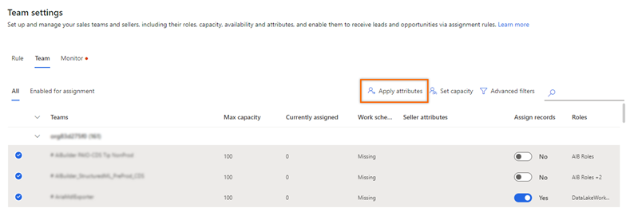  

    The **Apply attribute** pane opens.

6.	On the **Apply attribute** pane, select one of the following options:

    -	**Replace existing attributes with new attributes**: This option replaces the existing attributes that were already applied to the seller. If any leads were assigned to the seller based on the previous attributes, those leads won't be affected.
    -	**Keep existing attributes and add more**: This option adds more attributes to the seller, in addition to the attributes that were already applied.

7.	Select **Add attribute**, and then choose the attribute and its corresponding values. Repeat this step for each attribute you want to add.

    >[!div class="mx-imgBorder"]
    >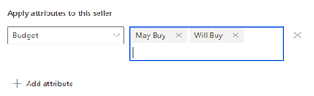

8.	Select **Apply**.

The attributes are applied to the sellers.

## Set capacity for sellers

When you set capacity, you set a combined upper limit of leads and opportunities that a seller can be assigned at any given time. When a seller reaches this limit, even though a lead or an opportunity record is created and ready to be automatically assigned to the seller, the record won't be assigned. You can view unassigned records for leads and opportunities in their respective open record views.

For example, Kenny is a seller, and his capacity limit is set to 10. A new lead is generated, and the assignment rule qualifies the lead to be assigned to Kenny. However, Kenny is currently handling his maximum of 10, so the newly generated lead won't be assigned to him.

**To set capacity**

1.	Sign in to your Dynamics 365 Sales Hub app.    
2.	Go to **Change area** in the lower-left corner of the page, and select **Sales Insights settings**.   
3.	Under **Sales accelerator**, select **Assignment rules**.     
4.	From the **Team** tab, select a team or sellers that you want to apply attributes for and then select **Set capacity**.

    >[!NOTE]
    >- The **Team settings** page lists the teams that include sellers whose security roles were configured when the sales accelerator was originally set up.
    >- To bulk-apply the attributes, select multiple sellers.

    >[!div class="mx-imgBorder"]
    >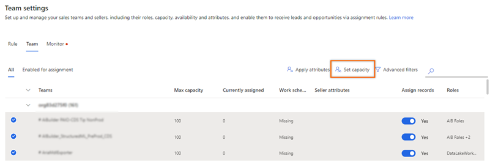   

    The **Set maximum capacity** pane opens.

    >[!div class="mx-imgBorder"]
    >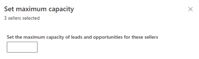

6.	In **Set the maximum capacity of leads and opportunities for these sellers**, enter the value you want.

7.	Select **Apply**.

    >[!NOTE]
    >If you're changing the existing maximum capacity, a confirmation message appears. Select **Override settings**.    
    >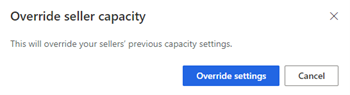 
 
The maximum capacity limit is set for the seller.

## Turn off record assignment to sellers

When a seller is on vacation or otherwise unavailable, you can disable record assignment until the seller is available again. 

**To turn off assignment**
<!--markdownlint-enable MD036-->  
1.	Sign in to your Dynamics 365 Sales Hub app.    
2.	Go to **Change area** in the lower-left corner of the page, and select **Sales Insights settings**.   
3.	Under **Sales accelerator**, select **Assignment rules**.  
4.	From the **Team** tab, under the **Assign records** column, turn off the toggle.   

    >[!div class="mx-imgBorder"]
    >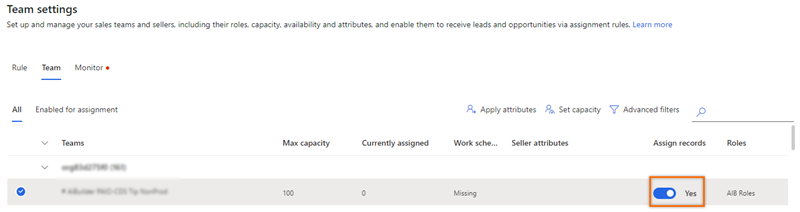   

6. In the confirmation message, select **Turn off availability**.  

    >[!div class="mx-imgBorder"]
    >

[!INCLUDE[cant-find-option](../includes/cant-find-option.md)] 

### See also

[Manage assignment rules](create-manage-assignment-rules.md)    
[Create and activate an assignment rule](create-and-activate-assignment-rule.md)

[!INCLUDE[footer-include](../includes/footer-banner.md)]
