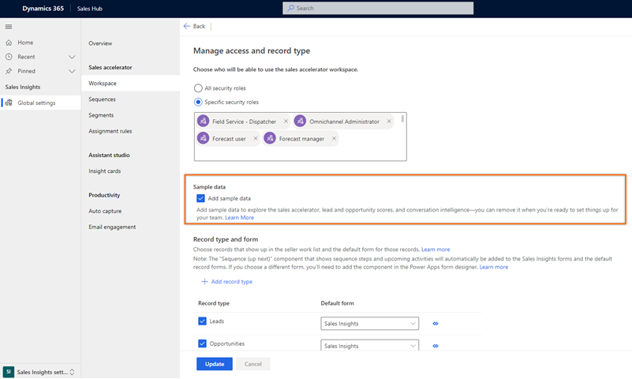
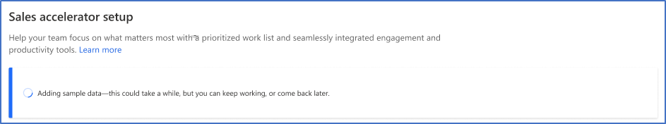
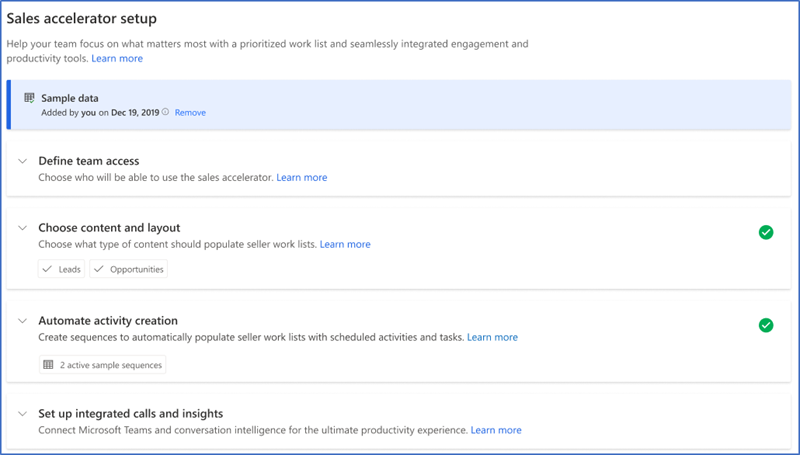
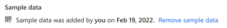
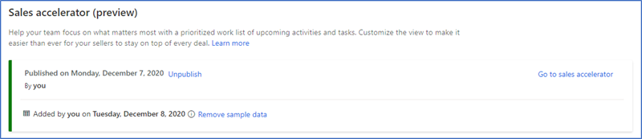
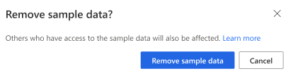

# Explore the sales accelerator with sample data 

Sample data helps you visualize a product and its features. Learn how to add or remove sample data to explore sales accelerator.

## License and role requirements

| &nbsp; | &nbsp; |  
|-----------------------|---------|
| **License** | Dynamics 365 Sales Premium or Dynamics 365 Sales Enterprise  More information: [Dynamics 365 Sales pricing](https://dynamics.microsoft.com/sales/pricing/) |
| **Security Role** | System Administrator    See [Predefined security roles for Sales](security-roles-for-sales.md)|
|||
  

## Add sample data

You can add sample data any time you need, during or after the configuration of the sales accelerator.  

> [!NOTE]
> - The sample data adds basic Dynamics 365 Sales and Sales Premium record types. More information: [Record types updated with sample data](#record-types-updated-with-sample-data)     
> - To prevent unwanted results, sample data is available only in non-production environments.  
> - You can also add sample data from the quick setup panel (with the Dynamics 365 Sales Enterprise license). More information: [Set up sales accelerator](digital-selling.md#set-up-sales-accelerator)

1. Sign in to your sales app.   
2. Go to **Change area** in the lower-left corner of the page, and select **Sales Insight settings**.    
3. Under **Sales accelerator**, select **Setup**.    
4. Select **Get started**.    
5. In the **Explore with sample data?** dialog box, select **Add sample data**.    
    > [!div class="mx-imgBorder"]
    >    
    It might take a few minutes to add the sample data to your organization.   
    > [!div class="mx-imgBorder"]
    >      
6. After the sample data is added to your organization, you can start using it to play around with the sales accelerator and other Sales Premium features.   
    > [!div class="mx-imgBorder"]
    >      
    You can also add sample data after you've configured the sales accelerator. Select **Add sample data**.     
    > [!div class="mx-imgBorder"]
    >     

After the sample data is added to your organization, a confirmation message is displayed with the date and time it was added.    

> [!div class="mx-imgBorder"]
>     

## Sample data availability

By default, sample data is available for the administrator who adds it. The administrator can assign the records that are associated with sample data for other users to explore.

## Remove sample data

As an administrator, you can remove sample data that your organization no longer needs.

>[!NOTE]
>You can always add the sample data again, whenever you need it.

**To remove sample data**

1. Sign in to your sales app.   
2. Go to **Change area** in the lower-left corner of the page, and select **Sales Insight settings**.    
3. Under **Sales accelerator**, select **Setup**.    
4.	On the setup page, select **Remove sample data**.    
    > [!div class="mx-imgBorder"]
    >        
5.	In the **Remove sample data?** confirmation message, select **Remove sample data**.   
    > [!div class="mx-imgBorder"]
    >      

The application takes a few seconds to remove the sample data from your organization.

## Record types updated with sample data

When sample data is added to your organization, the following record types are updated with sample data:

- Account
- Action Card
- Appointment
- Competitor
- Contact
- Lead
- Opportunity
- Phone Call
- Price List
- Price List Item
- Product
- Sequence
- User

[!INCLUDE [cant-find-option](../includes/cant-find-option.md)]

### See also

[Configure sales accelerator](enable-configure-sales-accelerator.md)

[!INCLUDE[footer-include](../includes/footer-banner.md)]
