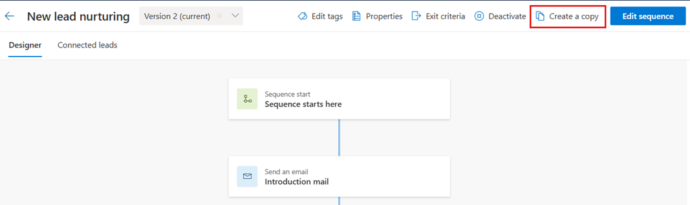
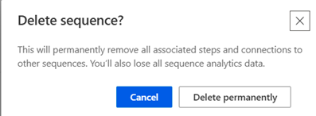

# Manage sequences 

Manage your sequences in the sales accelerator by viewing details and cloning, editing, deleting, and applying tags to them.

## License and role requirements

| Requirement type | You must have |
|-----------------------|---------|
| **License** | Dynamics 365 Sales Enterprise, Dynamics 365 Sales Premium, or [Microsoft Relationship Sales](https://dynamics.microsoft.com/sales/relationship-sales/)  More information: [Dynamics 365 Sales pricing](https://dynamics.microsoft.com/sales/pricing/) |
| **Security roles** | Salesperson    More information: [Predefined security roles for Sales](security-roles-for-sales.md)|

## View details of sequences and connected records

1. Sign in to your sales app, and in the lower-left corner of the page, go to **Change area** > **Personal settings**.

2. Under **Sales accelerator**, select **Sequences**.   

3. On the **Sequences** page, select and open the sequence for which you want to view details such as activities and assigned records.
    
    >[!TIP]
    >Alternatively, you can hover over a sequence and then select **More options** > **View sequence**.

    The sequence opens and on the **Designer** tab, you can view the activities that are defined for the sequence.

    :::image type="content" source="media/sequence-designer-sequence-tab.png" alt-text="Designer tab of a sequence.":::
   
4. To view the list of connected records, select the **Connected *record*** tab. In this example, we're selecting a sequence with the lead record type. You can also remove and connect records with the sequence through this view. More information: [Connect a sequence to records](connect-a-sequence-to-records.md#ContactThroughASequence)

    - The **Connected segments** section lists the segments that are associated with the sequence.
    - The **Connected *records*** section displays the list of records that are connected to the sequence, with the following columns:
        - **Progress**: Shows the number of steps that have been completed in the record.  
        - **Current step**: Shows the step that is to be completed.
        - **Days elapsed**: Shows the number of days since the record moved into the current step.

    :::image type="content" source="media/sequence-connected-records-tab.png" alt-text="Connected records tab of a sequence.":::

5. To view the properties of the sequence&mdash;such as, name, description, record type, and owner&mdash;select **Properties**. If the sequence is in the active state, you can only view the information. To update the name or description, you must deactivate the sequence. You can't edit record type or owner information at any time.

    :::image type="content" source="media/sequence-view-properties.png" alt-text="View properties of a sequence.":::

    The **Properties** pane opens.

    :::image type="content" source="media/sequence-properties-pane.png" alt-text="Properties pane of a sequence.":::

More information: [View details of a sequence and its connected records](view-sequence-details-connected-records.md)

## Clone and edit a sequence

Cloning a sequence makes it easier to edit, and save the changes to create new sequence. Also, cloning pulls down a full copy of the sequence data that you're cloning at that point in time, including all steps and configurations. After you edit, you can save and activate the cloned sequence and apply it to records.

1. Sign in to your sales app, and in the lower-left corner of the page, go to **Change area** > **Personal settings**.   

1. Under **Sales accelerator**, select **Sequences**.   

1. Open the sequence that you want to clone, and then select **Create a copy**.

    >[!TIP]
    >Alternatively, you can hover over a sequence and then select **More options** > **Create a copy**.
    
    > [!div class="mx-imgBorder"]
    >   

1. In the **Create a copy** dialog, enter a name for the sequence and a description.

    > [!div class="mx-imgBorder"]
    >    

1. Select one of the following:   

    - **Save and edit**: Select this button to open the sequence editor and add steps as necessary. For details, go to the [following section](#edit-a-sequence-seller).
    - **Save and close**: Select this button to save and create the sequence. 

**To edit the sequence**  

1. Open the sequence that you want to edit.    

    >[!NOTE]
    >If the sequence is in the **Active** state, you can do one of the following:   
    >- Deactivate the sequence, or create a copy.
    >- Select **Edit sequence**.

1. Do one of the following:

    - To add an activity, perform **step 4** from [Create and connect sequences for yourself](create-sequence-seller.md ).
    - To edit an activity, select the activity. In the right pane, make the edits you want, and then select **Save**.

1. (Optional) If you want the sequence to be available to connect with records, select **Activate**.

1. Select **Save**, and then exit the sequence designer.

More information: [Clone and edit a sequence](edit-a-sequence.md)

## Delete a sequence

1. Sign in to your sales app, and in the lower-left corner of the page, go to **Change area** > **Personal settings**.   

1. Under **Sales accelerator**, select **Sequences**.   

1. On the **Sequences** page, hover over the sequence you want to delete, and then select **More options** > **Delete**.  

1. In the confirmation message that appears, select **Delete permanently**.
    
    >[!NOTE]
    >If you're deleting a sequence that's in the active state, a confirmation message is displayed that the sequence will be deactivated and deleted. Select **Deactivate and delete**.
    
    > [!div class="mx-imgBorder"]
    > 

## Apply and remove tags from your sequences

Tags help you quickly filter and identify sequences from a list by categories that you define. To know more about tags, go to [Manage tags for sequences](manage-tags-for-sequences.md).  

### Apply tags to a sequence

With the Salesperson role, you can't create, edit, or delete tags. However, if your sales manager or administrator created tags, you can apply them to sequences.  

1. Sign in to your sales app, and in the lower-left corner of the page, go to **Change area** > **Personal settings**.

1. Under **Sales accelerator**, select **Sequences**.   

1.	Select the sequence to which you want to apply tags, and then select **Edit tags**.

    >[!NOTE]
    >You can also select the **Edit tags** option by opening the sequence.

    >[!div class="mx-imgBorder"]
    >    
    
1.	On the **Edit sequence tags** pane, select **Add tags to sequence**.

    >[!div class="mx-imgBorder"]
    >    
 
1.	Select the tags that you want to apply to the sequence.

    The tags you select are highlighted in blue, and they're also listed with their full hierarchy path in the **Selected tags** section.

    >[!div class="mx-imgBorder"]
    >
 
1.	Select **Add**.

    The tags, including their hierarchy path, are listed in the sequence. Hover over a tag to view the full path.

    >[!div class="mx-imgBorder"]
    >

1.	Select **Apply**.

### Remove tags from a sequence

1.	In your sales app, go to the **Change area** in the lower-left corner of the page, and select **Sales Insights settings**.

2.	Under **Sales accelerator**, select **Sequence**.   

3.	Select the sequence from which you want to remove tags, and then select **Edit tags**.

4.	In the **Sequence tags** section, select the **X** next to the tag, and then select **Apply**.

The tag is removed from the sequence.

[!INCLUDE[cant-find-option](../includes/cant-find-option.md)]

### See also

[What is the sales accelerator?](sales-accelerator-intro.md)  
[Create and connect sequences for yourself](create-sequence-seller.md)  
[Apply and remove tags from your sequences](apply-remove-tags-seller.md)

