# Manage tags for sequences

Tags help you quickly filter and identify sequences from a list by categories that you define.

## License and role requirements
| Requirement type | You must have |
|-----------------------|---------|
| **License** | Dynamics 365 Sales Enterprise, Dynamics 365 Sales Premium, or [Microsoft Relationship Sales](https://dynamics.microsoft.com/en-in/sales/relationship-sales/)  More information: [Dynamics 365 Sales pricing](https://dynamics.microsoft.com/sales/pricing/) |
| **Security roles** | System Administrator, Sequence manager, or Sales Manager    More information: [Predefined security roles for Sales](security-roles-for-sales.md)|

## Permission requirements to manage tags

The following table shows the permissions required for a user role to perform tasks on tags.

| Task related to tags | Permissions required |
|--------------------------|----------------------|
| Create, edit, and delete | In the Security roles page, under the **Custom Entities** tab, provide Create, Read, Write, and Delete permissions for **Sales Tag** entity. More information: [Security roles and privileges](/power-platform/admin/security-roles-privileges)   **Note:** By default, these permissions are available for System Administrator, Sequence manager, and Sales Manager security roles. | 
| Apply and remove | In the Security roles page, under the **Custom Entities** tab, provide permissions for following entities:  - **Sales Tag**: Read, Append, and Append To - **Sequence**: Read, Append, and Append To More information: [Security roles and privileges](/power-platform/admin/security-roles-privileges)   **Note:** By default, these permissions are available for System Administrator, Sequence manager, Sales Manager, and Salesperson security roles. |

## What are tags?

A *tag* is a label that's used to identify a sequence. The tag works as metadata to help you filter and find sequences. By tagging sequences, you can distinguish one sequence from another and easily choose a specific sequence from a huge list.

You can perform the following activities on tags:

-	[Create tags](#create-tags)
-	[Edit a tag](#edit-a-tag)
-	[Delete a tag](#delete-a-tag)
-	[Apply a tag to a sequence](#apply-a-tag-to-a-sequence)
-	[Filter sequences based on tags](#filter-sequences-based-on-tags)
-	[Remove tags from a sequence](#remove-tags-from-a-sequence)

## Who can manage tags?

By default, the users with sales manager and sequence manager roles can use the tag manager and assign tags to sequences. For other roles to use the feature, you need access to the **Sequences** page. Contact your administrator to get the following privileges:   
- Read, append, and append to access at the user level for the **Sales tag** (**msdyn_salestag**) table to assign tags to a sequence.   
- Create, read, write, and delete access at the user level for the **Sales tag** (**msdyn_salestag**) table to use tag manager.

More information: [Security roles and privileges](/power-platform/admin/security-roles-privileges)

## Create tags

Create tags to categorize sequences into a logical order. For example, you want to categorize leads based on their city of origin. You create tags with city names, such as Seattle and Hyderabad, and apply them to leads according to their city of origin.

1.	In the **Sales Hub** app, go to **Change area** in the lower-left corner of the page, and select **Sales Insights settings**.

2.	Under **Sales accelerator**, select **Sequence**.

3.	On the **Sequences** page, select **Tag manager**.

    >[!div class="mx-imgBorder"]
    >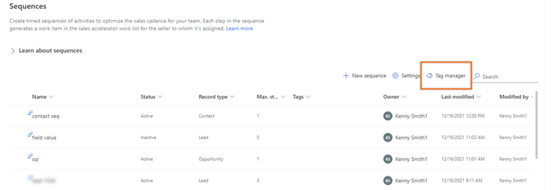
 
4.	On the **Tag manager** page, select **New tag**.

5.	In the **Create new tags** dialog, enter the following details.   

    | Field | Description |
    |-------|-------------|
    | Tag name | Enter the name of the tag. **Note**: Forward slash (/) isn't supported in tag names. |
    | Nest tag under | Select a tag name under which you want to create the tag. When **None** is selected, the tag is created at level 1 and you can add tags under it. To add multiple tags, select **Enter** after adding each tag. You can also create nested tags. More information: [Create nested tags](#create-nested-tags). |

6.	Select **Save**.    

Repeat the procedure to add more tags.

### Create nested tags

Nested tags allow you to group tags together so that it's easy to identify tags while applying them to a sequence. For example, you want to create tags based on regions and go down levels to countries, states (if applicable), and cities. You create North America (at level 1), United States of America (level 2), Washington state (level 3), and then Seattle (level 4).

>[!IMPORTANT]
>- You can create nested tags for up to four levels.
>- There's no limit to adding tags at level 1. For other levels, you can only add up to 100 tags.

1.	Create a tag at the root node. In this example, we're creating the **North America** tag.   

    >[!div class="mx-imgBorder"]
    >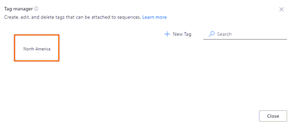
  
2.	Create a node at a level below the root node of North America.   

    1.	Hover over the root node tag of **North America**, and then select **Add (+)**.     

        >[!NOTE]
        >You can also use **New Tag** to add a node below the root node.   
        
        >[!div class="mx-imgBorder"]
        >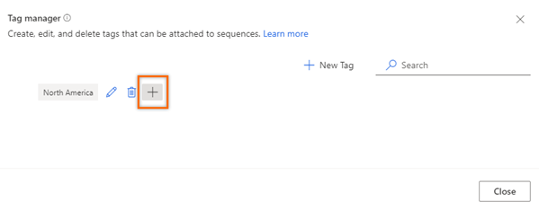     

    1.	In the **Create new tags** dialog, enter the **Tag names**. Add multiple tags by selecting **Enter** after each tag.      

        In the **Nest tag under** field, select the parent tag. Currently, only four levels of hierarchy are supported, and each level can have up to 100 tags. For example, level 1 > level 2 > level 3 > level 4. If you try to add another node below the level 4 node, an error message is displayed.    

        In this example, we're adding **United States of America**, **Canada**, and **Mexico** under the parent node **North America**.
        
        >[!div class="mx-imgBorder"]
        >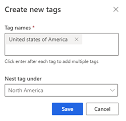     
        
    1.	Select **Save**.     

        Under the **North America** node, you can see that **United States of America**, **Canada**, and **Mexico** have been added to the next level as child nodes.
                    
        >[!div class="mx-imgBorder"]
        >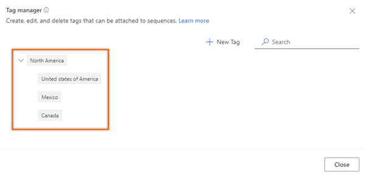             
    
3.	Similarly, repeat step 2 to add: 

    -	A node below **United States of America** as **Washington State**.
    -	A node below **Washington State** as **Seattle**.
 
    >[!div class="mx-imgBorder"]
    >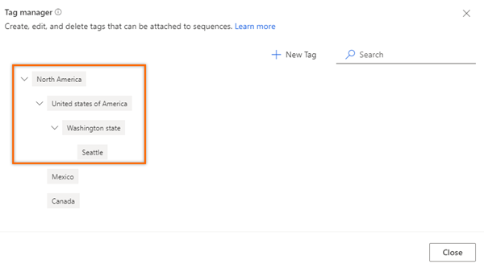    

## Edit a tag

You can edit a tag if you want to change its name or hierarchy level. In this example, we're editing the tag **Mexico City** (which is under **North America**) to move it under **Mexico** without changing its name.  

1.	Open the tag manager.

2.	Hover over a tag, and select the **Edit** icon.  

    >[!div class="mx-imgBorder"]
    >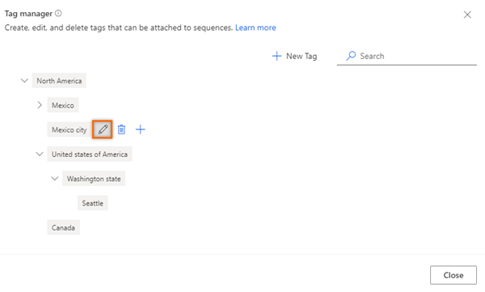    
 
    The **Edit tag** dialog opens.
 
    >[!div class="mx-imgBorder"]
    >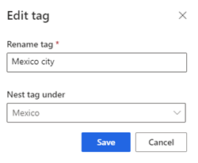    

3.	Update the information as necessary, and then select **Save**. In this example, we're changing the **Nest tag under** value to **Mexico**.  
    
    >[!div class="mx-imgBorder"]
    >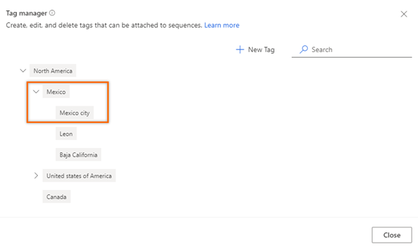    

## Delete a tag

You can remove the tags that your organization no longer requires to be associated with a sequence. If a sequence is associated with the deleted tag, the tag is automatically removed from the sequence. More information: [Filter sequence based on tags](#filter-sequences-based-on-tags)

1.	Open the tag manager.

2.	Hover over a tag, and select the **Delete** icon.     
    A confirmation message is displayed.

    >[!div class="mx-imgBorder"]
    >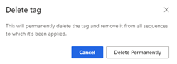    
 
3.	Select **Delete permanently**.     

If the tag being deleted has child tags, the child tags will move up a level in hierarchy and will be nested under the parent of the deleted tag.

For example, there are three levels of tags in the hierarchy. You delete a tag at level 2 that has child tags. The child tags (level 3) move up a level (level 2) and are nested under the hierarchy parent (level 1). When you delete **Mexico** (parent), which is at level 2, the cities under it move a level up to **North America** and become level 2 in the hierarchy.

>[!div class="mx-imgBorder"]
>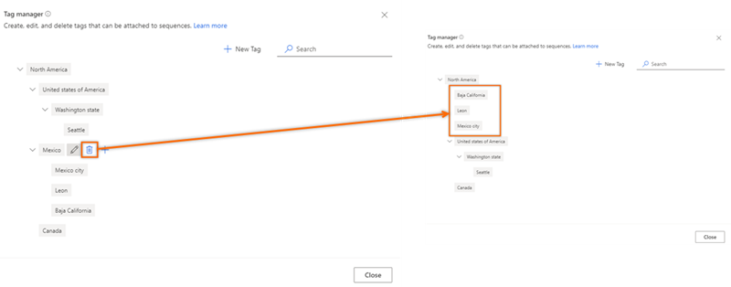    

## Apply a tag to a sequence

1.	In the **Sales Hub** app, go to **Change area** in the lower-left corner of the page, and select **Sales Insights settings**.

2.	Under **Sales accelerator**, select **Sequence**.   

3.	Select a sequence for which you want to apply tags, and then select **Edit tags**.    
    
    >[!NOTE]
    >You can also select the **Edit tags** option by opening the sequence.   
    
    >[!div class="mx-imgBorder"]
    >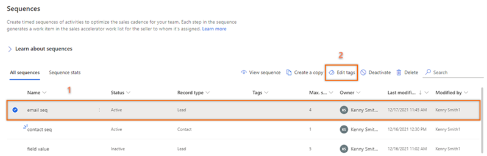    
    
5.	On the **Edit sequence tags** pane, select **Add tags to sequence**.

    >[!div class="mx-imgBorder"]
    >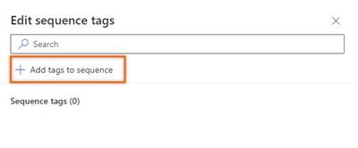    
 
6.	Select the tags that you want to apply to the sequence.    

    The selected tags are highlighted in blue and are listed in the **Selected tags** section with the hierarchy path.   

    >[!div class="mx-imgBorder"]
    >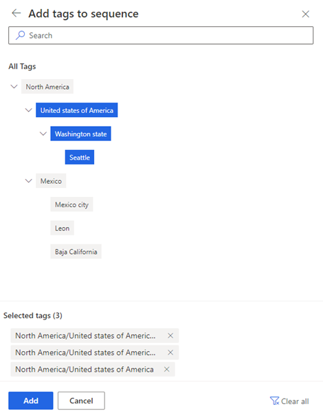    
 
7.	Select **Add**.    

    The tags, including the hierarchy, are listed in the sequence. Hover over the added tag to view the full path for the tag.

    >[!div class="mx-imgBorder"]
    >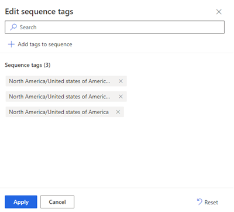     

8.	Select **Apply**.     

The tags are applied to the sequence.

## Filter sequences based on tags

1.	In the **Sales Hub** app, go to **Change area** in the lower-left corner of the page, and select **Sales Insights settings**.

2.	Under **Sales accelerator**, select **Sequence**.   

3.	Select the **Tags** column.   
    The **Filter by option** opens.   

    >[!div class="mx-imgBorder"]
    >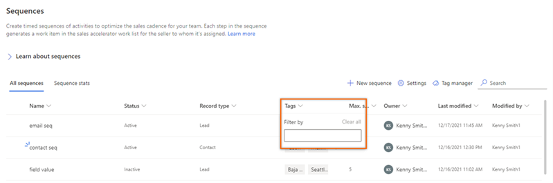     

4.	Search for the tags to filter the sequence.

    >[!div class="mx-imgBorder"]
    >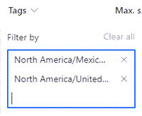      
    
    The sequences are filtered and listed on the **Sequences** page. The list displays all the sequences that match the filter criteria, regardless of their status.<!--note from editor: Edit okay?-->

    >[!div class="mx-imgBorder"]
    >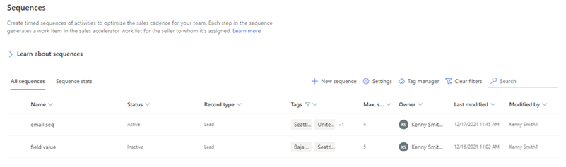      

## Remove tags from a sequence 
 
1.	In the **Sales Hub** app, go to **Change area** in the lower-left corner of the page, and select **Sales Insights settings**.

2.	Under **Sales accelerator**, select **Sequence**.   

3.	Select a sequence for which you want to remove tags, and then select **Edit tags**.

4.	In the **Sequence tags** section, select the **Cross** icon (**X**) corresponding to the tag, and then select **Apply**.    

The tag is removed from the sequence.

[!INCLUDE[cant-find-option](../includes/cant-find-option.md)] 

### See also

[Create and manage sequences](create-manage-sequences.md)      
[Create and activate a sequence](create-and-activate-a-sequence.md)

[!INCLUDE[footer-include](../includes/footer-banner.md)]

