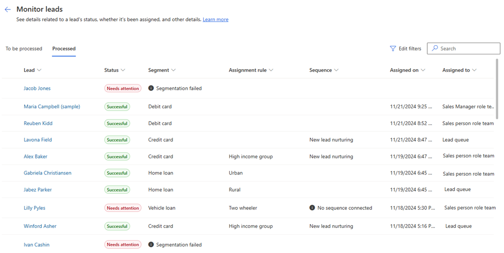

# View and manage unassigned records

Monitoring of unassigned records allows you to view the lead or opportunity records that aren't assigned to any seller. As an administrator, sales manager, or sequence manager, you can view these unassigned records and assign to sellers. 

## License and role requirements
| Requirement type | You must have |
|-----------------------|---------|
| **License** | Dynamics 365 Sales Premium or Dynamics 365 Sales Enterprise   More information: [Dynamics 365 Sales pricing](https://dynamics.microsoft.com/sales/pricing/) |
| **Security roles** | System Administrator, Sequence Manager, or Sales Manager    More information: [Predefined security roles for Sales](security-roles-for-sales.md)|

## View unassigned records

You can view the list of records that aren't assigned to sellers and assign them to sellers either manually or by creating an assignment rule. More information: [Create and activate an assignment rule](create-and-activate-assignment-rule.md#to-create-and-activate-an-assignment-rule).  
The records aren't assigned automatically because of one of the following reasons: 

| Reason | Description |
|--------|-------------|
| Eligible sellers don't have availability | Record couldn’t be assigned as eligible sellers aren't available. |
| Eligible sellers don't have capacity | Record couldn’t be assigned as eligible sellers don't have the capacity. |
| No assignment rule for this record's segment | Record doesn't match any assignment rule that is currently active and available in the organization.|
| No sellers meet the conditions | Record isn't assigned as none of the sellers meet the conditions that are defined in the matched assignment rule. | 
| Owner assigned manually | Owner is manually assigned to the record. |
| Owner assigned successfully | Owner is assigned to the record. |
| Record doesn't meet any conditions | Record isn't assigned as it doesn't match any conditions that are defined for the assignment rule. |
| Run is in progress | Specifies that the assignment is in progress for the record. |
| There was an issue with the server | Record isn't assigned as there's an issue with the server that your organization is hosted on. |

You can view the unassigned records through one of the following ways:
- [Assignment rules homepage](#assignment-rule-homepage)
- [Monitor tab](#monitor-tab)

**Assignment rules homepage**

When you open the **Assignment rules** home page, by default, the lists of rules are grouped according to the available segments. If not, select **Group by segment** > **Segments**. Grouping by segments helps you to view the number of records that aren't assigned to a seller. Further, you can run the rules again or schedule the run for that segment to assign these records. More information: [Run reassignment of unassigned records](#run-reassignment-of-unassigned-records) and [Schedule reassignment of unassigned records](#schedule-reassignment-of-unassigned-records)

1.	Sign in to your Dynamics 365 Sales Hub app.    
2.	Go to **Change area** in the lower-left corner of the page, and select **Sales Insights settings**.   
3. Under **Sales accelerator**, select **Assignment rules**.  
    
    The number of unassigned records that belong to a segment are displayed under the **Unassigned records** column under the **Rules** tab.

    >[!div class="mx-imgBorder"]
    >
    
    >[!NOTE]
    >- If no segment is attached to a rule, then the rule is grouped under **No segments**.
    >- When a segment is deleted, the attached rules will be automatically assigned to the default segment. 

**Monitor tab** 

1.	Sign in to your Dynamics 365 Sales Hub app.    
2.	Go to **Change area** in the lower-left corner of the page, and select **Sales Insights settings**.   
3. Under **Sales accelerator**, select **Assignment rules**.  

    >[!div class="mx-imgBorder"]
    >

3. Select the **Monitor** tab, and then select the unassigned tab according to your requirement. In this example, we're selecting the **Unassigned Lead** tab and a list of unassigned lead records is displayed.

    >[!div class="mx-imgBorder"]
    > 

    The **Status Reason** column displays why the record isn't assigned to a seller. By analyzing the reason, you can take appropriate action by assigning these leads to sellers, creating an assignment rule, or by adding conditions to existing assignment rule. More information: [Create and activate an assignment rule](create-and-activate-assignment-rule.md#to-create-and-activate-an-assignment-rule). 

## Run reassignment of unassigned records

The number of unassigned records for a segment are displayed under the **Unassigned records** column in the **Assignment rules** home page. You can run the rules again in the segment and try to assign the records to the sellers. After the records are successfully assigned, you can view the history of assigned records. 

By default, a maximum of 500 records are considered for reassignment on each run. Older records are prioritized for assignment.   

>[!NOTE]
>If you want to schedule a time to run the reassignment, go to [Schedule reassignment of unassigned records](#schedule-reassignment-of-unassigned-records)

1. On the **Assignment rules** page, select the calender icon corresponding to the segment name for which you want to reassign the records.
    
    :::image type="content" source="media/sa-ar-run-reassignment-select-reassignment.png" alt-text="Screenshot illustrating the selection of calender icon to open reassignment rules pane":::   

    The **Run assignment rules for *segment name*** pane opens with information on the number of records that aren't assigned, date and time on when the last reassignment was run, and history.

    :::image type="content" source="media/sa-ar-run-reassignment-side-pane.png" alt-text="Screenshot illustrating the reassignment side pane":::       

2. On the **Run assignment rules for *segment name*** pane, select **Run now**.   
    The rules run and assign the records to the sellers who are available and have the capacity to work. Also, the **Last run** section is updated with the latest run time. To view the history of each run and the list of records that are assigned to sellers, select **Show history**. More information: [View reassignment run history](#view-reassignment-run-history)

## Schedule reassignment of unassigned records

You can schedule the reassignment of unassigned records for the application the automatically run. Depending on your organizational requirements, you can schedule the reassignment on a recurring basis by choosing the start date, time, and the days of the week. You can have up to one scheduled for a segment and the reassignment can run twice daily. For example, you can schedule the reassignment of unassigned records on every working weekday at 6 AM and 2 PM.    
The reassignment runs on the records that are unassigned. Once the scheduled run is complete, the history is updated with the latest time. More information: [View reassignment run history ](#view-reassignment-run-history)    

1. On the **Assignment rules** page, hover over the segment name and then select the calender icon.
    
    :::image type="content" source="media/sa-ar-run-reassignment-select-reassignment.png" alt-text="Screenshot illustrating the selection of calender icon to open reassignment rules pane":::   

    The **Run assignment rules for *segment name*** pane opens with information on the number of records that aren't assigned, date and time on when the last reassignment was run, and history.

    :::image type="content" source="media/sa-ar-run-reassignment-side-pane.png" alt-text="Screenshot illustrating the reassignment side pane":::       

2. Select **+ Schedule run**.   

3. On the **Schedule run for *segment name*** pane, configure the required information.
    
    | Option | Description |  
    |--------|-------------|  
    | Start date | Select the start date of the scheduled run. |  
    | Time | Select the time at which you want to run the schedule. You can't have more than two schedules a day. |  
    | Days of the week | Select the days of the week on which you want to run the schedule. |  

    :::image type="content" source="media/sa-ar-run-reassignment-schedule-configuration-side-pane.png" alt-text="Screenshot illustrating the reassignment schedule configuration side pane":::           
    
4. Select **Save schedule**.   
    The schedule is added to the segment and runs on the configured time. Also, a calendar icon is displayed corresponding to the segment name specifying that schedule is configured. 

    :::image type="content" source="media/sa-ar-run-reassignment-schedule-confirmation-side-pane.png" alt-text="Screenshot illustrating the reassignment schedule side pane":::   

    >[!NOTE]
    >- To edit the schedule, hover over the **Run scheduled** section and then select the pencil icon.
    >- To delete the schedule, hover over the **Run scheduled** section and then select the delete icon.

## View reassignment run history 

Viewing the history helps you understand the reassignment run by providing information on each run such as, time of the reassignment run, the number of records that are reassigned, time taken to complete the reassignment run, status of the run, and how it's triggered.  

On the **Run assignment rules for *segment name*** pane, under the **Last run** section, select **Show history**.   

:::image type="content" source="media/sa-ar-run-reassignment-select-show-history.png" alt-text="Screenshot illustrating the selection of reassignment schedule history":::   

The history pane opens with information on each reassignment run such as, time of the run, time taken to complete, number of records reassigned, status of the run, and how it's triggered.  

:::image type="content" source="media/sa-ar-run-reassignment-show-history.png" alt-text="Screenshot illustrating the reassignment run history":::

## Assign records manually

You can assign the unassigned records to sellers or a team. 

1. Select the record that you want to assign to a seller and then select **Assign**. In this example, we're selecting a lead record. 
    
    >[!NOTE]
    >You can select multiple records at once to assign to a seller.  

    >[!div class="mx-imgBorder"]
    > 

2. On the **Assign leads to a seller or team** page, select a seller to who you want to assign the record.   

    >[!NOTE]
    >- Enable the **Show eligible sellers** option to view only the seller who are added to assignment rules through team settings. More information: [Manage sales teams in assignment rules](manage-sales-teams.md)
    >- To assign the record to a team, select **Team** tab.

    >[!div class="mx-imgBorder"]
    > 
        
3. Select **Assign**.    
    The record is assigned to the seller and the list refreshes to remove the assigned record.    
    To view the details of the assigned records, select the **Assignment history** tab. A list of previously assigned records is displayed.

[!INCLUDE[cant-find-option](../includes/cant-find-option.md)]

### See also

[Manage assignment rules](create-manage-assignment-rules.md)

[!INCLUDE[footer-include](../includes/footer-banner.md)]
